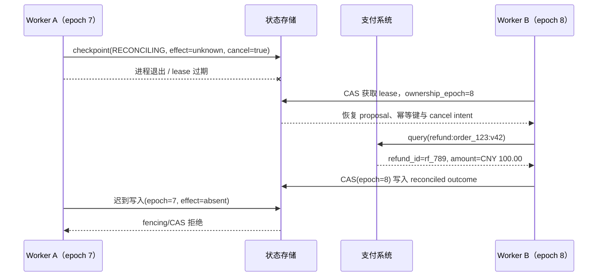

# 03 · 持久执行、Checkpoint 与 Exactly-Once

`order_123` 已进入 Reconciliation Pool，Worker A 正准备查询支付回执，进程却在部署期间退出。几秒后 Worker B 接管。它不能从一句“用户已取消”重新猜测任务，也不能因为 checkpoint 中没有 ACK 就再次退款；它必须恢复原提案、原幂等键、Cancel intent、未知效果和当前所有权。

这就是持久执行（Durable Execution）解决的问题：不是让进程永不失败，而是让另一个进程能从持久事实继续。上一章已经定义容量与核对优先级，本章推进到 **跨 Worker 的所有权、Replay 与版本语义**。

> Durable Workflow、多 Worker 恢复与跨小时任务是 L1 之后的能力，不是首个 Agent Loop 的前置依赖；它们属于全书毕业而非八周启动的硬要求。

## 学习目标

- 保存足以恢复语义状态的 Checkpoint，而不只是聊天文本。
- 用 Lease、Heartbeat、Fencing Token 和 CAS 保持单写所有权。
- 区分 Replay、消息投递、Handler 执行与真实业务效果。

## 1. Worker B 需要恢复什么

```text
run_id: run_refund_123
state: RECONCILING
actor: 小林
proposal: order_123 / CNY 100.00 / resource_version 42
approval_hash + approval_expiry
idempotency_key: refund:order_123:v42
in_flight_effect: unknown
cancel_intent: true
reconciliation_deadline + remaining_query_budget
runtime/workflow/schema/prompt/tool/policy versions
ownership_epoch + event_cursor
context/source artifact references
```

只恢复消息历史，Worker B 无法知道哪项业务意图已经提交、Cancel 发生在何时、能否继续使用旧审批，或应该查询哪个幂等记录。

## 2. Event History 与 Replay

Durable Workflow 通常通过事件历史重建确定性控制逻辑。Replay 重新计算的是“这些已记录事件应导出什么状态”，不应再次直接读取当前时间、随机数、模型或外部服务。

模型与工具调用属于外部非确定性 Activity。它们的结果、错误和版本要作为事件记录；恢复时引擎可能重新投递 Activity，因此 Handler 仍需幂等、去重、结果缓存或权威查询。Replay 从来不承诺模型再次生成同一内容。

## 3. Lease 不是所有权的最后一道防线

同一 Run 的最小所有权协议包括：

- **Lease**：有过期时间的处理权。
- **Heartbeat**：长步骤持续证明持有者存活并更新进度。
- **Fencing token / `ownership_epoch`**：每次接管单调增加，下游拒绝旧 epoch 的迟到写入。
- **CAS / Optimistic Concurrency**：状态转移只有在预期版本和 epoch 一致时才能原子提交。
- **Single-writer invariant**：一个 epoch 内只有一个控制决定可以成为权威状态。

Lease 过期不会杀死旧 Worker。没有 Fencing/CAS 时，Worker A 可能在 Worker B 接管后恢复网络并写回过期状态。

## 4. `order_123` 的接管时序



Worker B 没有重新调用模型，也没有再次提交退款。它执行的是上一章定义的确定性核对动作，最终把 Run 写成 `COMPLETED_WITH_EFFECT_AFTER_CANCEL`。

## 5. 队列与投递语义

- Visibility Timeout 要覆盖正常处理时间，长 Activity 通过 Heartbeat 延长。
- 消息可能重复投递，Consumer 通过 message/call/idempotency ID 去重。
- Poison Message 达到上限后进入 DLQ/隔离区，保留诊断、责任人和可控 Replay 条件。
- 数据库变更与发布事件之间使用 Transactional Outbox；消费端使用 Inbox/Dedup 收敛。

DLQ 不是垃圾桶。必须定义告警、所有者、修复方式、重放前置、数据保留与删除策略。

## 6. Exactly-Once 必须拆开说

分别询问：

- 消息被 Delivery 几次？
- Handler 被执行几次？
- 数据库被 Commit 几次？
- 用户可观察的业务效果发生几次？

某层宣称 Exactly-Once，不代表第三方支付、邮件或外部 API 只产生一次效果。更现实的端到端目标是：

```text
at-least-once attempt
+ idempotent/deduplicated effect
+ authoritative receipt query
+ reconciliation
```

对于 `order_123`，Worker 可以被投递多次，支付系统仍应只存在一笔与同一业务意图匹配的 100 元退款。

## 7. 长 Run 的版本演进

跨小时或跨天 Run 可能跨越多次部署。Checkpoint 必须固定或可解释地迁移：

```text
workflow + runtime + state schema
prompt + model/provider route
tool contract + policy + context builder
```

恢复时不应让新代码重新解释旧审批。优先让旧 Run 路由到兼容 Worker；确需迁移时，使用版本化 Migration、Shadow Replay 和明确回滚。无法安全迁移的 Run 保持旧执行器或转人工。下一章之后的发布运营会进一步处理旧 Run 与新 Run 的切流。

补偿（Compensation）是新的业务动作，不是数据库式 Rollback。每个补偿都要定义前置条件、授权、幂等、失败所有者和用户可见语义。

## 纸面微实验（45 分钟）

推演 Worker A 在以下位置退出：支付 Commit 前、Commit 后 ACK 前、Receipt 到达后 Checkpoint 前、Reconciliation 查询后状态写入前。让 Worker B 以新 epoch 接管，并写出：

1. 恢复的持久字段。
2. 可以 Replay 的控制逻辑与禁止重放的 Activity。
3. CAS/Fencing 条件。
4. 最终 Outcome 和旧 Worker 迟到写入的处理。

## L1 后系统实验

在上述四个边界强杀 Worker，强制 Lease 过期与双 Worker 竞争。验证：只有新 epoch 能提交状态；同一业务意图只产生一次可观察效果；Poison Event 进入 DLQ；旧版 Run 不被新逻辑或新模型路由静默改写。

## 常见误区

- Checkpoint 是最后一条消息。
- Durable Workflow 自动提供第三方 Exactly-Once。
- 有 Lease 就不需要 Fencing 与 CAS。
- Replay 可以重新调用模型并得到相同结果。
- 新部署可以直接用新逻辑恢复所有旧 Run。

## 章末检查

1. Worker B 为什么不能因 Checkpoint 中没有 ACK 就重新退款？
2. Lease 之后为什么还需要 Fencing Token 和 CAS？
3. Replay 与 Activity 重新投递有什么区别？
4. Exactly-Once 为什么必须分别讨论投递、处理、Commit 与业务效果？

## 本章小结

持久执行保存的是可恢复事实、所有权和版本，不是“让进程一直活着”。Worker B 通过新 epoch、原幂等键和权威查询接住了 `order_123`，旧 Worker 的迟到写入被拒绝。下一章将用[Trace、SLO 与成本](/masterpiece-static-docs/08-可靠性与可观测/04-Trace-SLO与成本.md)复盘整条事故：哪一步造成未知效果，系统为何没有重复退款，用户又等了多久才得到真相。

## 一手资料

- [Temporal Workflow Execution](https://docs.temporal.io/workflow-execution)
- [Temporal Activity Definition](https://docs.temporal.io/activity-definition)
- [AWS Idempotent APIs](https://aws.amazon.com/builders-library/making-retries-safe-with-idempotent-APIs/)
- [AWS Transactional Outbox](https://docs.aws.amazon.com/prescriptive-guidance/latest/cloud-design-patterns/transactional-outbox.html)
