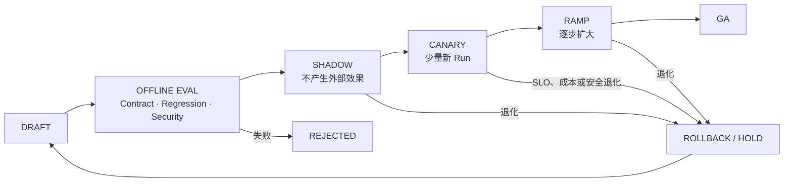

# 05 · 发布、模型依赖与生产运营

`order_123` 的 Trace 指向一个直接诱因：支付依赖变慢时，当前版本仍持续接收新 Run，并在 Worker 部署退出前没有充分 Drain。团队正在评估备用模型、Provider Circuit Breaker 和新的恢复策略，但这些“修复”本身也可能改变 Tool Call、状态迁移或旧 Run 的语义。

生产运营的核心不是多准备几个开关，而是把 **模型、Prompt、Context Builder、工具、策略、Runtime 和配置作为一个可评测、可分批、可回滚的版本发布**。本章只建立这一层门禁。

## 1. Provider/Model Fallback 不是无损切换

不同 Provider 或模型可能在 Tool Schema 子集、流式事件、停止原因、结构化输出、延迟和拒绝行为上不同。Fallback 必须先通过同一 M0/Eval、协议 Contract Test 和 Protected Slice，不能因主 Provider 报错就在生产 Run 中临时换模型。

Fallback 是可选的复杂度，不是成熟系统的默认勋章。数据驻留、安全策略或工具语义不允许自动换 Provider 时，正确方案可以是有界等待、明确拒绝、返回有限结果或转人工；毕业要求是策略可演练，而不是必须拥有第二个模型。

尤其要区分：

- **新 Run**：可按已发布路由进入经过 Eval 的版本；只有确实配置 Fallback 时，才进入通过同一门禁的备用版本。
- **尚未形成动作提案的旧 Run**：只有状态契约允许时才能切换，并记录新的 Attempt/版本。
- **已冻结或已审批提案的 Run**：不得用另一个模型重新解释参数；继续执行原提案，或使审批失效后重新预览。
- **Reconciliation**：应依赖幂等键、Receipt 与权威查询，不需要模型 Fallback。

模型别名会移动时，仍需记录可获得的精确模型标识、Provider Route、Prompt、Toolset、Schema、Policy 和 Context Builder 版本。

## 2. Quota、Circuit Breaker 与降级

为 Provider、Tool、Tenant 和任务风险分别定义 Quota。Circuit Breaker 根据连续失败、限流或延迟进入：

```text
CLOSED → OPEN → HALF_OPEN → CLOSED / OPEN
```

Open 时停止创建新的相关调用；Half-open 只放少量探针。降级必须有任务语义：只读回答可改为等待或返回有限结果，高风险写动作不能静默换成未经评测的 Provider，已有未知效果仍进入预留 Reconciliation 通道。

因此故障注入至少要验证两条合法路径之一：已采用 Fallback 的系统证明主备 Contract/Eval 等价且不改写审批；未采用 Fallback 的系统证明等待、拒绝、有限结果或人工接管有界、诚实且不会触发新副作用。

## 3. 发布状态机



- Shadow 复用脱敏/获准输入，但不得真实执行写动作。
- Canary 只接新 Run，并按任务切片、Tenant 和风险限制流量。
- Ramp 同时观察 Outcome、Trajectory、安全、Time to Truth、尾延迟和成功任务成本。
- Rollback 必须能还原代码、配置、Prompt、模型路由、Tool/Policy 版本，而不只是回滚容器镜像。
- Kill Switch 立即停止新 Planning/Command；在途与未知效果转入有界 Drain/Reconciliation，而不是直接丢弃。

## 4. 旧 Run 与新 Run 怎样切流

长期 Run 必须带版本路由：

| Run 类型                 | 默认策略                    |
| ---------------------- | ----------------------- |
| 新创建 Run                | 进入当前 Canary/GA 版本       |
| 正在模型/只读步骤中的旧 Run       | 保持原版本；显式兼容时才迁移          |
| 等待审批的 Run              | 固定提案、策略与版本；变更后重新审批      |
| 正在执行 Command 的 Run     | Drain 并保存真实在途状态，不热切换执行器 |
| `IN_DOUBT/RECONCILING` | 路由到兼容恢复 Worker，保持原幂等键   |

发布时先停止领取新工作，再等待 Model Stream、队列消息和 Command 到达安全边界。超过 Drain Deadline 的工作写入 Checkpoint；无法确认的 Command 进入 `IN_DOUBT`。关闭连接不等于完成 Drain。

## 5. 灾备与配置也是发布

灾备需要定义状态存储、事件历史、队列、工件、密钥、模型 Provider 和领域系统的 RTO/RPO，并实际演练：

- 从备份恢复后，Fencing/CAS 仍阻止双写。
- 重放队列不会产生重复业务效果。
- 旧 Run 仍能找到兼容的 Worker、Prompt、Policy 与 Tool Contract。
- Provider/区域不可用时，系统能拒绝、降级或转人工，而不是无限等待。

配置、Feature Flag、Prompt 和模型路由都应经过同一发布状态机，具有审批、版本、作用域、过期时间和回滚；“只改配置”不是绕过 Eval 与 Canary 的理由。

## 6. 用 `order_123` 验证修复

发布候选版本时重新注入：支付延迟、ACK 丢失、用户 Cancel、Worker Drain Deadline 到期和 Provider 限流。通过证据包括：

1. Shadow 不产生退款。
2. Canary 中新 Run 使用新版本，旧 Run 保持可恢复语义。
3. Circuit Open 后停止新调用，但 `order_123` 仍在预留通道完成核对。
4. Kill Switch 不丢失在途 Command，Drain 后没有孤儿 Run。
5. Rollback 后版本、路由和状态均可解释，没有重复退款。
6. Provider 不可用时，实际选定的 Fallback 或非 Fallback 降级路径与声明一致。

## 常见误区

- 更强模型可以直接成为自动 Fallback。
- 没有备用 Provider 就不算生产级系统。
- 回滚应用镜像就等于回滚 Agent 行为。
- Kill Switch 可以把所有 Run 立即写成失败。
- Shadow 可以安全调用真实写工具，只要之后删除数据。
- 配置和 Prompt 变更不需要发布门禁。

## 章末检查

1. 为什么已审批 Run 不应静默切换模型重新解释提案？
2. Stream Drain 与关闭 Worker 有什么差异？
3. Kill Switch 后哪些工作必须继续收敛？
4. Canary 应同时观察哪些质量、可靠性、安全和成本信号？

## 本章小结

Agent 发布的对象不是单个模型，而是一整套版本化行为系统。Eval、Shadow、Canary、Drain、Rollback、Kill Switch 与灾备共同保证新版本只影响获准的新流量，旧 Run 和未知效果仍能说清来路与去向。至此，`order_123` 从一次用户请求走到了可复盘、可恢复、可发布的生产闭环；下一站是[综合系统心智模型](/masterpiece-static-docs/10-毕业门禁/01-综合系统心智模型.md)。

## 一手资料

- [Google SRE Workbook: Canarying Releases](https://sre.google/workbook/canarying-releases/)
- [AWS Circuit Breaker Pattern](https://docs.aws.amazon.com/prescriptive-guidance/latest/cloud-design-patterns/circuit-breaker.html)
- [OpenAI Evaluation best practices](https://developers.openai.com/api/docs/guides/evaluation-best-practices)
- [Kubernetes Pod termination flow](https://kubernetes.io/docs/concepts/workloads/pods/pod-lifecycle/#pod-termination-flow)
