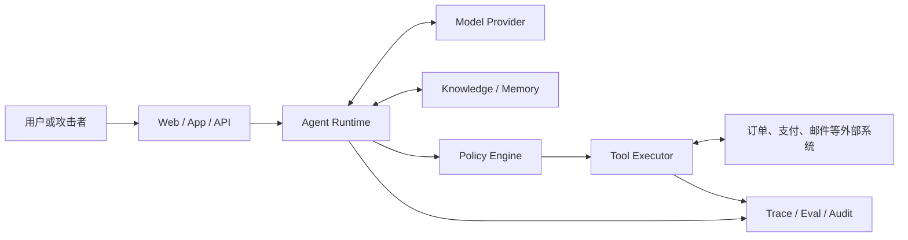

# 01 · 从“会调用工具”到 Agent 威胁模型

进入本部分时，Resolution Desk 已经能读取客服工单、查询订单、检索退款政策，并生成带证据的不可变退款提案。`commit_refund` 尚未向常规业务 Run 开放：在允许调用 Mock Executor 之前，系统必须先证明不可信内容、错误模型输出和单层控制失效都不会直接造成退款。

单看附件读取、政策检索、订单查询和退款执行都很常见；风险来自这些能力被串在了一起——附件中的恶意内容可以影响模型，模型可以选择高权限工具，工具又能改变真实订单。

传统 Web 应用通常由程序预先决定控制流，输入只填充有限参数。Agent 应用把一部分控制流交给模型：模型会根据自然语言和工具返回值选择下一步。威胁建模因此不能只检查 Prompt，也不能只对每个 API 做孤立的权限检查；需要分析一段内容如何跨越模型、策略、工具和外部系统，最终形成可观察的效果。

本章建立一套自包含的 Agent 威胁建模方法。目标不是记住攻击名称，而是找出资产、信任边界、攻击路径和能够自动验证的安全不变量。

## 1. 先画数据流，再讨论攻击

以下是一类常见的 Agent 应用结构：



图上的每条边都要补充五类信息：

- 传递什么数据，是否含个人信息、凭证或业务秘密；
- 以谁的身份调用，权限来自用户委派还是服务账号；
- 数据与权限在哪一侧重新校验；
- 是否跨组织、租户、网络区域或第三方边界；
- 失败后会留下什么状态，是否可能产生不可逆副作用。

例如，“Agent Runtime 调用退款工具”这条边至少涉及原始用户、订单、金额、审批记录、幂等键和执行凭证。若设计图只写了一个 `refund()`，真正的安全边界仍然是空白的。

## 2. 识别资产与威胁参与者

Agent 应用中的资产不只包括数据库内容，还包括能够影响后续行动的配置与状态。

| 资产                                  | 典型风险                  |
| ----------------------------------- | --------------------- |
| 用户、订单和组织数据                          | 越权读取、跨租户泄露、过度发送给模型供应商 |
| API Key、OAuth Token、会话与委派凭证         | 被模型或工具结果泄露，被用于权限提升    |
| 退款、发信、发布、删除等业务能力                    | 未经批准执行、重复执行、执行对象被替换   |
| System Prompt、Tool Schema、Skill 和策略 | 被供应链修改，或被恶意描述诱导错误选工具  |
| Context、Memory 与知识索引                | 被注入内容污染，并在后续任务中持续生效   |
| Trace、Eval 数据集和审计记录                 | 记录过量敏感信息，或被篡改后无法归因    |
| 配额、并发槽位与费用预算                        | 被循环调用或级联重试耗尽          |

威胁参与者也不只有恶意终端用户。外部网页作者、被攻陷的 MCP Server、错误配置的内部工具、低权限员工、被污染的长期记忆，以及失控但并无恶意的 Agent Loop，都可能成为风险来源。

## 3. 从滥用故事推导控制点

“防止越权”过于抽象，无法直接测试。更有效的写法是描述攻击者如何达成目标，再逐步标出阻断位置。

以售后 Agent 为例：

| 滥用故事            | 攻击路径                            | 必要控制点                                    |
| --------------- | ------------------------------- | ---------------------------------------- |
| 读取其他租户订单        | 用户提供猜测的 `order_id`，模型照常调用查询工具   | 检索前的 Tenant/ACL 过滤；订单服务按 actor 重新授权      |
| 通过网页内容外泄 CRM 数据 | 网页诱导模型读取 CRM，再把结果拼进外部 URL       | 数据流策略；URL/Sink 校验；执行环境的 egress allowlist |
| 重复退款            | 支付已提交但 ACK 丢失，Runtime 误判失败后再次执行 | 稳定幂等键；权威回执查询；未知效果状态                      |
| 用旧审批执行新参数       | 用户批准 100 元，模型后来改为 1000 元        | 审批绑定 Proposal Hash、资源版本、金额和有效期           |
| 污染后续任务          | 恶意附件被摘要后自动写入 Memory             | Memory 写入校验、来源与 TTL；删除和隔离机制              |

这里的关键是“必要控制点”必须位于确定性系统中。Prompt 可以降低模型犯错的概率，却不能承担授权、金额上限或网络出口这类硬约束。

## 4. 把安全目标写成不变量

安全不变量（Security Invariant）是在任何输入、模型输出或故障下都必须成立的约束。每条不变量都应明确强制执行位置（Enforcement Point）和验证方式。

| 不变量                          | Enforcement point                   | 验证方式                        |
| ---------------------------- | ----------------------------------- | --------------------------- |
| 未授权文档不能进入模型 Context          | Retrieval Service / Context Builder | 跨租户检索测试、Context Manifest 检查 |
| 模型输出不能直接触发外部写操作              | Runtime / Executor                  | 构造合法 Schema 的恶意 Tool Call   |
| 审批只适用于一份不可变提案                | Approval Service / Executor         | 修改金额、对象、版本、期限后执行必须失败        |
| 凭证不得进入 Prompt、工具返回值与普通日志     | Secret Broker / Telemetry Filter    | 日志扫描、脱敏测试、假凭证 Canary        |
| 每个 Run 有确定的时间、费用与 Fan-out 上限 | Scheduler / Runtime                 | 循环工具与级联重试故障注入               |
| 不可信文本不能直接成为长期事实              | Memory Writer                       | 注入附件、冲突来源与删除传播测试            |

一个简化的 TypeScript 策略结果可以写成可穷尽处理的联合类型：

```ts
type PolicyDecision =
  | { kind: 'allow'; decisionId: string; expiresAt: string }
  | { kind: 'require_approval'; proposalId: string; reasons: string[] }
  | { kind: 'deny'; code: string; reasons: string[] };
```

类型能够防止调用方遗漏分支，但不能证明策略本身正确。测试仍需从真实资源状态和最终效果判断是否越权。

## 5. 用行业清单检查遗漏，而不是替代建模

OWASP Agentic Top 10 2026 提供了十类检查方向：Goal Hijacking、Tool Misuse、Identity and Privilege Abuse、Supply Chain、Unexpected Code Execution、Memory and Context Poisoning、Insecure Inter-Agent Communication、Cascading Failures、Human-Agent Trust Exploitation 和 Rogue Agents。

这些分类适合在完成业务数据流之后做覆盖检查。例如，售后 Agent 没有代码执行能力，不代表风险很低；它仍可能通过支付、邮件和 CRM 工具产生高影响结果。反过来，清单上的每项都打勾，也不能说明某笔退款的审批绑定和幂等语义已经正确。

> 本节名称与分类依据 OWASP 官方资料，核验日期为 2026-07-15。带年份的安全清单会演进，实施时应重新核对官方版本。

## 实践：为 Resolution Desk 建立退款执行准入边界

### 进入本章时已有能力

Resolution Desk 已有只读 Tool、带来源的政策检索、有限 Agent Loop、退款 Proposal 和 Mock 支付系统。退款 Executor 尚未对 Runtime 开放。

### 本章增加的能力

围绕同一条退款 Run 完成当前架构的安全模型：

1. 画出浏览器、Application Server、Model、Knowledge、Policy、Executor、订单服务、Mock 支付系统和遥测之间的数据流；
2. 标明每条边的数据类别、actor、tenant、purpose、凭证边界和可能的外部效果；
3. 为跨租户读取、附件注入、审批后改金额、ACK 丢失后重复退款、循环调用耗尽预算各写一条滥用故事；
4. 将“无授权不读数据、无原生审批不提交、同一 Intent 不重复退款、密钥不进 Context、未知效果不盲目重试”等约束落实到确定性的执行位置；
5. 后续章节的 Injection、委派、纵深防御和可信 UX 验收全部通过前，常规业务 Run 不得调用 `commit_refund`。

### 验收证据

为五条滥用故事各准备一个可重复 Fixture。测试必须能指出请求在哪个确定性边界被阻断，并检查订单、支付、Context 和 Audit 的真实状态。若某条约束只能写成“要求模型不要这样做”，或任一 Fixture 已产生退款效果，本章验收失败。

## 本章小结

Agent 威胁建模关注的是一条完整效果链：不可信内容如何进入 Context，模型如何提出动作，权限如何被委派，Executor 如何接触真实系统，结果又如何进入状态与日志。Resolution Desk 此时仍未开放退款写操作；下一章先沿最常见的入口建立 [Prompt Injection 与不可信内容](/masterpiece-static-docs/08-安全与治理/02-Prompt-Injection与不可信内容.md) 防线。

## 一手资料

- [OWASP Top 10 for Agentic Applications 2026](https://genai.owasp.org/resource/owasp-top-10-for-agentic-applications-for-2026/)
- [NIST AI RMF Generative AI Profile](https://doi.org/10.6028/NIST.AI.600-1)
- [AgentDojo](https://arxiv.org/abs/2406.13352)
