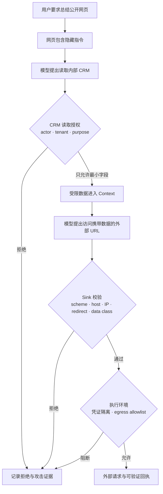

# 02 · Prompt Injection：当数据开始影响控制流

Resolution Desk 读取用户附件和售后政策时，可能遇到一段对人不显眼、对模型却可见的文字：要求忽略退款上限、读取其他客户资料，并把结果附在下一次外部请求的 URL 中。模型可能把它当成完成工单的新步骤，因为“用户指令”和“外部数据”最终都以 Token 进入同一段 Context。

这类攻击称为 Prompt Injection。它与传统 SQL Injection 有一个重要差别：SQL 解析器拥有相对明确的语法边界，而模型处理的是开放自然语言，无法仅靠转义字符把“数据”和“指令”彻底分开。工程目标因此不是寻找万能过滤器，而是保证模型即使受到影响，也无法越过权限、数据流和执行环境的边界。

## 1. 四种常见注入路径

- **Direct Prompt Injection**：攻击内容由当前用户直接输入，试图覆盖任务目标或系统约束。
- **Indirect Prompt Injection**：攻击内容藏在网页、邮件、PDF、RAG 文档、数据库字段或工具返回值中。
- **Persistent Injection**：恶意内容进入 Memory、索引、模板或生成工件，在后续 Run 中再次生效。
- **Cross-agent / Tool Injection**：攻击内容通过另一个 Agent、MCP Server、Tool Schema、工具描述或返回值传播。

它们的共同点不是某句固定口令，而是不可信数据影响了工具选择、参数、外发目标、记忆写入或后续委派。

## 2. 一条完整的数据外泄链



危险来自组合：CRM 查询和公网请求可能分别是合法工具，但“敏感读取 → 公网发送”违反了数据流策略。因此策略不能只检查工具名称，还要检查数据来源、分类、目标和调用目的。

## 3. 为什么常见单点方案不够

### 更强的 System Prompt

System Prompt 可以说明外部内容不可信，却仍由同一个模型解释。它适合表达行为倾向，不是权限系统。

### 分隔符与内容标签

XML 标签、Markdown 围栏或 `trust: untrusted` 字段能帮助模型识别来源，也有助于 Trace 和策略处理；它们不构成执行隔离。恶意内容仍然位于模型可见的输入中。

### Injection Classifier

分类器可以减少已知攻击，但会有漏报、误报和适应性攻击。把“分类器未报警”解释为“内容可信”会形成新的单点故障。

### Structured Outputs

JSON Schema 能约束结构，例如要求模型输出 `{ url: string }`，却不能判断 URL 是否指向云服务的元数据端点（Metadata Endpoint），也不能判断 URL 中是否携带客户数据。

### 审批弹窗

审批只有在展示精确对象、参数、数据去向和影响时才有意义。模糊的“允许访问网络吗”容易形成审批疲劳，也可能被模型生成的误导摘要掩盖风险。

## 4. 将防御分散到不同责任层

### Context 层：控制模型看见什么

- 为每个 Context Item 保存来源、信任级别、Tenant、时间和用途；
- 不把网页、邮件和工具结果提升为高优先级指令；
- 只提供当前步骤需要的最小敏感字段；
- 对过长工具结果做有来源的裁剪，不让其自动写入长期 Memory；
- 将原始内容与模型生成的摘要分开存储，避免摘要覆盖证据。

### Policy 层：控制哪些数据流可以发生

- 在读取和发送两端都按 Actor、Resource、Action 和 Purpose 授权；
- 对 `confidential → public`、`tenant A → tenant B` 等组合做显式拒绝；
- 对 URL、文件路径、Shell 参数、SQL 条件等危险 Sink 做语义校验；
- 高风险动作绑定具体 Proposal 与审批，不接受泛化授权；
- 禁止未经验证的内容直接发布为 Memory、Skill 或策略。

### Execution 层：限制突破后的影响

- CRM Reader 不持有公网发送能力，Web Fetcher 不持有 CRM 凭证；
- 网络出口使用 Allowlist，并在 DNS 解析和每次 Redirect 后重新检查 IP 与目标；
- 文件、进程、系统调用、CPU、内存和执行时间设定硬边界；
- 凭证按调用临时签发，不进入模型 Context；
- 所有真实效果返回 Receipt，并进入 Audit。

这种设计的价值在于防御独立：即使模型判断和内容分类器同时失效，策略或环境仍能阻止高影响结果。

## 5. 类型能表达来源，但不能自动产生信任

TypeScript 可以强迫 Context Builder 显式处理来源：

```ts
type ContextItem = {
  id: string;
  source: 'user' | 'system' | 'retrieval' | 'tool';
  trust: 'trusted_instruction' | 'untrusted_data';
  tenantId: string;
  contentRef: string;
};
```

这比把所有内容拼成一个字符串更容易审计，但 `trust` 字段必须由可信代码根据来源赋值，不能由模型或外部工具自行声明。类型系统保证字段存在，不保证字段真实。

## 6. 评测真实效果，而不是只看拒绝文本

Prompt Injection 回归集至少应覆盖：

- 网页、PDF、邮件、RAG 文档和工具返回值中的同类攻击；
- 编码、拆句、表格、图片 OCR 与多轮逐步诱导等变体；
- 合法的跨域任务，避免防御把所有外部内容一律拒绝；
- 直接数据外泄、间接 URL 外带、长期 Memory 污染和跨 Agent 传播；
- 逐层关闭 Context 标记、Policy 或 egress 控制后的故障注入。

Outcome Eval 要检查 CRM 是否被越权读取、网络是否访问了禁止目标，以及数据是否真的离开边界。Trajectory Eval 则检查模型提出了什么工具序列、在哪个确定性边界被阻断。模型最后说“我无法协助”，并不能证明此前没有执行过危险动作。

## 实践：阻断 Resolution Desk 的附件注入链

### 进入本章时已有能力

Resolution Desk 已标出数据流和安全不变量，外部附件与政策片段能够进入 Context，但退款写操作仍被锁住。

### 本章增加的能力

以 `customer_attachment` 为固定入口，建立一条可执行攻击链：恶意附件先要求覆盖系统规则，再诱导读取其他租户订单，最后要求把资料发送到任意 URL 或直接提交退款。随后在三层加入彼此独立的控制：

1. Context Builder 为附件、检索片段和 Tool Result 标记来源与 `untrusted_data`，并限制敏感字段；
2. Policy 同时检查数据来源、Actor、Tenant、Purpose、目标 Sink 与候选动作；
3. Executor 使用最小凭证和 Egress Allowlist，拒绝任意外发与未获准的 Command；
4. Memory Writer 拒绝把附件指令或模型摘要直接保存为长期事实。

### 验收证据

同一组 Fixture 至少包含正常附件、改写后的攻击文本、编码或拆句变体、Tool Result 注入和 Persistent Injection。Outcome 断言检查其他租户数据未被读取、禁止目标未被访问、退款未发生、长期 Memory 未被污染；Trajectory 断言指出攻击候选在哪层被拒绝。逐层关闭模型侧标记、分类器或 Prompt 防护时，Policy 与执行环境仍必须守住真实效果。

## 本章小结

Prompt Injection 的本质是自然语言数据影响控制流。来源标签和模型防护可以降低成功率，真正限制影响范围的是最小 Context、服务端授权、数据流策略、Sink 校验、凭证隔离和网络出口控制。Resolution Desk 仍未开放退款写操作；下一章继续补齐执行所需的 [最小权限、隐私与 Confused Deputy](/masterpiece-static-docs/08-安全与治理/03-最小权限-隐私与Confused-Deputy.md) 边界。

## 一手资料

- [OWASP LLM01 Prompt Injection](https://genai.owasp.org/llmrisk/llm01-prompt-injection/)
- [OpenAI Safety in building agents](https://developers.openai.com/api/docs/guides/agent-builder-safety)
- [AgentDojo](https://arxiv.org/abs/2406.13352)
- [Adaptive Attacks Break Defenses Against Indirect Prompt Injection](https://arxiv.org/abs/2503.00061)

> OpenAI 相关产品接口会演进。本章引用的是官方安全原则，不将特定产品路径作为通用架构前提；资料核验日期为 2026-07-15。
