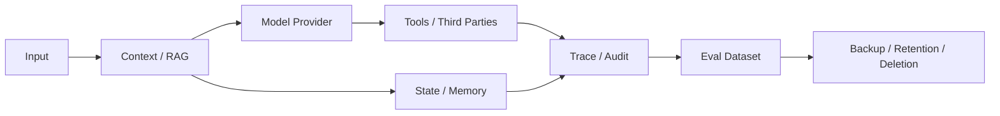

# 03 · 身份委派、最小权限与 Confused Deputy

Resolution Desk 已能识别不可信内容，但“模型没有被注入”并不等于它有权行动。浏览器带着客服 Session 调用 Application Server，Runtime 代表客服规划，Executor 再以受限凭证调用订单与支付服务；每一跳都必须保留原始 actor、tenant、resource、action 和 purpose。

如果这条委派链被压缩成一个共享 API Key，资源服务只能看到“某个高权限 Agent 在调用”，却无法回答原始用户是谁、为什么调用、获准操作哪个资源。这种有能力但缺少正确上下文的代理，容易成为混淆代理（Confused Deputy）。

## 1. 五个容易混淆的安全概念

| 概念             | 回答的问题                | 例子                                |
| -------------- | -------------------- | --------------------------------- |
| Authentication | 调用者是谁？               | 当前登录用户是 `user_42`                 |
| Authorization  | 调用者能否对该资源执行该动作？      | `user_42` 能否退款 `order_123`        |
| Delegation     | 某个服务代表谁、在什么范围和期限内行动？ | Runtime 代表 `user_42` 查询订单，有效 5 分钟 |
| Consent        | 数据主体是否同意特定处理或披露？     | 是否允许把附件发送给第三方模型服务                 |
| Approval       | 是否确认这一份具体提案？         | 批准对 `order_123` 退款 100 元          |

Approval 不能替代 Authorization。用户可能批准了一项自己无权执行的操作；反过来，某个操作在权限上允许，也可能因金额、风险或合规要求必须再次审批。

## 2. 三种“最小化”控制不同风险

- **Least Agency**：不需要模型决定的控制流由代码持有。固定查询可以用普通 API，就不引入开放式工具选择。
- **Least Privilege**：只授予当前 actor、resource、action 所需权限，并限制 audience、scope 与期限。
- **Least Disclosure**：只把当前步骤必需的数据交给模型、工具和第三方服务。

三者分别缩小自主决策面、执行能力面和数据暴露面。只做最小权限仍可能把整份客户档案送进 Context；只做最小披露也无法阻止 Agent 重复执行有副作用的动作。

## 3. 每次工具调用都应携带完整责任链

一个可审计的调用上下文至少包含：

```ts
type ExecutionContext = {
  actor: { userId: string; tenantId: string };
  delegate: { runtimeId: string; sessionId: string };
  action: string;
  resource: { type: string; id: string; version?: string };
  purpose: string;
  scopes: string[];
  approvalRef?: string;
  policyDecisionRef: string;
  expiresAt: string;
  traceId: string;
};
```

这些字段由认证与策略系统注入，不由模型填写。模型可以提出“查询订单”，但不能决定 `tenantId`、扩大 `scopes` 或生成一个可信的 `approvalRef`。

执行链上的每一层都只接受自己需要的最小信息：

```text
User
  └─ delegates a limited task to Agent Runtime
       └─ Runtime obtains a short-lived capability for Executor
            └─ Executor calls Resource Service
                 └─ Resource Service re-authorizes actor + resource + action
```

最终资源服务必须重新授权，因为它最了解当前资源归属、版本和业务前置条件。上游传来的 `authorized: true` 只是普通数据，不应成为永久通行证。

## 4. Confused Deputy 往往发生在“合法调用的组合”中

考虑两个工具：

- `readCustomerProfile`：内部客服允许读取部分客户信息；
- `sendWebhook`：集成服务允许向登记的合作方发送事件。

两次调用分别通过权限检查，并不代表组合后的数据流合法。若 Runtime 把客户档案发送到攻击者控制的 Webhook，问题不在单个工具的 Role，而在数据来源、目的地和 Purpose 不匹配。

策略层需要表达跨工具约束：

```text
customer_pii may flow to approved_crm_processor
customer_pii must not flow to arbitrary_public_endpoint
payment_credential must never enter model_context
tenant_A_data must not flow into tenant_B_tool_call
```

跨 Agent 委派同样如此。Parent Agent 应向 Child Agent 传递缩减后的 Capability 和原始 actor，而不是让 Child 继承 Parent 的全部权限。内部来源不是可信的同义词。

## 5. 隐私治理覆盖完整数据生命周期

Agent 的数据会经过比普通请求更长的路径：



每一跳都要定义用途、最小字段、访问者、第三方或地域边界、保留期和删除方式。以下派生物仍可能包含敏感信息：

- 文档 Chunk、Embedding 与向量索引；
- 模型生成的摘要、Context Snapshot 和 Memory Candidate；
- Tool Result、Trace Attribute 与错误栈；
- 生产失败回流形成的 Eval Case；
- Cache、导出文件和备份。

Embedding 不是自动匿名化；删除聊天记录也不代表这些派生物已经不可访问。

## 6. 删除是一条传播协议

删除请求需要转化为可跟踪的删除任务：

1. 定位 Source Record、Thread、Memory、Chunk、Vector、Cache、Trace、Eval 和第三方副本；
2. 先写 Tombstone 并阻断服务路径，避免异步物理删除期间继续命中；
3. 通知各存储层失效或删除，并记录版本与完成状态；
4. 对无法立即删除的备份说明保留期和恢复后的再删除流程；
5. 使用 Canary ID 做正向与反向查询，直到所有可服务副本均不可见。

删除任务本身也需要幂等和审计，避免部分失败后无法重跑。

## 7. 供应链也是委派链的一部分

模型、SDK、MCP Server、Skill、Prompt 模板、容器镜像、观测平台和 Eval 数据集都能影响系统行为。治理措施至少包括：

- 固定版本并记录来源与完整性；
- 对 Tool Schema、Skill 脚本和策略变更执行 Code Review；
- 为外部 MCP Server 使用独立、最小权限的凭证；
- 对新增数据出境和网络目标进行审批；
- 保留快速撤销凭证、禁用工具与回滚版本的路径。

## 实践：收紧 Resolution Desk 的退款委派链

### 进入本章时已有能力

Resolution Desk 已有来源标记、数据流策略和 Injection Fixture，但订单查询与 Mock 支付仍可能通过共享高权限凭证执行。

### 本章增加的能力

将每次 Tool Call 收敛为受限委派：可信 Session 注入 actor 与 tenant，Runtime 只传递当前任务所需 Scope，Executor 获取短期 audience-bound 凭证，订单与支付服务按当前资源版本重新授权。随后覆盖四条攻击路径：

1. 合法客服要求查询另一租户的订单；
2. 低权限 Runtime 将请求交给高权限 Worker；
3. 订单读取结果被发送到任意 Webhook；
4. 客户数据删除后仍从 Cache 或 Vector Index 命中。

### 验收证据

资源服务必须拒绝跨租户访问和扩大后的 Scope，数据流策略或执行环境必须阻断任意外发，删除 Canary 不能再被服务，Audit 只能保存最小引用但足以还原 actor、delegate、resource、purpose、Policy Decision 和最终结果。测试通过前，`commit_refund` 保持关闭。

## 本章小结

Agent 身份不是一个新的超级用户，而是一条受限委派链。Least Agency 控制模型决策范围，Least Privilege 控制可执行能力，Least Disclosure 控制数据暴露；资源服务的再次授权和跨工具数据流策略共同防止 Confused Deputy。下一章把这些边界组织成可承受单层失效的 [纵深防御与人类控制](/masterpiece-static-docs/08-安全与治理/04-纵深防御与人类控制.md)。

## 一手资料

- [NIST SP 800-207 Zero Trust Architecture](https://csrc.nist.gov/pubs/sp/800/207/final)
- [MCP Security best practices](https://modelcontextprotocol.io/docs/tutorials/security/security_best_practices)
- [RFC 8707 Resource Indicators](https://www.rfc-editor.org/rfc/rfc8707.html)
- [NIST Privacy Framework](https://www.nist.gov/privacy-framework)
