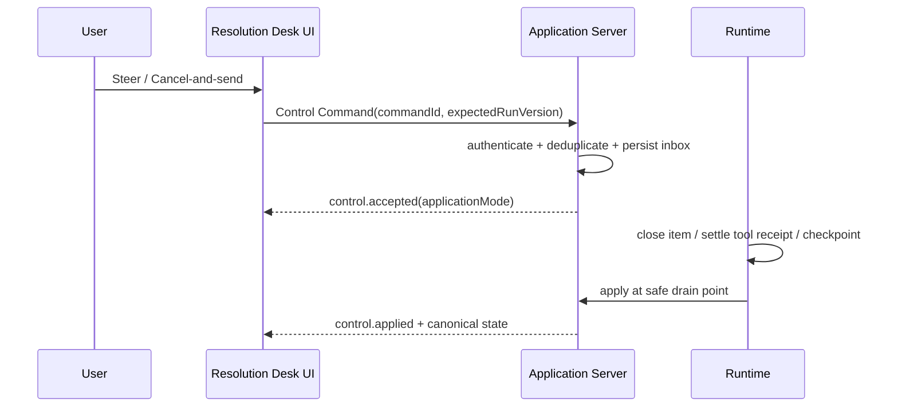

# Agentic UI 03 · Agent UX 与可控交互

上一章已经让 Resolution Desk 通过 AG-UI Adapter 传递运行、消息、Tool 与 State Event。事件能够抵达浏览器之后，下一个问题不是怎样增加动画，而是怎样把服务端事实投影成可信界面：用户必须看清正在处理的对象、金额、依据、资源版本和外部效果，模型生成的文案不能伪造 Approval，也不能决定哪些按钮可用。

支付请求发出后若网络中断，用户再点击停止，前端最容易犯的错误是立刻显示“退款已取消”。实际上，Runtime 只确认收到了停止意图，尚不知道支付系统是否已经提交退款。

Agent UX 不只是聊天气泡、流式文字和 Loading 动画。它是持久 Runtime 状态的产品化投影：展示已经确认的事实、仍然未知的部分、当前责任人，以及在这一状态下真正合法的操作。运行中的输入也不能只有“发送”或“停止”两个极端；排队追问、不中断引导、取消后发送和旁路提问各自需要独立语义。

本模块前四章已经建立 Threat Model、Prompt Injection 防线、最小权限与纵深防御边界。本章把这些约束投影为用户能够理解和控制的界面语义；下一章用 A2UI 实现低风险动态 Surface，第 07 章再通过攻击链与 Red Team 验证整套交互是否守住边界。任何高风险动作在安全门禁和评测通过前都只能停留在 Dry Run。

## 1. 从传统请求状态升级为任务状态

前端常见的 `idle / loading / success / error` 不足以表示长任务和外部副作用。一个退款 Run 可能经历：

| Public Run State                     | 用户可见含义                   | 合法操作                       |
| ------------------------------------ | ------------------------ | -------------------------- |
| `planning`                           | 正在检索政策或形成下一步计划，尚未冻结高风险提案 | 排队追问；能力允许时引导当前 Run；旁路提问；停止 |
| `waiting_input`                      | 政策来源冲突，需要确认适用版本          | 补充信息、选择来源、停止               |
| `waiting_approval`                   | 退款提案已经冻结，等待有资格的人批准       | 批准、拒绝、返回修改                 |
| `executing_tool`                     | 正在向支付系统提交                | 请求停止后续工作、查看详情              |
| `cancel_requested`                   | 已收到停止意图，正在中止未开始的工作       | 查看状态；不承诺撤销在途动作             |
| `in_doubt` / `reconciling`           | 外部效果尚未确认，或正在查询权威状态       | 等待核对、联系人工；不开放普通 Retry      |
| `completed_with_effect_after_cancel` | 退款已发生，停止请求晚于提交           | 查看回执、申请后续处理                |
| `manual_intervention`                | 自动核对到期，已有明确人工责任人         | 补充材料、查看处理期限                |

这张映射表是前后端契约。文案可以调整，状态含义不能由组件局部改写。

## 2. UI 消费的是 Public Run State

内部状态机可能包含很多运维细节，前端需要稳定的公开投影。本节直接复用[Agent Application Server 与 UI 事件协议](/masterpiece-static-docs/05-模型接口与Agent内核/09-Agent-Application-Server与UI事件协议.md)定义的 `RunSnapshot`、`UIState`、`RunEvent`、`PublicRunState`、`EffectStatus` 与 `PublicControl`，不再建立第二套状态协议。

```ts
type UXProjection = {
  run: UIState;
  goal: string;
  currentStep?: string;
  evidence: EvidenceSummary[];
  pendingRequests: PendingReverseRequest[];
  pendingControls: Array<{
    commandId: string;
    kind: ControlKind;
    phase: "submitting" | "accepted" | "applied" | "rejected";
  }>;
  nextAction?: string;
};
```

`UXProjection` 只补充目标、证据、未决请求和控件提交阶段等展示数据。权威状态仍来自 `run.state`，外部效果来自 `run.effectStatus`，合法控件来自 `run.availableControls`；模型不能决定这些字段。`submitting` 是以 `commandId` 关联的本地瞬时阶段，其他阶段来自服务端事实。刷新页面、切换设备或断线重连后，客户端从 Snapshot 与后续 Event 重建同一视图，而不是从本地聊天记录猜测。

前端还要保留三类数据的视觉边界：

| 数据类别                                        | UI 表达                            | 可以决定什么                     |
| ------------------------------------------- | -------------------------------- | -------------------------- |
| 持久可重放（Durable / Replayable）Event 与 Snapshot | Timeline、Pending Inbox、最终消息、控件状态 | 业务状态和恢复基线                  |
| 瞬时实时（Transient / Live-only）Signal           | “正在生成”的草稿、活动脉冲、当前连接质量            | 只改善实时反馈；不得决定成功、审批或队列       |
| 内部持久化（Internal / Persistence-only）Record    | 默认不展示；必要时投影为脱敏运维状态               | Runtime 恢复、租约和重试，不直接成为产品事实 |

实时文本在闭合前应有明确的“生成中”样式。收到 `item.completed` 后，客户端用服务端最终文本替换草稿；刷新后实时草稿消失是允许的，最终消息和未决操作消失则是协议缺陷。

## 3. Streaming 不是 Progress

持续输出 Token 只能证明模型仍在生成，不能说明任务完成了多少。有效进度应来自可验证阶段，例如：

- 已检索 3 个获准来源，1 个来源因过期被排除；
- 退款资格判断已完成，正在生成不可变提案；
- 提案已获批准，支付 Command 已提交；
- ACK 未收到，正在按幂等键查询 Receipt；
- 自动核对将于 10 分钟后转人工。

避免展示伪精确的“完成 73%”，除非工作量确实可以确定性计算。对开放式研究任务，更诚实的表达是阶段、已完成项、未决问题和剩余预算。

## 4. Preview 与 Approval 必须引用同一份提案

审批前的 Preview 应来自持久 Proposal，而不是临时自然语言摘要：

```text
actor: user_42
order_id: order_123
amount_minor: 10000
currency: CNY
policy_version: refund-policy-2026-07
resource_version: 42
proposal_hash: sha256:...
expires_at: 2026-07-12T14:30:00+08:00
```

界面需要展示对象、精确参数、依据、数据去向、费用、可逆性、资源版本和有效期。审批后任一关键字段变化，Runtime 应生成新 Proposal 并重新审批。前端不能用旧 Modal 的“已同意”状态替新参数背书。

## 5. 每个按钮先提交 Command，再等待事实

| 控件                   | Command 意图                                         | 服务端接受后可见事实                                    | 明确不保证                                       |
| -------------------- | -------------------------------------------------- | --------------------------------------------- | ------------------------------------------- |
| Queue follow-up      | 当前回合自然结束后处理新输入                                     | `control.accepted` + 持久队列位置                   | 立即改变当前生成                                    |
| Steer without cancel | 在同一 Run 的下一个安全边界注入指令                               | `control.accepted`，随后是 `control.applied`      | 在 Token、半段 JSON 或在途副作用中间插入                  |
| Stop / Cancel        | 停止尚未开始的后续工作                                        | `cancel_requested`                            | 已提交的外部效果被撤销                                 |
| Cancel-and-send      | 原子保存 Cancel Intent 与替代输入                           | 一个接受回执，随后在安全排空点应用                             | Transport 断开等于安全取消                          |
| Side question        | 针对指定 Snapshot 启动只读子 Run                            | `control.applied` 关联 `childRunId`             | 修改父 Run、解决父 Approval                        |
| Edit & Retry         | 提交 `edit_and_retry`，保留旧 Attempt 并请求带替代输入的新 Attempt | `control.accepted / applied` + 新 Attempt      | 覆盖旧失败证据                                     |
| Resume               | 提交 `resume`，请求 Runtime 从 Durable Checkpoint 继续     | `control.accepted / applied` + 恢复后的 Run State | 用 Public Snapshot 恢复执行，或绕过过期审批、权限与 Deadline |
| Retry failed step    | 提交 `retry_safe`，请求 Runtime 计算安全重试路径                | 重试已接受或拒绝                                      | 前端直接重复写 Command                             |

Command 至少携带 `commandId`、actor、`runId`、目标版本与时间。前端可以乐观显示“正在提交”，但必须等 Runtime 追加接受事件后才能改变业务状态。网络超时后使用同一 `commandId` 查询或重试，不能生成新 ID 后重复排队。

Public Snapshot 是浏览器恢复显示状态的基线，Durable Checkpoint 才是 Runtime 恢复执行的基线。Resume Command 只表达恢复意图；服务端必须重新检查 Checkpoint 兼容性、Fencing、权限、审批、Deadline、预算和未知 Effect，客户端不得回传一份 Snapshot 让 Runtime 据此继续。

```ts
type ControlSubmission =
  | {
      phase: "submitting";
      commandId: string;
      kind: ControlKind;
    }
  | {
      phase: "accepted";
      commandId: string;
      kind: ControlKind;
      applicationMode: ControlApplicationMode;
    }
  | {
      phase: "applied";
      commandId: string;
      kind: ControlKind;
      childRunId?: string;
      attemptId?: string;
      resumedFrom?: "durable_checkpoint";
    }
  | {
      phase: "rejected";
      commandId: string;
      kind: ControlKind;
      reasonCode: string;
    };
```

界面文案必须区分“已收到”和“已生效”。例如 Steer 可先显示“引导已排队，将在当前工具返回后应用”，而不能立即改写当前步骤标题；Cancel-and-send 可显示“停止请求和新输入已保存，正在等待安全边界”，而不能先清空 Timeline。

### 5.1 运行中的 Composer 必须显示发送方式

运行空闲时，Enter 可以开始新输入；Run 活跃时，默认行为必须固定并可见，不能随状态悄悄改变。Resolution Desk 采用以下产品语义：

- Enter 默认 Queue follow-up，输入框上方显示当前队列位置。
- “引导当前任务”显式提交 Steer；只有 `availableControls` 包含 `steer` 时出现。
- “停止并发送”显式提交 Cancel-and-send，并展示它不能撤销在途退款。
- “旁路提问”打开独立面板，标注答案基于哪个 `snapshotSeq`。
- 单独的 Stop 只提交 Cancel Intent，不自动发送输入框草稿。

键盘快捷键和按钮必须落到同一个命令注册表（Command Registry），命令面板、辅助技术标签和确认文案也从同一语义定义派生。高风险或不可逆动作不能借用普通 Enter 手势。

### 5.2 Side Question 是隔离协作，不是隐藏 Steer

用户可能在退款核对过程中问“为什么采用 2026-07 版政策？”。旁路问题应固定当前公开 Snapshot 和获准证据，创建有预算、只读的子 Run。它可以解释当前状态，但不得：

- 写入父 Run 的 Context、输入队列或 Proposal；
- 批准、拒绝或延长 Pending Approval；
- 调用产生外部副作用的 Tool；
- 把父 Run 后续产生的新事实伪装成提问时已经存在。

父 Run 的 `upToSeq` 超过问题的 `snapshotSeq` 后，界面应显示“回答基于较早状态”，并允许用户重新提问。是否把旁路问答保留到审计 Timeline 是产品策略；只要它跨刷新可见，就必须拥有独立持久记录，不能只放在组件内存中。

### 5.3 安全排空点（Safe Drain Point）决定控制何时生效



安全排空点至少要求结构化 Item 已闭合、下一外部 Command 尚未派发、在途效果已有 Receipt 或进入核对状态，以及命令收件箱（Command Inbox）与 Checkpoint 已持久化。UI 应把等待原因说清楚；“不立刻打断”是完整性保证，不是系统失去响应。

### 5.4 Pending Reverse Request 是持久工作项

补充输入和 Approval 都是 Runtime 发给人的 Reverse Request。界面应为每个请求展示：

- 稳定 `requestId`、类型、发起时间、截止时间和当前责任人；
- 它绑定的 Run、Proposal Hash、资源版本或响应 Schema；
- 是否已被其他设备或其他审批人解决；
- 过期、权限变化和 Proposal 变化后的失效原因。

Pending Inbox 从 Public Snapshot 重建，不能依赖发起请求时的浏览器连接。两个客户端同时提交时，服务端按 Request Version 做比较并交换（Compare-and-Swap）；失败的一端显示“已由其他人处理”，不能覆盖获胜决策。

### 5.5 多客户端只共享服务端确认状态

每个客户端可以保留以 `commandId` 关联的本地“正在提交”，但队列位置、审批结果和 Run 状态只从 Canonical `seq` 更新。Live Signal 使用单独的 Stream Offset，只影响当前设备的生成草稿。出现领域序号缺口时，客户端停止应用后续事实并获取 Snapshot；出现实时 Offset 缺口时，只丢弃该草稿并等待闭合 Item。

一个纯 Reducer 先调用前章定义的 `applyEvent` 更新 canonical `UIState`，再派生展示字段：

```ts
function reduceUXProjection(
  view: UXProjection,
  event: RunEvent,
): UXProjection {
  const run = applyEvent(view.run, event);

  if (run.sync === "gap") {
    return { ...view, run };
  }

  return deriveUXProjection({ ...view, run });
}
```

`applyEvent` 使用 `event.seq` 与 `run.nextSeq` 实现重复 Event 去重和序号缺口检测；`sync: "gap"` 会触发 Snapshot 恢复。Reducer 不在断线时自行重新调用模型，也不根据 HTTP 状态猜业务终态。

## 6. 可解释性来自证据，不来自原始 Chain-of-Thought

用户通常需要看到：

- 当前目标与适用的规则版本；
- 采用、排除和冲突的来源；
- 模型提出的候选动作与确定性校验结果；
- 审批人、审批范围与有效期；
- 已执行工具、外部 Receipt 和真实 Outcome；
- 仍未知的事实、下一责任方和人工入口。

这些信息比原始 Chain-of-Thought 更稳定，也更适合审计。UI 应在视觉上区分权威事实、引用证据、模型推断和未知状态，避免用一个“置信度 92%”掩盖来源冲突。

## 7. 错误恢复是主流程，不是 Toast

复杂 Agent 应用通常需要聊天之外的任务工作台：

- **Timeline**：展示 Run、Item、Tool、Approval 与 Receipt；
- **Pending Inbox**：集中等待输入、审批和人工接管的任务；
- **Artifact View**：展示报告、Diff、表单或结构化结果；
- **Recovery View**：解释失败位置、已发生效果和安全重试路径；
- **Notification**：长任务离开页面后，在需要人时重新通知。

一次性错误提示（Toast）无法承载“结果未知、自动核对中、十分钟后转人工”这类长期状态。

命令收件箱也属于恢复视图：接受但尚未应用的 Follow-up、Steer 或 Cancel-and-send 必须在刷新后继续出现。若 Runtime 因状态变化拒绝它，界面展示稳定 `reasonCode` 和可采取的下一步，而不是让输入静默消失。

## 实践：为 Resolution Desk 实现可信退款界面

### 进入本章时已有能力

Resolution Desk 已有 Canonical `RunSnapshot + RunEvent`、AG-UI Adapter 和可恢复的前端投影，能够展示 Proposal 与 `waiting_approval`；前四章也已经建立 Authorization、Approval 与外部副作用门禁。当前 UI 仍可能把模型文本、HTTP 状态和本地按钮状态误当作领域事实，第 07 章会把这些交互纳入完整攻击链与 Red Team 验证。

### 本章增加的能力

基于 `RunSnapshot + RunEvent + LiveRunSignal` 实现等待补充信息、等待审批、执行中、停止请求已收到、效果核对中、已转人工六个界面，并为运行中 Composer 增加 Queue follow-up、Steer、Cancel-and-send 和 Side Question。每个界面必须注明：

1. 对应的 Runtime 状态和 Snapshot 字段；
2. 已确认事实与仍未知内容；
3. 当前控件提交的 Command，以及服务端接受后对应的 Event；
4. 每个控件明确不保证的事项；
5. 刷新和断线后如何恢复相同视图。
6. Live-only 草稿与规范终态（Canonical Terminal State）如何区分。
7. Command 处于提交、接受、应用或拒绝中的哪一阶段。

退款 Preview 与 Approval 必须由原生可信组件渲染服务端保存的 Proposal；组件从 `availableControls` 获取合法操作，不接受模型生成的金额、权限结论或按钮配置。A2UI Surface 可以收集低风险澄清信息或触发旁路提问，但其 Action 只能形成不可信 Command Intent，不能生成 Approval Fact。本章只实现可信 UI，并用 Dry Run 验证合法 Approval 能推进到 `command_ready`；Mock `commit_refund` 仍不向常规业务 Run 开放，直到 [Agent 安全评测与 Red Team](/masterpiece-static-docs/08-安全与治理/07-Agent安全评测与Red-Team.md)及其前置安全门禁全部通过。

### 验收证据

用同一组 Snapshot/Event Fixture 验证刷新、重复 Event、领域序号缺口、Live Offset 缺口、Proposal 过期、审批后订单版本变化、模拟的未知效果和用户 Stop。再用两个客户端并发测试重复 Follow-up、Steer 等待安全边界、Cancel-and-send 崩溃恢复、同一 Approval 竞争和旁路回答过期标记。界面必须恢复到服务端同一状态，旧审批不能继续使用，效果未知时不得显示失败、取消或成功，实时草稿丢失不能污染最终消息。若某个界面无法映射到持久状态，或高风险 Approval 可由模型/A2UI Payload 生成，本章验收失败；全部通过后，合法原生 Approval 也只能在 Dry Run 中到达 `command_ready`，不能产生 Mock Receipt。

## 本章小结

Agent UX 是 Runtime 的诚实投影，而不是对模型输出的装饰。Resolution Desk 的退款 Preview 与 Approval 固定由原生可信 UI 承担；状态、证据和控制项都来自服务端事实。Queue follow-up、Steer、Cancel-and-send 和 Side Question 通过幂等 Command、安全排空点与持久回执协作，多客户端只共享服务端确认状态。下一章进入 [Agentic UI 04：A2UI 与声明式生成界面](/masterpiece-static-docs/08-安全与治理/06-A2UI与声明式生成界面.md)，为低风险澄清与证据收集增加一个受控的动态 Surface。

## 一手资料

- [Guidelines for Human-AI Interaction](https://www.microsoft.com/en-us/research/publication/guidelines-for-human-ai-interaction/)
- [People + AI Guidebook](https://pair.withgoogle.com/guidebook/)
- [NIST AI Risk Management Framework](https://www.nist.gov/itl/ai-risk-management-framework)
