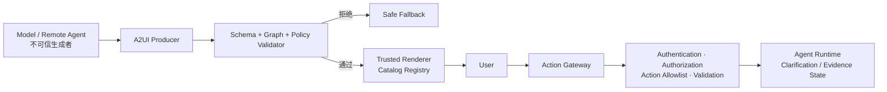
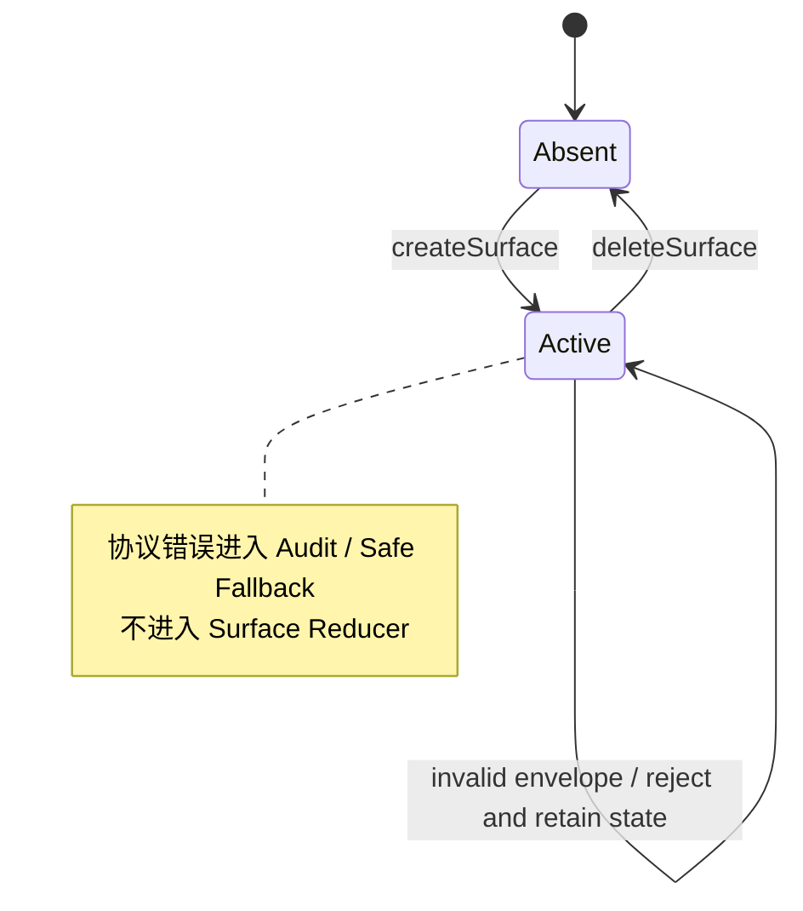
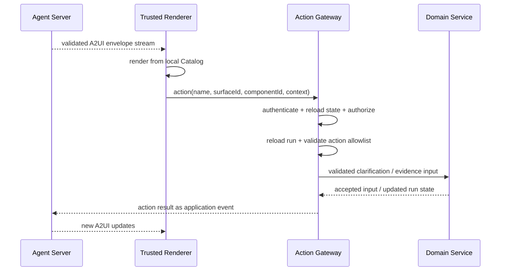

# Agentic UI 04 · A2UI 与声明式生成界面

让模型直接返回一段 JSX 或 HTML，再交给浏览器执行，能够很快做出“生成式界面”演示。它也同时把代码生成、DOM 注入、网络访问和业务动作放进了同一条不可信链路：模型可能生成 `<script>`、事件处理器、危险 URL、隐藏表单，或让一个看似普通的按钮直接调用高权限接口。即使移除 `<script>`，动态组件加载、`dangerouslySetInnerHTML`、CSS 覆盖和未经校验的点击回调仍然可以扩大攻击面。

Agent-to-User Interface（A2UI）协议采用另一种边界：Agent 只发送声明式 JSON，客户端只用预先注册的原生组件渲染。模型决定“从获准的组件中如何组合界面”，应用仍然决定“哪些组件存在、每个属性怎样解释、哪些动作可以执行”。这与前端熟悉的 Schema 驱动表单相似，但增加了流式生成、渐进渲染、跨端 Catalog 和 Agent Action 等协议对象。

Resolution Desk 必须实现至少一个受控 A2UI Surface，用于低风险的补充信息或证据选择，例如让客服确认退款原因、选择需要核对的政策片段。退款 Preview、Approval 与提交始终由固定的原生可信 UI 和专用服务端 Command 承担；任何 A2UI Surface 都不能创建、批准或执行退款。

> 版本核验日期：2026-07-19。本章以 A2UI `v0.9.1`（Current Production）为实现基线；`v1.0` 仍处于 Candidate 阶段。同时，官方仓库 README 仍将整个生态标记为 Early Stage Public Preview。因此，“Current Production”只表示当前推荐的协议基线，不代表实现和 Renderer 已经没有破坏性变更风险。v1.0 增加的 `actionResponse`、`callFunction` / `functionResponse` 等双向 RPC 能力不属于本章的 v0.9.1 Contract。升级前必须重新核对规范状态、迁移指南和 Renderer 兼容性。

## 本章目标

- 理解 Surface、Catalog、Component adjacency list 与 Data Model 的职责。
- 掌握 v0.9.1 的四类 Server-to-Client Envelope 和独立 Action 返回通道。
- 区分 A2UI payload 与 AG-UI、A2A、MCP、SSE 等承载协议。
- 比较固定 Tool Result 组件、A2UI 声明式 Catalog 与 MCP Apps 沙箱应用三种 Generative UI 模式。
- 建立 Schema、Catalog、数据、URL、富文本、Action 与可访问性校验。
- 用录制的 JSONL Fixture 实现一个可验证的 TypeScript Renderer 边界。

## 1. Generative UI 的三种工程模式

Generative UI 不是一种单一协议。当前工程实践中常见的三种模式，分别把界面控制权放在产品前端、声明式协议和外部 MCP Server：

| 模式                 | 界面结构由谁决定                                                | 运行形态                                                                         | 适用场景与主要边界                                                                              |
| ------------------ | ------------------------------------------------------- | ---------------------------------------------------------------------------- | -------------------------------------------------------------------------------------- |
| Tool Result → 固定组件 | 应用预先编写组件，模型只选择 Tool 并生成参数；前端把类型化结果映射到对应组件               | AI SDK UI 一类实现通常从 Tool Part 的状态与结果渲染本地 React/Vue/Svelte 组件                   | 控制力最强，适合稳定工作流和可信产品界面；高风险 Approval 仍应读取 Canonical State，不能把未经确认的 Tool Result 当作领域事实     |
| A2UI 声明式 Catalog   | Agent 在客户端声明的 Catalog 内组合 Component、Data Model 与 Action | JSON/JSONL 经 Schema、Graph 与 Policy 校验后，由本地 Trusted Renderer 渲染原生组件           | 动态性与控制力平衡，适合澄清表单、证据列表和跨端界面；必须限制 Catalog、资源、Action 与数据回传                                |
| MCP Apps 沙箱应用      | MCP Server 提供完整 HTML/JavaScript UI Resource             | Host 在沙箱化 `iframe` 中渲染，应用通过 `postMessage`/JSON-RPC Bridge 与 Host、MCP Tool 通信 | 封装能力最强，适合第三方图表、Dashboard 和多步骤工具界面；必须依赖 Sandbox、Permission、CSP、Bridge Policy 与 Host 兼容性 |

这三种模式不是从“初级”到“高级”的替换关系。固定组件让产品拥有最大的视觉与行为控制，A2UI 让 Agent 在受限语言中动态组合界面，MCP Apps 则隔离一个由外部 Server 拥有的完整应用；它执行的是宿主按策略加载的 UI Resource，不是把模型临时生成的任意 HTML 注入父页面。AG-UI 位于另一条轴上：它提供 Agent↔UI 的双向运行时连接，可以承载 A2UI 等 Generative UI Payload，但本身不定义生成式界面结构。

Resolution Desk 同时使用前两种模式：退款 Preview 与 Approval 固定为原生组件，澄清或证据收集使用 A2UI。MCP Apps 作为外部 MCP Server 需要交付完整交互界面时的对照模式，不进入退款授权链路。

## 2. A2UI 把“生成代码”改成“生成受限数据”

两种设计的责任边界完全不同：

```text
危险链路：Model → JSX / HTML / JavaScript → Browser executes

A2UI 链路：Model → declarative JSON → validate → allowed Catalog
          → local component implementation → native UI
```

A2UI 降低了任意代码执行的风险，但它不是自动安全机制。声明式数据仍可能包含钓鱼文案、敏感字段、恶意 URL、超大组件图或高风险 Action。真正的安全边界由应用实现：



Catalog 只是缩小协议可以表达的范围，Validator 和 Action Gateway 才负责把限制落实为运行时不变量。

## 3. 四个核心对象

### Surface：一块独立的渲染区域

Surface 是一棵声明式 UI 树及其 Data Model 的生命周期容器。`surfaceId` 在当前生成式 UI Session 中标识它；`catalogId` 指定该 Surface 允许使用的组件与函数集合。

Surface 创建后，`surfaceId` 与 `catalogId` 固定。若要更换 Catalog，应先删除再重建，而不是让流中的一条更新偷偷扩大能力。每个组件树必须恰好有一个 `id: "root"` 的根节点。

### Catalog：Renderer 接受的能力清单

Catalog 定义可用 Component、Function、Theme 以及每种对象的 JSON Schema。它不是供 Agent 下载并执行的前端 Bundle；即使 `catalogId` 采用 URI 风格，它在 v0.9.1 中也只是双方约定的标识符，不保证能够解析为网络资源。

生产客户端应把 Catalog 映射到本地、固定版本的实现：

```ts
const catalogRegistry = new Map([
  ["urn:resolution-desk:a2ui:evidence-intake:1", evidenceIntakeCatalogV1],
]);

function resolveCatalog(catalogId: string): TrustedCatalog {
  const catalog = catalogRegistry.get(catalogId);
  if (!catalog) throw new Error("UNSUPPORTED_CATALOG");
  return catalog;
}
```

v0.9.1 的 Inline Catalog 方向是 Client / Renderer 通过 Capability Metadata 提供给 Agent，而不是 Agent 把组件实现下发给 Renderer。Client 只有在 Agent 明确声明 `acceptsInlineCatalogs: true` 时才应发送，并且默认仅提供经审核、固定 ID 的 Schema 定义。无论是否启用 Inline Catalog，Renderer 都只能映射到本地预注册组件，不能根据 `catalogId` 或 Catalog 内容动态 `import()` 远程代码。

### Component adjacency list：用扁平列表表达 UI 树

A2UI 不要求 Agent 一次生成深层嵌套 JSON。`updateComponents` 发送扁平 Component 列表，容器通过 Component ID 引用子节点，形成邻接表（Adjacency List）：

```json
{
  "id": "root",
  "component": "Column",
  "children": ["title", "submit"]
}
```

```json
{
  "id": "title",
  "component": "Text",
  "text": { "path": "/clarification/title" }
}
```

这种表示适合 Streaming：`root` 可以先引用尚未到达的 `title`，Renderer 暂存引用并显示 Placeholder，后续消息再补齐节点。代价是客户端必须验证：

- 根节点是否唯一；
- Component ID 是否重复或覆盖了不兼容类型；
- 子引用是否最终存在；
- 图中是否存在环、过深路径或过多节点；
- 自定义 Catalog 的结构字段是否使用规范的 `ComponentId` / `ChildList` 类型，使 Validator 能识别引用关系。

### Data Model：结构之外的可绑定状态

Data Model 与组件结构分离。Component 属性既可以是 Literal，也可以通过 JSON Pointer 绑定数据：

```json
{
  "id": "amount",
  "component": "Text",
  "text": { "path": "/clarification/question" }
}
```

输入组件可以在客户端进行 Two-Way Binding。用户输入会立即更新本地 Data Model，但不会因每次按键自动发起网络请求；只有发生显式 Action 时，选定的 Context 或启用的 Data Model 才通过 Transport 返回服务端。

Data Model 是界面状态，不是领域事实源。订单事实、政策版本、退款金额、权限和 Proposal 仍应由服务端保存；客户端回传的澄清答案和证据选择一律作为不可信输入重新校验。

## 4. v0.9.1 的四类 Server-to-Client Envelope

A2UI v0.9.1 的每条 Server-to-Client 消息都是一个 JSON Envelope。除 `version` 外，它必须且只能包含以下四种消息之一：

| Envelope           | 作用                          | 关键不变量                       |
| ------------------ | --------------------------- | --------------------------- |
| `createSurface`    | 创建 Surface，确定 Catalog 与选项   | 先于该 Surface 的更新；同 ID 不可重复创建 |
| `updateComponents` | Upsert 一组扁平 Component       | 只使用当前 Catalog；结构引用接受图验证     |
| `updateDataModel`  | 在 JSON Pointer 路径替换、插入或删除数据 | 路径、大小、类型和敏感级别受策略约束          |
| `deleteSurface`    | 删除 Surface、组件与本地数据          | 删除后旧 Action 和更新全部失效         |

最小流可以写成 JSONL，每一行都是一条完整消息：

```json
{"version":"v0.9.1","createSurface":{"surfaceId":"evidence_clarification","catalogId":"urn:resolution-desk:a2ui:evidence-intake:1","sendDataModel":false}}
{"version":"v0.9.1","updateComponents":{"surfaceId":"evidence_clarification","components":[{"id":"root","component":"Column","children":["title","submit"]},{"id":"title","component":"Text","text":{"path":"/clarification/title"}},{"id":"submit","component":"Button","child":"submit_label","action":{"event":{"name":"submit_clarification","context":{"caseId":{"path":"/clarification/caseId"},"evidenceId":{"path":"/clarification/selectedEvidenceId"}}}}},{"id":"submit_label","component":"Text","text":"提交补充信息"}]}}
{"version":"v0.9.1","updateDataModel":{"surfaceId":"evidence_clarification","value":{"clarification":{"caseId":"case_42","title":"确认本次售后原因与适用证据","selectedEvidenceId":"policy_2026_07"}}}}
```

`updateDataModel.path` 省略或为 `/` 时替换完整 Data Model；指定路径时替换该位置，不带 `value` 时删除对应 Key。实现时必须固定这些 Upsert / Delete 语义，不能让不同 Renderer 各自猜测。



流式到达不代表未经校验的消息可以先渲染。每条 Envelope 都应先通过协议 Schema、选定 Catalog 的 Schema 和应用策略，再进入 Surface Reducer。

## 5. Action 走独立的返回通道

在 v0.9.1 中，渲染流是 Server → Client 的单向消息流。交互组件可以声明 Server Action；用户触发后，Client 通过 Transport 提供的独立返回通道发送 `action`：

```ts
type A2UIAction = {
  name: string;
  surfaceId: string;
  sourceComponentId: string;
  timestamp: string;
  context: Record<string, unknown>;
};
```



Action 是用户意图，不是执行授权。服务端至少要重新确认：

1. Actor Identity 来自可信 Session，而不是 Action Context；
2. Surface 仍然存在，Component 仍允许该 Action；
3. Context 通过 Schema 与领域校验，且没有越权字段；
4. Actor 对当前 Resource 仍有 Authorization；
5. Action 名称在该 Catalog 的低风险 Allowlist 中；退款审批、提交或权限变更一律拒绝；
6. 重复点击按同一输入意图幂等归并，不产生重复状态转移。

Resolution Desk 的 Action Allowlist 只包含 `submit_clarification`、`select_evidence` 和 `dismiss_surface` 等低风险事件。用户进入 `waiting_approval` 后，A2UI Surface 必须退出主交互区，固定原生组件从服务端读取不可变 Proposal 并提交 Approval。即使 A2UI Payload 伪造 `approve_refund`、`commit_refund` 或正确的 Proposal Hash，Action Gateway 也必须拒绝。

本地 `functionCall` 同样只能调用 Catalog 中注册的纯函数或受控平台函数。`openUrl`、剪贴板、文件选择和导航都具有安全影响，不能因为“不经过服务端”就跳过策略。

## 6. A2UI 是 Payload Protocol，不绑定 Transport

A2UI 定义 JSON 消息与 Renderer 语义，不规定消息必须怎样传输。承载层至少需要提供：

- 有序交付，否则 `updateComponents` 可能先于 `createSurface`；
- 清晰 Framing，例如 JSONL 行、WebSocket Frame 或 SSE Event；
- Metadata，用于 Catalog Capability、Client Capability 与可选 Data Model 同步；
- 交互场景下的 Client → Server 返回通道。

A2UI v0.9.1 的标准 MIME 标识是 `application/a2ui+json`。承载层应保留该标识，Renderer 在解析前同时校验 MIME、Envelope `version` 与 Catalog ID。MIME 字段在 A2A 等不同版本 Wire Shape 中的具体位置可能不同，该差异属于 Transport Adapter，不应泄漏到 Surface Reducer。

因此，A2UI 可以由不同协议承载：

| 承载方式                                   | 负责什么                                      | A2UI 仍负责什么                                     |
| -------------------------------------- | ----------------------------------------- | ---------------------------------------------- |
| AG-UI（Agent–User Interaction Protocol） | Agent 与前端之间的运行、消息、工具、状态事件                 | 声明式 Surface、Component、Data 与 Action 描述         |
| A2A（Agent2Agent Protocol）              | 独立 Agent 系统之间的消息、任务与 Metadata             | 作为 Message Part 中的 UI Payload                  |
| MCP（Model Context Protocol）            | Tool / Resource 等能力连接                     | 作为 Tool Output 或 Resource 更新中的 UI Payload      |
| SSE（Server-Sent Events）                | HTTP 上的单向事件 Framing；应用另定义 Cursor / Replay | 每个 Event 内的 A2UI Envelope；Action 另走 POST / RPC |

A2UI 不等于 AG-UI。前者回答“界面由哪些受限组件和数据构成”，后者回答“Agent Runtime 与 UI 之间发生了哪些事件”。AG-UI 可以承载 A2UI，但采用其中一个不代表自动获得另一个的状态、重放或安全语义。

Transport 还必须补齐 Authentication、Authorization、顺序恢复、去重、保留期和 Backpressure。A2UI 的 `version` 或 `surfaceId` 不能替代应用层 `seq`、Snapshot 和 Event Store。

## 7. Renderer 的六层校验

### 7.1 Schema 与版本必须在渲染前验证

TypeScript 类型只约束编译期，网络输入必须使用 v0.9.1 官方 JSON Schema 和选定 Catalog Schema 做运行时校验。验证链至少包含：

```ts
function acceptEnvelope(raw: unknown, session: RenderSession): Envelope {
  enforceByteLimit(raw, 256_000);
  const envelope = validateV091Envelope(raw); // exactly one message kind
  assert(envelope.version === "v0.9.1");

  const surface = findTargetSurface(envelope, session);
  const catalog = resolveCatalogFor(envelope, surface);
  catalog.validate(envelope);
  validateGraphAndLimits(envelope, session, catalog);
  validateContentPolicy(envelope, catalog.policy);

  return envelope;
}
```

除了 Schema，还要限制 Envelope 大小、单次更新节点数、总节点数、树深、引用数、字符串长度、Data Model 大小、更新频率和校正重试次数。合法 JSON 也可能造成内存或渲染线程耗尽。

### 7.2 Catalog 是 Allowlist，不是插件市场

Renderer 只能实例化本地注册的 Component Factory 与 Function。未知 `catalogId`、未知组件、未知函数和不兼容版本都应拒绝或降级，不能透传成 DOM Tag、React Component Name 或动态模块路径。

Catalog Schema 还应禁止“任意属性袋”。在 React 中将 Agent 属性直接 `{...props}` 展开到 DOM，可能重新引入事件处理器、危险 URL 或不受控 ARIA/CSS。组件适配器应逐字段转换。

### 7.3 Data Model 默认最小化

`createSurface.sendDataModel: true` 会让 Client 在后续 Client-to-Server 消息的 Metadata 中附带该 Surface 的完整 Data Model。即使规范要求只发给 Surface Owner，这仍然扩大了数据披露面。

生产默认值应为 `false`。优先在 Action Context 中显式选择最小字段；确需完整同步时，Data Model 不能包含 Token、密钥、跨租户数据、隐藏权限字段或不应回传的 PII，并且要限制目的、保留期与日志记录。服务端不得把回传 Data Model 直接写回领域数据库。

### 7.4 URL、资源与富文本需要 Sink Policy

Schema 能证明 URL 是字符串，不能证明它适合打开。Renderer 应：

- 只允许业务需要的 Scheme 与 Origin，拒绝 `javascript:`、`data:`、`file:` 等危险 Scheme；
- 对重定向、下载、深链和外部导航增加用户提示或确认；
- 通过受控 Image Proxy / Resource Gateway 处理远程图片，限制大小、Content Type 与跟踪参数；
- 服务端抓取 URL 时防御 Server-Side Request Forgery（SSRF）；
- 将普通文本作为 Text Node 渲染，不使用 `innerHTML`；
- Markdown 或富文本使用固定语法子集和成熟 Sanitizer，禁止 Raw HTML、Iframe、任意 SVG 与内联事件；
- 样式使用受限 Design Token，不接受任意 CSS、选择器或定位覆盖。

### 7.5 Action 必须在服务端重新执行 Authorization

按钮名称、`sourceComponentId`、Context、时间戳和 Data Model 全部可被伪造。Action Gateway 不能信任客户端传来的 `authorized: true`、金额、Tenant 或 Role，也不能让一个展示组件决定服务端 Tool 名称。

把 UI Action 映射到固定的低风险 Application Event，再复用前文的 Identity、Authorization 和当前 Run State 边界。Resolution Desk 不把退款 Approval 或 Command 注册进 A2UI Catalog；这两项操作只接受原生可信 UI 发出的专用请求，并在服务端重新读取 Proposal、Authorization 与资源版本。客户端校验只改善体验，不构成安全控制。

### 7.6 Accessibility 与 Fallback 由 Catalog 保证

可访问性（Accessibility，a11y）不能依赖模型每次都生成正确的 ARIA。Catalog 的原生组件应内建：

- 语义化元素、可访问名称与 Label 关联；
- 键盘操作、Focus 顺序、Focus 恢复和可见焦点；
- 错误说明与输入项的程序化关联；
- 对比度、Reduced Motion 和缩放支持；
- 对流式更新使用克制的 Live Region，避免每个 Delta 都打断读屏。

Validator 可以把“Button 缺少可访问名称”“Image 缺少替代文本”设为 Catalog Schema 或 Semantic Rule。跨 Web、Flutter 和 Native Renderer 必须用相同 Fixture 验证等价语义，而不只是比较截图。

Fallback 是协议的一部分，而不是一个空白页面：

| 故障              | 安全降级                                  |
| --------------- | ------------------------------------- |
| 不支持的版本或 Catalog | 显示受控提示与纯文本摘要，不猜测组件                    |
| `root` 尚未到达     | 显示 Skeleton / Placeholder，并设置等待上限     |
| 子引用暂缺           | 保留可恢复占位；流结束后仍缺失则报告验证错误                |
| URL 或富文本被策略拒绝   | 显示安全文本，不静默执行替代动作                      |
| Stream 断开或乱序    | 停止归并，从 Transport Snapshot / Replay 恢复 |
| Action 提交失败     | 保留用户输入，展示权威错误和可用恢复动作                  |

## 8. 生产 Renderer 与最小 Surface Reducer

面向 Web 的生产实现不应从零重写协议处理、状态管理和 Schema 校验。A2UI 官方 Renderer 指南建议 React、Vue、Svelte 等 Web Renderer 复用 `@a2ui/web_core`；对于本章的 v0.9.1 基线，从 `@a2ui/web_core/v0_9` 使用 `MessageProcessor` 和 `SurfaceModel`，把应用代码集中在本地组件映射、内容策略、Action Gateway 与可访问性上：

```ts
import { MessageProcessor, SurfaceModel } from '@a2ui/web_core/v0_9';
```

下面的手写 Reducer 只用于理解四类 Envelope 的状态语义，并作为 Contract Test 中的小型参考模型；它不是与 `web_core` 并行维护的生产协议栈。测试可以让 `web_core` 和参考 Reducer 消费同一组录制 Fixture，再比较 Surface State 是否等价。

这个参考 Renderer Store 与具体 UI Framework 无关：

```ts
type Surface = {
  catalogId: string;
  components: Map<string, ComponentNode>;
  data: unknown;
};

function applyEnvelope(
  surfaces: Map<string, Surface>,
  raw: unknown,
  session: RenderSession,
): Map<string, Surface> {
  const event = acceptEnvelope(raw, session);

  if ("createSurface" in event) return createSurface(surfaces, event);
  if ("updateComponents" in event) return upsertComponents(surfaces, event);
  if ("updateDataModel" in event) return patchDataModel(surfaces, event);
  if ("deleteSurface" in event) return removeSurface(surfaces, event);

  return assertNever(event);
}
```

相同初始状态加相同 Envelope 序列必须得到相同 Surface State。React、Flutter 或其他 Renderer 只消费经过验证的状态，不在组件渲染期间重新解释协议、调用远端 Tool 或修补领域数据。对于非 Web 平台，可以依照官方实现清单实现对应 Renderer，但仍应使用同一组 Contract Fixture 验证协议语义。

## 实践：为 Resolution Desk 增加受控的证据收集 Surface

### 进入本章时已有能力

Resolution Desk 已有固定原生界面展示 Proposal、Approval、执行状态与恢复操作。本章要求增加一个受控能力：针对不同工单动态组合低风险澄清问题和证据列表。

### 本章增加的能力

目标不是让模型“画一个退款表单”，而是证明不可信 A2UI Stream 只能表达受限的澄清与证据收集：

1. 固定 A2UI v0.9.1 的 Common、Server-to-Client 与 Client-to-Server Schema；
2. 定义 `urn:resolution-desk:a2ui:evidence-intake:1` Catalog，只包含 `Column`、`Text`、`ChoiceGroup`、`EvidenceList`、`Button` 和必要的纯函数；
3. Catalog 只注册 `submit_clarification`、`select_evidence` 与 `dismiss_surface`，明确排除 Approval、退款提交、外部导航和任意 Tool 名称；
4. Web 客户端使用 `@a2ui/web_core/v0_9` 处理 JSONL 消息、Surface 状态和协议 Schema；服务端 Adapter 仍独立执行输入校验；
5. 仅在 Contract Test 中保留最小 `Map<surfaceId, Surface>` 参考 Reducer，用同一组 Fixture 对比四类 Envelope、唯一 `root`、前向引用、删除和资源上限的行为；
6. 将 Catalog 映射到本地 React Component，禁止动态导入组件、Raw HTML 和 Props 全量透传；
7. 实现 `POST /runs/:runId/a2ui-actions`，服务端根据 Session 注入 Actor，重载当前 Run，只接受最小澄清字段并重新做 Schema、Tenant 与状态校验；
8. 使用 axe-core 或等价工具检查键盘、名称、Label、Focus 与错误提示，再用键盘和读屏做人工验证。

### 验收证据

| Fixture                                            | 期望结果                                 |
| -------------------------------------------------- | ------------------------------------ |
| `version: "v1.0"` 发给 v0.9.1 Renderer               | 明确拒绝或降级，不猜测 v1 字段                    |
| Envelope 同时包含 `createSurface` 与 `updateComponents` | Schema Validation 失败                 |
| 未创建 Surface 就更新 Component                          | 拒绝并报告顺序错误                            |
| 未知 `catalogId` 或组件名为 `script`                      | 不实例化，不动态加载                           |
| Component 图存在环或超过节点上限                              | 拒绝该更新，保留最后一个有效 Surface               |
| `root` 先到、子节点后到                                    | 先显示 Placeholder，补齐后确定性渲染             |
| Text 含 ``                         | 作为文本显示，不执行 HTML                      |
| `openUrl` 指向 `javascript:` 或内网地址                   | Sink Policy 拒绝                       |
| `sendDataModel` 中植入密钥 Canary                       | Action Metadata 中不得出现 Canary         |
| 伪造 `sourceComponentId` 或其他 Run 的 `caseId`          | Action Gateway 拒绝                    |
| Payload 声明 `approve_refund` 或 `commit_refund`      | Action Allowlist 拒绝，原生 Approval 状态不变 |
| Data Model 伪造金额、权限或 Proposal Hash                  | 字段被丢弃，领域 Proposal 不变                 |
| 同一澄清 Action 重放两次                                   | 只产生一次输入状态转移                          |
| Button 无可访问名称                                      | Catalog / a11y 发布检查失败                |
| Stream 断开后从中间续传                                    | 不在缺少顺序证据时继续归并                        |

完成标准包括：所有错误都能归因到 Transport、Envelope、Catalog、Graph、Content、Action 或 Domain 中的明确一层；任何失败都不得降级为执行模型生成的 JSX/HTML，任何 A2UI Payload 都不能创建 Approval 或退款 Command。

## 常见误区

- A2UI 是一种安全的远程 React Component 协议。
- 声明式 JSON 不会产生 XSS、钓鱼、数据泄露或资源耗尽风险。
- Catalog ID 是可以直接下载并执行的组件包 URL。
- 通过 JSON Schema 后，URL、富文本和 Action 就可以直接执行。
- `sendDataModel: true` 只是方便同步，不会改变数据披露边界。
- 客户端 Button 可见，代表当前用户已经获得服务端 Authorization。
- 可以用 A2UI Button 承载 Resolution Desk 的退款 Approval，只要服务端再次校验。
- A2UI 自带有序重放、断线恢复、身份认证与 Exactly-Once。
- A2UI、AG-UI、A2A 与 MCP 是互相替代的同层协议。
- v1.0 Candidate 的字段可以无协商地发给 v0.9.1 Renderer。

## 本章小结

A2UI 把生成式界面限制为受 Catalog 约束的声明式 JSON，避免直接执行模型生成的任意代码。Surface 管理生命周期，Component Adjacency List 表达结构，Data Model 保存可绑定的界面状态，四类 Envelope 支持渐进更新，Action 则通过独立返回通道表达用户意图。

协议只定义可交换的 UI 数据，不替代 Schema 与图验证、Catalog Allowlist、数据最小化、URL 与富文本策略、服务端 Authorization、a11y 或 Transport 恢复机制。在 Resolution Desk 中，它只负责低风险澄清与证据收集；退款 Preview 和 Approval 始终留在原生可信 UI。完成四章 Agentic UI 主线后，下一章进入 [Agent 威胁建模](/masterpiece-static-docs/08-安全与治理/01-Agent威胁建模.md)，系统分析模型输入、Tool、UI Action 与外部副作用之间的攻击路径。

## 官方资料

- [A2UI 首页与版本状态](https://a2ui.org/)
- [A2UI：What is A2UI?](https://a2ui.org/introduction/what-is-a2ui/)
- [A2UI 官方仓库与项目状态](https://github.com/a2ui-project/a2ui)
- [A2UI Protocol v0.9.1 — Current Production](https://a2ui.org/specification/v0.9.1-a2ui/)
- [A2UI v0.9.1 Extension for A2A](https://a2ui.org/specification/v0.9.1-a2ui-extension-specification/)
- [A2UI Protocol v1.0 — Candidate](https://a2ui.org/specification/v1.0-a2ui/)
- [A2UI Renderer Implementation Guide](https://a2ui.org/guides/renderer-development/)
- [AI SDK UI：Generative User Interfaces](https://ai-sdk.dev/docs/ai-sdk-ui/generative-user-interfaces)
- [MCP Apps Overview](https://modelcontextprotocol.io/extensions/apps/overview)
- [AG-UI 与 Generative UI Specs](https://docs.ag-ui.com/concepts/generative-ui-specs)
- [RFC 6901 — JSON Pointer](https://www.rfc-editor.org/rfc/rfc6901)
