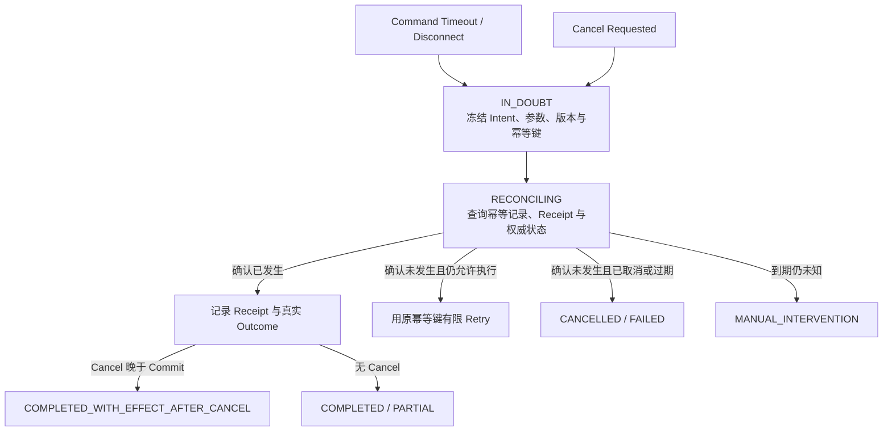

# 01 · Timeout 之后：Retry、Cancellation 与未知效果

完成安全与治理部分后，Resolution Desk 已能用原生可信 UI 展示不可变 Proposal，在服务端重新授权，并向 Mock 支付系统提交同一笔退款 Command。安全边界已经决定“这笔退款有没有资格执行”；本章继续解决“请求中断后，系统怎样知道它是否已经发生”。

浏览器里的只读请求超时后，再发一次通常问题不大；支付、退款、发信或删除请求却不同。客户端没有收到响应，只能说明本地等待结束，不能说明服务端没有执行。

假设 Agent 发起一笔退款：支付系统已经 Commit，返回的 ACK 却在网络中丢失。Runtime 看到 Timeout，用户随后点击 Stop。若系统把 Timeout 记为“退款失败”，自动 Retry 可能造成重复退款；若把 Stop 记为“退款已撤销”，UI 就在陈述未经确认的事实。

本章建立可靠 Agent Runtime 最重要的一条边界：**本地执行结果与外部业务效果必须分开建模。**

## 1. 两条状态轴回答不同问题

| 维度               | 示例状态                                                                       | 回答的问题            |
| ---------------- | -------------------------------------------------------------------------- | ---------------- |
| Execution Status | `running`、`response_received`、`timeout`、`disconnected`、`cancelled_locally` | 本次调用在当前进程看来怎样结束？ |
| Effect Status    | `absent`、`committed`、`compensated`、`unknown`                               | 权威业务系统中实际发生了什么？  |

查询类工具通常没有外部副作用，Timeout 后可以在剩余预算内重试。Command 类工具可能在 Commit 前、Commit 后 ACK 前，或 ACK 到达但本地持久化前失败；没有 Receipt 或权威查询结果时，Effect 必须保持 `unknown`。

这四种是单个业务 Effect 的 canonical status，Application Server 和 UI 事件也复用它们。如果一个 Run 包含多个 Effect，公开 Snapshot 可增加聚合值 `partially_committed`；每个 Effect 本身仍保留 `absent | committed | compensated | unknown` 之一。

TypeScript 结果类型应强迫调用方处理这种不确定性：

```ts
type CommandResult<TReceipt> =
  | { kind: 'committed'; receipt: TReceipt }
  | { kind: 'not_committed'; reason: string }
  | { kind: 'unknown_effect'; callId: string; idempotencyKey: string };
```

不要用一个可选的 `success?: boolean` 混合协议失败与业务效果。

## 2. 保存业务意图，而不是只保存一次 HTTP 请求

每个有副作用的动作都应先形成稳定 Intent：

```text
intent_id: refund_order_123_v42
actor: user_42
action: refund
resource: order_123
resource_version: 42
amount: CNY 100.00
proposal_hash: sha256:...
idempotency_key: refund:order_123:v42
deadline: ...
```

一次 Intent 可以有多个 Attempt。每个 Attempt 使用独立 `attempt_id`，但所有安全 Retry 必须复用同一个业务幂等键。若相同幂等键收到不同 Payload，资源服务应拒绝，而不是选择最后一次参数。

幂等记录至少保存请求摘要、处理状态、Receipt 和有效期。它让重复提交收敛为同一业务效果，但仍不能代替未知效果查询与对账。

## 3. `IN_DOUBT → RECONCILING` 协议



进入未知效果状态后，Runtime 应停止新的模型规划和无关动作。核对过程是确定性协议：

1. 冻结原始 Intent、Proposal、资源版本和幂等键；
2. 查询下游 Idempotency Record、Receipt 或权威资源状态；
3. 确认效果已经发生时，如实记录 Outcome；
4. 只有确认效果没有发生、授权与 Deadline 仍有效时，才允许复用原幂等键 Retry；
5. 到达核对期限仍无权威结论时，转入有责任人的人工异常队列。

Cancel 是“不要继续创建工作”的控制意图，不是“过去的效果已经被撤销”的证据。

## 4. Deadline、Timeout 与 Cancellation

- **Deadline**：整个用户目标最晚何时仍有业务价值；下游只能继承剩余时间。
- **Step Timeout**：单次模型或工具调用最多等待多久，应从剩余 Deadline 派生。
- **Cancellation**：协作式停止信号，阻止新工作并尽力终止在途调用。
- **Reconciliation Deadline**：业务目标停止后，自动核对未知效果到何时转人工。

Run 的业务 Deadline 到期后不应继续规划新步骤，但已经在途或效果未知的 Command 仍需使用独立、有限的 Reconciliation Budget 完成核对。否则，系统会用 `budget_exhausted` 掩盖真实副作用。

在 Node.js 中，`AbortSignal` 负责传播取消意图：

```ts
async function runStep(signal: AbortSignal) {
  signal.throwIfAborted();
  return tool.execute({ signal });
}
```

这只能保证支持该信号的本地代码尽快停止。第三方服务是否已经 Commit，仍要通过 Receipt 或权威查询确认。

## 5. Retry 是有条件的恢复策略

只有同时满足以下条件才适合 Retry：

- 错误被明确分类为瞬时故障；
- 操作无副作用，或具有稳定幂等语义；
- 仍在总 Deadline、费用和 Attempt Budget 内；
- 没有 Cancel、过期审批或策略变化；
- Retry 责任由一个明确层持有。

使用有限 `max_attempts`、指数退避和抖动（jitter）。需要特别区分：

- `max_attempts = 4` 表示包括首次调用在内最多 4 次；
- `max_retries = 4` 表示首次之外再试 4 次，共 5 次。

多层各自重试会乘法放大。若三层都设置 `max_attempts = 4`，最底层最多收到 `4 × 4 × 4 = 64` 个 Attempt。重试预算应集中在最了解操作语义的一层，并向下游传播剩余 Deadline。

## 6. 用错误分类决定下一步

| 观察结果                 | Effect      | 下一步                      |
| -------------------- | ----------- | ------------------------ |
| 输入无效、策略拒绝            | `absent`    | 澄清、修正或结束，不重试             |
| Resource Version 冲突  | `absent`    | 重新读取资源，旧审批失效             |
| 只读查询限流或瞬时不可用         | `absent`    | 在预算内退避 Retry             |
| 只读查询 Timeout         | 通常 `absent` | 仍有预算时可 Retry             |
| Command Timeout / 断连 | `unknown`   | `IN_DOUBT → RECONCILING` |
| Cancel 且确认未发生        | `absent`    | `CANCELLED`              |
| Cancel 后确认已发生        | `committed` | 记录效果，必要时新建补偿流程           |
| 核对到期仍未知              | `unknown`   | `MANUAL_INTERVENTION`    |

## 实践：确认一笔效果未知的退款

### 进入本章时已有能力

Resolution Desk 能在原生 Approval 通过后，以稳定 Intent 和幂等键向 Mock 支付系统提交退款；正常响应会产生 Receipt。当前实现仍把 Timeout、Stop 和失败混在一条状态轴上。

### 本章增加的能力

为同一个 `run_id`、`intent_id` 和 `idempotency_key` 分离 Execution Status 与 Effect Status，并实现 `IN_DOUBT → RECONCILING → authoritative outcome / MANUAL_INTERVENTION`。对同一个 Command 依次在四个位置中断：

1. 请求发出前；
2. 下游 Commit 前；
3. Commit 后、ACK 返回前；
4. ACK 到达后、本地 Checkpoint 前。

Cancel 只停止新的规划与尚未开始的工作；未知效果继续使用独立 Reconciliation Budget 查询原幂等记录和 Receipt。

### 验收证据

每个中断点都断言 Execution Status、Effect Status、允许的状态转移、幂等键和用户文案。测试必须覆盖 Commit 后 ACK 丢失、用户随后 Stop、Receipt 最终确认已提交，以及核对到期仍未知四种结果：没有权威证据时不会写成“未执行”，Retry 不生成新业务意图，Cancel 不被解释为 Rollback，同一 Intent 最多产生一笔退款。

## 本章小结

Timeout 只说明等待结束，Cancel 只表达停止意图；两者都不能证明外部效果不存在。稳定 Intent、同一幂等键、权威 Receipt 查询和有限 Reconciliation，才能把效果未知的状态转化为可确认的事实。下一章将处理并发规模扩大后的问题：[并发、背压与预算](/masterpiece-static-docs/09-可靠性与可观测/02-并发-背压与预算.md)。

## 一手资料

- [AWS Timeouts, retries and backoff with jitter](https://aws.amazon.com/builders-library/timeouts-retries-and-backoff-with-jitter/)
- [AWS Idempotent APIs](https://aws.amazon.com/builders-library/making-retries-safe-with-idempotent-APIs/)
- [gRPC Deadlines](https://grpc.io/docs/guides/deadlines/)
- [gRPC Cancellation](https://grpc.io/docs/guides/cancellation/)
- [Google SRE: Addressing Cascading Failures](https://sre.google/sre-book/addressing-cascading-failures/)
