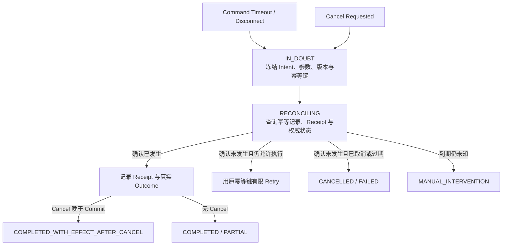

# 01 · Timeout 之后：Retry、Cancellation 与未知效果

完成 Agentic UI 与安全治理部分后，Resolution Desk 已能通过 AG-UI 同步任务状态、用 A2UI 收集低风险澄清信息，并用原生可信 UI 展示不可变 Proposal；所有 Action 都会回到服务端重新授权，再向 Mock 支付系统提交同一笔退款 Command。安全边界已经决定“这笔退款有没有资格执行”；本章继续解决“请求中断后，系统怎样知道它是否已经发生”。

浏览器里的只读请求超时后，再发一次通常问题不大；支付、退款、发信或删除请求却不同。客户端没有收到响应，只能说明本地等待结束，不能说明服务端没有执行。

假设 Agent 发起一笔退款：支付系统已经 Commit，返回的 ACK 却在网络中丢失。Runtime 看到 Timeout，用户随后点击 Stop。若系统把 Timeout 记为“退款失败”，自动 Retry 可能造成重复退款；若把 Stop 记为“退款已撤销”，UI 就在陈述未经确认的事实。

本章建立可靠 Agent Runtime 最重要的一条边界：**本地执行结果与外部业务效果必须分开建模。**

## 1. 两条状态轴回答不同问题

| 维度               | 示例状态                                                                       | 回答的问题            |
| ---------------- | -------------------------------------------------------------------------- | ---------------- |
| Execution Status | `running`、`response_received`、`timeout`、`disconnected`、`cancelled_locally` | 本次调用在当前进程看来怎样结束？ |
| Effect Status    | `absent`、`committed`、`compensated`、`unknown`                               | 权威业务系统中实际发生了什么？  |

查询类工具通常没有外部副作用，Timeout 后可以在剩余预算内重试。Command 类工具可能在 Commit 前、Commit 后 ACK 前，或 ACK 到达但本地持久化前失败；没有 Receipt 或权威查询结果时，Effect 必须保持 `unknown`。

这四种是单个业务 Effect 的 canonical status，Application Server 和 UI 事件也复用它们。如果一个 Run 包含多个 Effect，公开 Snapshot 可增加聚合值 `partially_committed`；每个 Effect 本身仍保留 `absent | committed | compensated | unknown` 之一。

TypeScript 结果类型应强迫调用方处理这种不确定性：

```ts
type CommandResult<TReceipt> =
  | { kind: 'committed'; receipt: TReceipt }
  | { kind: 'not_committed'; reason: string }
  | { kind: 'unknown_effect'; callId: string; idempotencyKey: string };
```

不要用一个可选的 `success?: boolean` 混合协议失败与业务效果。

## 2. 保存业务意图，而不是只保存一次 HTTP 请求

每个有副作用的动作都应先形成稳定 Intent：

```text
intent_id: refund_order_123_v42
actor: user_42
action: refund
resource: order_123
resource_version: 42
amount: CNY 100.00
proposal_hash: sha256:...
idempotency_key: refund:order_123:v42
deadline: ...
```

一次 Intent 可以有多个 Attempt。每个 Attempt 使用独立 `attempt_id`，但所有安全 Retry 必须复用同一个业务幂等键。若相同幂等键收到不同 Payload，资源服务应拒绝，而不是选择最后一次参数。

幂等记录至少保存请求摘要、处理状态、Receipt 和有效期。它让重复提交收敛为同一业务效果，但仍不能代替未知效果查询与对账。

## 3. `IN_DOUBT → RECONCILING` 协议



进入未知效果状态后，Runtime 应停止新的模型规划和无关动作。核对过程是确定性协议：

1. 冻结原始 Intent、Proposal、资源版本和幂等键；
2. 查询下游 Idempotency Record、Receipt 或权威资源状态；
3. 确认效果已经发生时，如实记录 Outcome；
4. 只有确认效果没有发生、授权与 Deadline 仍有效时，才允许复用原幂等键 Retry；
5. 到达核对期限仍无权威结论时，转入有责任人的人工异常队列。

Cancel 是“不要继续创建工作”的控制意图，不是“过去的效果已经被撤销”的证据。

## 4. Deadline、Timeout 与 Cancellation

- **Deadline**：整个用户目标最晚何时仍有业务价值；下游只能继承剩余时间。
- **Step Timeout**：单次模型或工具调用最多等待多久，应从剩余 Deadline 派生。
- **Cancellation**：协作式停止信号，阻止新工作并尽力终止在途调用。
- **Reconciliation Deadline**：业务目标停止后，自动核对未知效果到何时转人工。

Run 的业务 Deadline 到期后不应继续规划新步骤，但已经在途或效果未知的 Command 仍需使用独立、有限的 Reconciliation Budget 完成核对。否则，系统会用 `budget_exhausted` 掩盖真实副作用。

在 Node.js 中，`AbortSignal` 负责传播取消意图：

```ts
async function runStep(signal: AbortSignal) {
  signal.throwIfAborted();
  return tool.execute({ signal });
}
```

这只能保证支持该信号的本地代码尽快停止。第三方服务是否已经 Commit，仍要通过 Receipt 或权威查询确认。

### 4.1 Cancellation 是控制事务，不是一个 Boolean

Cancellation Transaction（取消事务）不是把所有业务效果放进同一个数据库事务，而是把“接受停止请求、关闭新工作、传播信号、收集结果、分类未知效果、持久化终态”作为一个可重放的控制协议。单个 `cancelled = true` 无法表达请求已经收到但仍有 Activity 在排空的状态。

```ts
type CancellationRecord = {
  cancelId: string;
  runId: string;
  requestedBy: string;
  requestedAt: string;
  cutoffEventCursor: number;
  phase:
    | "admission_closed"
    | "propagating"
    | "draining"
    | "settled";
  affectedAttemptIds: string[];
  effectStatusByAttempt: Record<
    string,
    "absent" | "committed" | "compensated" | "unknown"
  >;
  stateVersion: number;
};
```

`phase` 只描述取消控制协议推进到哪里，`effectStatusByAttempt` 描述各项外部效果是否已经确认。二者是正交状态轴：取消事务可以在 Admission 已关闭、所有 Attempt 已分类并完成 Checkpoint 后进入 `settled`，同时某个 Effect 仍保持 `unknown`，由 Run 的 `reconciling` 状态继续核对。

一个可靠的取消协议按以下顺序推进：

1. 在同一 CAS 事务中用稳定 `cancelId` 追加 `cancel_requested` Event、关闭该 Run 的新模型调用、Tool Call、Retry 与 Timer Admission，并记录 `cutoffEventCursor`；初始 Durable Phase 直接是 `admission_closed`；
2. 事务提交后才返回“停止请求已受理”；重复 Stop 返回同一记录和 Cutoff，不创建第二次取消；
3. 向已知在途 Attempt 传播 `AbortSignal` 或下游取消协议，但不提前声明它们未执行；
4. 在有限 Drain Budget 内收集退出、Receipt、进程终止和效果查询结果；
5. 将每个在途动作分类为 `absent | committed | compensated | unknown`；
6. 持久化 Checkpoint 后再发布取消事务的 `settled`；仍有未知效果时，保持对应 Effect 为 `unknown`，并让 Run 进入 `reconciling`。

Cancel ACK 应区分“停止请求已受理”和“Run 已安全停止”，但前一种 ACK 也必须发生在 Admission 已持久关闭之后。若 Activity Completion 与 Cancel 并发到达，以持久 Event Cursor、资源版本和 CAS 决定记录顺序；无论谁先被 UI 看见，已确认的外部效果都不能被改写成 `absent`。取消事务本身也可能在 Worker 退出时中断，因此下一 Worker 必须能从其 Phase 和 Cutoff Cursor 继续，而不是重新发送一轮无边界取消。

## 5. Retry 是有条件的恢复策略

只有同时满足以下条件才适合 Retry：

- 错误被明确分类为瞬时故障；
- 操作无副作用，或具有稳定幂等语义；
- 仍在总 Deadline、费用和 Attempt Budget 内；
- 没有 Cancel、过期审批或策略变化；
- Retry 责任由一个明确层持有。

使用有限 `max_attempts`、指数退避和抖动（jitter）。需要特别区分：

- `max_attempts = 4` 表示包括首次调用在内最多 4 次；
- `max_retries = 4` 表示首次之外再试 4 次，共 5 次。

多层各自重试会乘法放大。若三层都设置 `max_attempts = 4`，最底层最多收到 `4 × 4 × 4 = 64` 个 Attempt。重试预算应集中在最了解操作语义的一层，并向下游传播剩余 Deadline。

### 5.1 生成重复与无进展不是普通瞬时错误

模型可能持续改写同一段答案、重复相同 Tool Call，或在同一个错误和计划之间循环。它没有抛出协议错误，却没有让任务状态前进。Runtime 应维护独立于自然语言长度的 Progress Marker：

```ts
type ProgressMarker = {
  stateVersion: number;
  eventCursor: number;
  evidenceRefs: string[];
  completedItemIds: string[];
  unresolvedBlockers: string[];
  externalEffectRefs: string[];
};
```

以下信号组合达到有界阈值时，可判定为 `no_progress`，而不是继续消耗通用 Retry Budget：

- 连续输出具有相同摘要或高度相似的语义结构；
- 相同工具和参数重复调用，只得到同一 Observation 或同一错误；
- Proposal、Evidence Set、Runtime State Version 与未决阻塞项均未变化；
- 模型声称“继续处理”，但 Event Cursor 只增加了生成文本，没有新增受验证事实。

语义相似只是告警信号，不能单独中止合法的迭代编辑。判定器应组合确定性摘要、工具调用签名和状态增量，并记录阈值版本。

恢复流程应是：

1. 协作式中断当前生成，持久化最后一个有效 Progress Marker 和循环证据；
2. 将触发循环的输出标为 `quarantined`，不进入 Memory、Compaction 的可信事实区、Few-shot 示例或后续自动 Retry Prompt；
3. 用确定性规则分类可由权威状态直接证明的原因：缺少输入、权限不足、同一工具错误持续出现或效果未知；
4. 对“目标矛盾”“规划停滞”等语义性原因，只生成带 Detector / Verifier 版本与证据引用的候选诊断；它们需要独立 Verifier 或人工复核，不能直接成为权威终态；
5. 只有存在新证据、新授权、缩小后的子目标或不同工具路径时，才创建新的 Planning Attempt；
6. 有界恢复仍无状态增量时，向用户提出具体阻塞、转人工或结束 Run。

提高温度、追加“请不要重复”或把已知坏输出再次塞回 Context，不构成恢复策略；它们会掩盖停滞原因并强化错误轨迹。

### 5.2 Rewind 创建新分支，不抹去已经发生的事实

Conversation Rewind（对话回退）应从某个 Durable Checkpoint 创建带 `parentCheckpointRef` 的新分支，并在 Event Log 追加 `rewind_requested` 与 `branch_created`。Checkpoint 之后的模型输出可以退出新分支的 Context，但原 Event、审批和外部效果仍保留在受控历史中。回退点之后已经发出的 Command 必须先 Reconcile；需要撤销时创建新的 Compensation，不能假装它们从未发生。

Versioned Artifact Rewind（版本化产物回退）也不是把旧内容无条件覆盖回去。工单注释、配置草案、知识条目或代码文件都应先解析成 Canonical Resource，再保存条件写回执：

```ts
type CanonicalResourceRef = {
  namespace: string;
  canonicalId: string;
};

type ArtifactWriteReceipt = {
  resource: CanonicalResourceRef;
  baseDigest: string;
  committedDigest: string;
  forwardDeltaRef: string;
  reverseDeltaRef?: string;
  toolCallId: string;
};
```

自动回退前先通过同一个 `resource` 重新读取当前 Digest：

- 当前值等于 `committedDigest` 时，才可通过 CAS 应用反向 Patch；
- 当前值已经等于 `baseDigest` 时，视为幂等完成；
- 当前值两者都不等时，说明用户、编辑器、另一个 Agent 或外部同步已经修改文件，必须进入 `rewind_conflict`；
- 冲突只能通过三方合并、展示 Diff 后确认或放弃回退解决，不能用 Last-write-wins 覆盖外部修改。

新对话分支还应使被判定错误、被拒绝或已撤回的输出失去默认可见性，防止恢复后再次 Inject；这不等于删除审计证据。文件 Adapter 必须复用前章的 Canonical File Target，不能把模型提供的原始 Path 填入 `canonicalId`。对于没有版本、Digest 或可恢复 Delta 的 Artifact，系统不能承诺自动 Rewind。

## 6. 用错误分类决定下一步

| 观察结果                 | Effect      | 下一步                      |
| -------------------- | ----------- | ------------------------ |
| 输入无效、策略拒绝            | `absent`    | 澄清、修正或结束，不重试             |
| Resource Version 冲突  | `absent`    | 重新读取资源，旧审批失效             |
| 只读查询限流或瞬时不可用         | `absent`    | 在预算内退避 Retry             |
| 只读查询 Timeout         | 通常 `absent` | 仍有预算时可 Retry             |
| Command Timeout / 断连 | `unknown`   | `IN_DOUBT → RECONCILING` |
| Cancel 且确认未发生        | `absent`    | `CANCELLED`              |
| Cancel 后确认已发生        | `committed` | 记录效果，必要时新建补偿流程           |
| 核对到期仍未知              | `unknown`   | `MANUAL_INTERVENTION`    |

## 实践：确认一笔效果未知的退款

### 进入本章时已有能力

Resolution Desk 能在原生 Approval 通过后，以稳定 Intent 和幂等键向 Mock 支付系统提交退款；正常响应会产生 Receipt。当前实现仍把 Timeout、Stop 和失败混在一条状态轴上。

### 本章增加的能力

为同一个 `run_id`、`intent_id` 和 `idempotency_key` 分离 Execution Status 与 Effect Status，并实现 `IN_DOUBT → RECONCILING → authoritative outcome / MANUAL_INTERVENTION`。对同一个 Command 依次在四个位置中断：

1. 请求发出前；
2. 下游 Commit 前；
3. Commit 后、ACK 返回前；
4. ACK 到达后、本地 Checkpoint 前。

Cancel 只停止新的规划与尚未开始的工作；未知效果继续使用独立 Reconciliation Budget 查询原幂等记录和 Receipt。

再增加两个恢复场景：

5. 模型连续三次提交同一查询并得到相同 Observation，Progress Marker 没有状态增量；
6. 让 Agent 写入一份版本化工单注释 Artifact，随后由用户从另一个客户端补充内容，再请求 Conversation Rewind 和 Artifact Rewind。

前者应终止当前 Planning Attempt、隔离重复输出并给出具体阻塞；只有获得新输入或改变合法执行路径后才允许有限重规划。后者应创建新的 Conversation Branch，并因当前 Artifact Digest 与写入 Receipt 不匹配而返回 `rewind_conflict`，不得覆盖用户从其他客户端提交的修改。

### 验收证据

每个中断点都断言 Execution Status、Effect Status、允许的状态转移、幂等键和用户文案。测试必须覆盖 Commit 后 ACK 丢失、用户随后 Stop、Receipt 最终确认已提交，以及核对到期仍未知四种结果：没有权威证据时不会写成“未执行”，Retry 不生成新业务意图，Cancel 不被解释为 Rollback，同一 Intent 最多产生一笔退款。

取消测试还要在 `admission_closed`、`propagating`、`draining` 和 Checkpoint 提交前后分别终止 Worker，并验证 Durable `cancel_requested` Event、Admission Cutoff 与首个 ACK 之间不存在可插入新工作的窗口。恢复后不得重新开放 Admission，重复 Stop 必须幂等，未知效果继续核对。停滞测试断言已知坏输出不会进入 Memory 或后续 Prompt；回退测试断言 Conversation Branch 保留因果历史，Artifact Digest 冲突可见且外部修改保持不变。

## 本章小结

Timeout 只说明等待结束，Cancel 只表达停止意图；两者都不能证明外部效果不存在。Cancellation Transaction 需要持久请求、关闭 Admission、排空在途 Attempt、分类 Effect 并提交 Checkpoint。生成重复和无进展应由状态增量检测与有界重规划处理，已知坏输出不能循环进入 Context 或 Memory。Conversation Rewind 创建可追溯分支，Versioned Artifact Rewind 必须以 Canonical Resource、Digest 和 CAS 保护外部修改。稳定 Intent、同一幂等键、权威 Receipt 查询和有限 Reconciliation，才能把效果未知的状态转化为可确认的事实。下一章将处理并发规模扩大后的问题：[并发、背压与预算](/masterpiece-static-docs/09-可靠性与可观测/02-并发-背压与预算.md)。

## 一手资料

- [AWS Timeouts, retries and backoff with jitter](https://aws.amazon.com/builders-library/timeouts-retries-and-backoff-with-jitter/)
- [AWS Idempotent APIs](https://aws.amazon.com/builders-library/making-retries-safe-with-idempotent-APIs/)
- [gRPC Deadlines](https://grpc.io/docs/guides/deadlines/)
- [gRPC Cancellation](https://grpc.io/docs/guides/cancellation/)
- [Google SRE: Addressing Cascading Failures](https://sre.google/sre-book/addressing-cascading-failures/)
