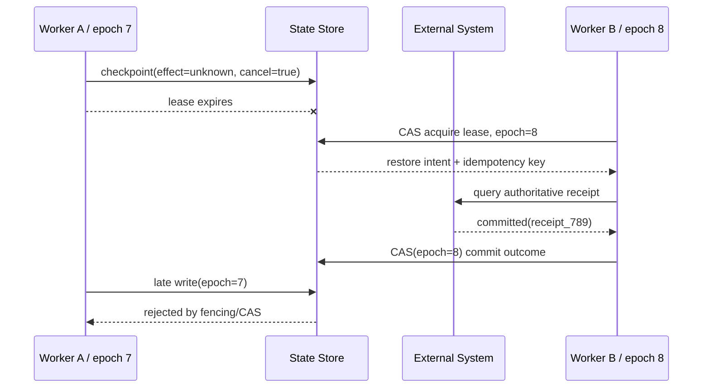

# 03 · 持久执行：Checkpoint、Replay 与 Exactly-Once 边界

一个任务等待人工审批两小时，期间系统发生了一次部署；另一个任务正在核对一笔效果未知的退款，Worker 突然退出。若所有状态只存在于进程内存或聊天历史中，新 Worker 既不知道已经发生了什么，也无法判断哪些步骤可以安全重跑。

持久执行（Durable Execution）的目标不是让进程永不失败，而是让任意兼容 Worker 都能根据持久事实继续，并且不把 Replay 变成重复副作用。

## 1. Checkpoint 保存的是控制语义

一个可恢复的 Run 至少需要保存：

```text
run_id / thread_id
runtime_state + state_version
goal + actor + tenant
current_step + completed_items
proposal + approval_ref + approval_expiry
in_flight_intent + idempotency_key + effect_status
cancel_intent
deadline + remaining budgets
workflow/runtime/schema/prompt/tool/policy versions
ownership_epoch + event_cursor
context/source artifact references
```

只保存最后一条消息无法回答：某个 Tool Call 是否已经提交、审批是否仍有效、Cancel 发生在何时、应该查询哪个幂等记录，以及新代码是否兼容旧状态。

Public Snapshot 与 Durable Checkpoint 也不相同：前者面向 UI，只包含可公开状态；后者面向 Runtime 恢复，需要保存版本、所有权、预算和在途效果等内部字段。

## 2. Workflow 与 Activity 要分开

Durable Workflow 将确定性控制逻辑与外部非确定性操作分离：

- **Workflow**：根据已记录 Event 计算下一状态，负责分支、等待、Timer 与调度；
- **Activity / Step**：调用模型、数据库、支付、邮件或其他外部服务；
- **Event History**：保存 Activity 结果、错误、Timer、Signal 和版本决策；
- **Replay**：重新执行 Workflow 代码，从历史 Event 导出相同控制状态。

Workflow Replay 不应直接读取当前时间、随机数、模型或外部 API。模型再次生成相同文本既不现实，也没有必要；模型结果应作为已完成 Activity 的记录参与 Replay。

一个概念化的 TypeScript 边界如下：

```ts
type WorkflowEvent =
  | { type: 'approval_received'; proposalId: string }
  | { type: 'activity_completed'; activityId: string; resultRef: string }
  | { type: 'activity_failed'; activityId: string; errorCode: string }
  | { type: 'timer_fired'; timerId: string }
  | { type: 'cancel_requested'; actorId: string };

function reduceWorkflow(state: WorkflowState, event: WorkflowEvent): WorkflowState {
  // 纯状态转移：不调用模型、支付或当前时间
  return transition(state, event);
}
```

## 3. Activity 可能重复投递

队列、Worker 崩溃和网络断连意味着 Activity Handler 可能执行多次。需要组合使用：

- 稳定 Activity ID、Call ID 和业务幂等键；
- Result Cache / Inbox Dedup；
- 资源版本与 Optimistic Concurrency；
- 对未知效果先查询 Receipt；
- 数据库写入与消息发布之间使用 Transactional Outbox；
- Poison Message 达到上限后进入有责任人的 DLQ。

DLQ 不是丢弃区。每种消息应定义告警、Owner、修复方式、Replay 前置条件、保留期和删除策略。

## 4. 多 Worker 需要可证明的单写所有权

Lease 过期后，旧 Worker 可能只是网络暂停，并没有停止运行。新的 Worker 接管时，需要防止旧 Worker 恢复后写回过期状态。

- **Lease**：有过期时间的处理权；
- **Heartbeat**：长 Activity 持续证明存活并报告进度；
- **Fencing Token / Ownership Epoch**：每次接管单调递增，下游拒绝旧 Epoch；
- **CAS / Optimistic Concurrency**：状态版本和 Epoch 同时匹配才允许提交；
- **Single-writer invariant**：同一 Epoch 只有一个控制决定成为权威事实。



Lease 负责发现所有权可能失效，Fencing 与 CAS 才负责拒绝旧所有者的迟到写入。

## 5. Exactly-Once 必须拆成四个问题

看到“Exactly-Once”时，应继续询问：

1. 消息被 Delivery 几次？
2. Handler 被执行几次？
3. 某个数据库事务被 Commit 几次？
4. 用户可观察的业务效果发生几次？

某一层做到一次提交，不代表第三方支付、邮件或外部 API 只产生一次效果。更实际的端到端目标是：

```text
at-least-once delivery / attempt
+ idempotent or deduplicated effect
+ authoritative receipt query
+ reconciliation
```

例如退款 Activity 可以被投递两次，但同一幂等键在支付系统中只能对应一笔退款，并且 Runtime 能查询到唯一 Receipt。

## 6. Compensation 不是时间倒流

退款、撤回邮件、恢复配置等补偿动作是新的业务行为，不是数据库式 Rollback。每个 Compensation 都需要：

- 当前资源状态与可补偿前置条件；
- 新的授权、审批和幂等键；
- 与原动作的因果引用；
- 失败、部分完成和人工接管语义；
- 用户可见的两段历史记录。

某些效果根本不可逆，例如邮件已经被阅读、数据已经外泄。系统必须明确这种边界，而不是提供一个误导性的 Undo 按钮。

## 7. 长任务必须固定版本语义

跨小时或跨天 Run 可能跨越多次发布。Checkpoint 应固定：

- Workflow、Runtime 与 State Schema 版本；
- Prompt、Model Route、Context Builder 与 Tool Contract 版本；
- Policy、Approval 与数据来源版本。

优先让旧 Run 路由到兼容 Worker。确需迁移时，使用显式 Migration、Replay Test、Shadow Replay 和可回滚发布。新代码不能静默重新解释旧审批，无法安全迁移的 Run 应留在旧执行器或转人工。

## 8. 故障实验：在四个边界强杀 Worker

依次在以下位置停止进程：

1. 外部 Command 提交前；
2. Commit 后、ACK 前；
3. ACK 到达后、Checkpoint 前；
4. Reconciliation 查询完成后、状态写入前。

随后让新 Worker 以更高 Epoch 接管，并验证：

- 恢复字段足以决定下一步，不依赖聊天文本猜测；
- Replay 不重复调用模型或外部 Command；
- 同一业务 Intent 只产生一个可观察效果；
- 旧 Worker 的迟到写入被 Fencing/CAS 拒绝；
- Poison Event 进入 DLQ 并可受控 Replay；
- 旧版 Run 不被新版本策略静默改写。

## 本章小结

持久执行保存的是控制事实、版本和所有权，而不是进程连续性。Checkpoint 使 Run 可恢复，Event History 使控制逻辑可 Replay，幂等与权威查询使重复 Activity 收敛，Fencing/CAS 防止双写。下一章将用 [Trace、SLO 与成本](/masterpiece-static-docs/09-可靠性与可观测/04-Trace-SLO与成本.md)观察这套系统是否真的可靠。

## 一手资料

- [Temporal Workflow Execution](https://docs.temporal.io/workflow-execution)
- [Temporal Activity Definition](https://docs.temporal.io/activity-definition)
- [AWS Idempotent APIs](https://aws.amazon.com/builders-library/making-retries-safe-with-idempotent-APIs/)
- [AWS Transactional Outbox](https://docs.aws.amazon.com/prescriptive-guidance/latest/cloud-design-patterns/transactional-outbox.html)
