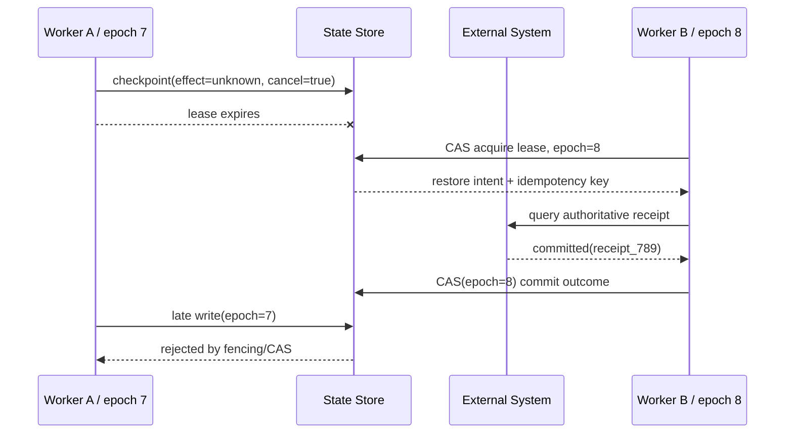

# 03 · 持久执行：Checkpoint、Replay 与 Exactly-Once 边界

Resolution Desk 已能在单进程内对同一笔退款做有界核对，并为 Reconciliation 保留容量。下一项缺口是进程生命周期：一个 Run 可能等待原生审批两小时，也可能正在核对效果未知的退款时遇到 Worker 退出或部署。

若所有状态只存在于进程内存或聊天历史中，新 Worker 既不知道已经发生了什么，也无法判断哪些步骤可以安全重跑。

持久执行（Durable Execution）的目标不是让进程永不失败，而是让任意兼容 Worker 都能根据持久事实继续，并且不把 Replay 变成重复副作用。

## 1. Checkpoint 保存的是控制语义

一个可恢复的 Run 至少需要保存：

```text
run_id / thread_id
runtime_state + state_version
goal + actor + tenant
current_step + completed_items
proposal + approval_ref + approval_expiry
in_flight_intent + idempotency_key + effect_status
cancel_intent
deadline + remaining budgets
workflow/runtime/schema/prompt/tool/policy versions
ownership_epoch + event_cursor
context/source artifact references
```

只保存最后一条消息无法回答：某个 Tool Call 是否已经提交、审批是否仍有效、Cancel 发生在何时、应该查询哪个幂等记录，以及新代码是否兼容旧状态。

Public Snapshot 与 Durable Checkpoint 也不相同：前者面向 UI，只包含可公开状态；后者面向 Runtime 恢复，需要保存版本、所有权、预算和在途效果等内部字段。

浏览器通过 AG-UI 或 Native Transport 恢复时，应先读取 Public Snapshot，再按应用 Cursor 重放后续公开事件；A2UI Surface 也只能从受控的 Surface Snapshot 或重新投影恢复。客户端重连不能触发 Workflow Replay、重新调用模型或重新生成已经提交的 Proposal。

### 1.1 Checkpoint 是一次持久提交

序列化一个 JSON 对象不等于完成 Checkpoint。Checkpoint Commit 至少需要：

1. 取得稳定 Event Cursor，暂时关闭该边界之前 Item 的追加；
2. Flush 已完成 Activity 的 Result、Receipt Ref、文件 Digest、Approval、Cancel Intent 和预算变更；
3. 在同一事务中提交 Runtime State Version、Event Cursor、Ownership Epoch 与 Inbox Dedup 状态，或使用可证明等价的原子协议；
4. 将待发布事件写入 Transactional Outbox，再返回 Durable ACK；
5. 只有 Durable ACK 之后，才允许确认取消完成、裁剪热日志或执行 Context Compaction。

本地文件存储中的 Flush 可能意味着 `fsync` 和原子 Rename；数据库或工作流服务中的 Flush 意味着收到满足其持久性契约的 Commit ACK。无论介质是什么，Runtime 都不能把“已放入进程缓冲区”当成恢复点。

Context Compaction 必须引用一个已提交的 Checkpoint 和其覆盖的稳定 Event Range。结构化目标、状态枚举、版本、Receipt 与 Effect Status 由确定性代码复制；模型只能为叙述性内容生成 Semantic Summary。若 Compaction 失败，系统保留原 Context 或暂停 Run，不能先删除消息再尝试补写恢复状态。Memory 生命周期和压缩产物的详细边界见 [State、Memory 与 Compaction](/masterpiece-static-docs/06-上下文-知识与记忆/04-状态-记忆与压缩.md)。

## 2. Workflow 与 Activity 要分开

Durable Workflow 将确定性控制逻辑与外部非确定性操作分离：

- **Workflow**：根据已记录 Event 计算下一状态，负责分支、等待、Timer 与调度；
- **Activity / Step**：调用模型、数据库、支付、邮件或其他外部服务；
- **Event History**：保存 Activity 结果、错误、Timer、Signal 和版本决策；
- **Replay**：重新执行 Workflow 代码，从历史 Event 导出相同控制状态。

Workflow Replay 不应直接读取当前时间、随机数、模型或外部 API。模型再次生成相同文本既不现实，也没有必要；模型结果应作为已完成 Activity 的记录参与 Replay。

一个概念化的 TypeScript 边界如下：

```ts
type WorkflowEvent =
  | { type: 'approval_received'; proposalId: string }
  | { type: 'activity_completed'; activityId: string; resultRef: string }
  | { type: 'activity_failed'; activityId: string; errorCode: string }
  | { type: 'timer_fired'; timerId: string }
  | { type: 'cancel_requested'; cancelId: string; actorId: string }
  | { type: 'cancel_admission_closed'; cancelId: string; cutoffCursor: number }
  | { type: 'no_progress_detected'; attemptId: string; evidenceRef: string }
  | {
      type: 'branch_created';
      branchId: string;
      parentCheckpointRef: string;
    };

function reduceWorkflow(state: WorkflowState, event: WorkflowEvent): WorkflowState {
  // 纯状态转移：不调用模型、支付或当前时间
  return transition(state, event);
}
```

Activity Result 也要区分 Deterministic Capture（确定性捕获）与 Semantic Capture（语义捕获）。Replay 所必需的结构化字段、响应状态、Receipt、资源 Digest、资源版本和受控 Artifact Ref 应按最小化、脱敏、加密与 Retention Policy 持久化；Tool 原始参数只有在 Contract 明确需要且 Policy 允许时才能保存，Secret 与无关 Payload 不得落盘。模型摘要、反思和计划解释只是带版本的派生 Artifact。Replay 读取前一类事实恢复控制状态，可以选择读取后一类材料帮助模型理解，但不能用语义摘要反推出已提交效果。

生成停滞同样必须成为历史事件。Runtime 把重复 Tool Signature、相同 Observation Digest、无变化的 State Version 和 Evidence Set 写入 `no_progress_detected`；触发循环的模型输出标记为 `quarantined`。Replay 恢复到这里时，先恢复这些确定性观察：权限、输入、Tool Error 和 Effect 可由规则分类；“目标矛盾”或“规划停滞”只能形成带版本的启发式诊断，等待独立 Verifier、人工复核或新 Signal。无论采用哪条路径，都不能再次调用模型生成同一个已知坏 Attempt。

## 3. Activity 可能重复投递

队列、Worker 崩溃和网络断连意味着 Activity Handler 可能执行多次。需要组合使用：

- 稳定 Activity ID、Call ID 和业务幂等键；
- Result Cache / Inbox Dedup；
- 资源版本与 Optimistic Concurrency；
- 对未知效果先查询 Receipt；
- 数据库写入与消息发布之间使用 Transactional Outbox；
- Poison Message 达到上限后进入有责任人的 DLQ。

DLQ 不是丢弃区。每种消息应定义告警、Owner、修复方式、Replay 前置条件、保留期和删除策略。

## 4. 多 Worker 需要可证明的单写所有权

Lease 过期后，旧 Worker 可能只是网络暂停，并没有停止运行。新的 Worker 接管时，需要防止旧 Worker 恢复后写回过期状态。

- **Lease**：有过期时间的处理权；
- **Heartbeat**：长 Activity 持续证明存活并报告进度；
- **Fencing Token / Ownership Epoch**：每次接管单调递增，下游拒绝旧 Epoch；
- **CAS / Optimistic Concurrency**：状态版本和 Epoch 同时匹配才允许提交；
- **Single-writer invariant**：同一 Epoch 只有一个控制决定成为权威事实。



Lease 负责发现所有权可能失效，Fencing 与 CAS 才负责拒绝旧所有者的迟到写入。

## 5. Exactly-Once 必须拆成四个问题

看到“Exactly-Once”时，应继续询问：

1. 消息被投递了几次？
2. Handler 被执行了几次？
3. 某个数据库事务被提交了几次？
4. 用户可观察的业务效果发生了几次？

某一层做到一次提交，不代表第三方支付、邮件或外部 API 只产生一次效果。更实际的端到端目标是：

```text
at-least-once delivery / attempt
+ idempotent or deduplicated effect
+ authoritative receipt query
+ reconciliation
```

例如退款 Activity 可以被投递两次，但同一幂等键在支付系统中只能对应一笔退款，并且 Runtime 能查询到唯一 Receipt。

## 6. Compensation 不是时间倒流

退款、撤回邮件、恢复配置等补偿动作是新的业务行为，不是数据库式 Rollback。每个 Compensation 都需要：

- 当前资源状态与可补偿前置条件；
- 新的授权、审批和幂等键；
- 与原动作的因果引用；
- 失败、部分完成和人工接管语义；
- 用户可见的两段历史记录。

某些效果根本不可逆，例如邮件已经被阅读、数据已经外泄。系统必须明确这种边界，而不是提供一个误导性的 Undo 按钮。

### 6.1 Cancellation 必须跨 Worker 收敛

Cancellation Transaction 的 Phase、稳定 `cancel_id`、Admission Cutoff Cursor、受影响 Attempt 和 Drain Deadline 必须进入 Checkpoint。新 Worker 接管后先恢复 `admission_closed`，再继续终止、排空和 Reconciliation；不能因为进程重启而重新开放模型调用或 Retry。

取消与 Activity Completion 并发时，两者都追加为 Event，再由 Reducer 按持久顺序归约：

- Completion 证明 Command 已 Commit 时，Effect 保持 `committed`，即使 Cancel Event 先被 UI 收到；
- 已确认没有开始的 Activity 可归约为 `absent`；
- 只有本地终止结果、没有下游证据时，Effect 保持 `unknown`；
- 所有 Attempt 完成分类且 Checkpoint Commit 后，才发布取消事务的 `settled`；这只表示取消控制协议已经收敛，不表示每个外部 Effect 都已查明。

因此，Cancel 的 Exactly-Once 目标不是“终止调用恰好执行一次”，而是同一 `cancel_id` 的重复投递收敛到一个 Cutoff 和一组已持久化分类。若某项分类仍是 `unknown`，取消 Phase 可以是 `settled`，而 Run 继续处于 `reconciling`；Cancellation Phase 与 Effect Status 不能合并成一个枚举。

### 6.2 Rewind 是向前写入的修正

Conversation Rewind 不能删除 Event History 后重新运行旧代码。它应追加一个 Branch Event，引用 `parentCheckpointRef`、原 Branch、请求 Actor、Policy Version 和 Rewind Reason。新 Branch 从父 Checkpoint 的控制状态开始，但继承之后已经确认的外部 Effect，并把被拒绝、已撤回或已知错误的生成结果加入 Exclusion Set，防止它们再次进入 Context、Memory 或 Replay 输入。

Versioned Artifact Rewind 需要把写入建模为有条件的 Activity。资源身份必须沿用授权、锁和实际 I/O 共用的 Canonical Resource，不能在恢复阶段退回模型提供的原始路径：

```ts
type DurableArtifactMutation = {
  mutationId: string;
  resource: CanonicalResourceRef;
  baseDigest: string;
  committedDigest: string;
  forwardDeltaRef: string;
  reverseDeltaRef?: string;
  resourceVersion?: string;
};
```

执行反向 Delta 前，Activity 必须比较当前 Digest 或 Resource Version：

- 匹配 `committedDigest` 才能以 CAS 提交反向 Delta；
- 已匹配 `baseDigest` 时返回原有 Rewind Receipt；
- 两者都不匹配时记录 `external_modification_conflict`，保存当前 Artifact Ref 并停止自动写入；
- 三方合并必须生成新 Proposal 和 Diff，重新经过授权，不能把旧审批沿用到变化后的 Artifact。

外部修改可能来自另一个浏览器、同步程序、Worker 或 Agent。Lease 只能保护 Runtime 自己的写所有权，不能证明 Artifact 未被这些 Actor 改动；Digest、版本化存储或源代码仓库的条件写才是冲突证据。没有这些前置条件时，系统只能提供人工恢复材料，不能承诺无损回退。

## 7. 长任务必须固定版本语义

跨小时或跨天 Run 可能跨越多次发布。Checkpoint 应固定：

- Workflow、Runtime 与 State Schema 版本；
- Prompt、Model Route、Context Builder 与 Tool Contract 版本；
- Policy、Approval 与数据来源版本。

优先让旧 Run 路由到兼容 Worker。确需迁移时，使用显式 Migration、Replay Test、Shadow Replay 和可回滚发布。新代码不能静默重新解释旧审批，无法安全迁移的 Run 应留在旧执行器或转人工。

## 实践：让 Resolution Desk 跨 Worker 恢复同一条 Run

### 进入本章时已有能力

Resolution Desk 已有稳定 Intent、Effect Status、Reconciliation、独立容量和可信 UI，但 Runtime State 主要依赖当前 Worker。

### 本章增加的能力

持久化 Event History、Durable Checkpoint、Outbox、Lease、Ownership Epoch 与 Fencing/CAS；Workflow Reducer 只消费已记录 Event，模型调用与支付操作都作为 Activity。Checkpoint Commit 会先 Flush Activity Result、Receipt、Cancel Intent 与 Event Cursor，再允许 Context Compaction。沿同一条退款 Run，依次在以下位置停止进程：

1. 外部 Command 提交前；
2. Commit 后、ACK 前；
3. ACK 到达后、Checkpoint 前；
4. Reconciliation 查询完成后、状态写入前。

随后让新 Worker 以更高 Epoch 接管。

再追加三类恢复试验：

5. Cancel 已关闭 Admission，但在所有在途 Attempt 分类前退出；
6. 模型重复相同 Tool Call 并达到 `no_progress_detected` 后退出；
7. 写入版本化工单注释 Artifact 并提交 Checkpoint，随后模拟用户从另一个客户端修改同一 Artifact，再请求回到父 Conversation Branch。

恢复后，取消事务应沿原 `cancel_id` 继续排空；停滞 Attempt 保持隔离，不能再次自动生成；Conversation Rewind 创建新 Branch，而 Artifact Rewind 因 Digest 变化进入外部修改冲突。

### 验收证据

验证：

- 恢复字段足以决定下一步，不依赖聊天文本猜测；
- Replay 不重复调用模型或外部 Command；
- 同一业务 Intent 只产生一个可观察效果；
- 旧 Worker 的迟到写入被 Fencing/CAS 拒绝；
- Compaction 只覆盖已有 Durable Checkpoint 的 Event Range，Flush 失败时原 Context 保持可恢复；
- Cancel 恢复后不重新开放 Admission，重复 Cancel 收敛到同一事务；
- 已知坏输出不会被 Replay、Memory 或新 Branch 重新注入；
- Artifact Rewind 使用 Canonical Resource 与 Digest/CAS，检测到用户外部修改时不覆盖；
- Poison Event 进入 DLQ 并可受控 Replay；
- 旧版 Run 不被新版本策略静默改写。

## 本章小结

持久执行保存的是控制事实、版本和所有权，而不是进程连续性。Checkpoint 只有在 Event、Result、Receipt 和 Cancel Intent 完成 Flush 后才构成恢复边界；Event History 使控制逻辑可 Replay，幂等与权威查询让重复执行的 Activity 收敛到同一权威结果，Fencing/CAS 则防止双写。取消以可重放事务收敛，Conversation Rewind 以新 Branch 保留因果历史，Versioned Artifact Rewind 以 Canonical Resource、Digest 和条件写保护外部修改；任何机制都不能通过重放已知坏输出制造“进展”。下一章将用 [Trace、SLO 与成本](/masterpiece-static-docs/09-可靠性与可观测/04-Trace-SLO与成本.md)观察这套系统是否真的可靠。

## 一手资料

- [Temporal Workflow Execution](https://docs.temporal.io/workflow-execution)
- [Temporal Activity Definition](https://docs.temporal.io/activity-definition)
- [AWS Idempotent APIs](https://aws.amazon.com/builders-library/making-retries-safe-with-idempotent-APIs/)
- [AWS Transactional Outbox](https://docs.aws.amazon.com/prescriptive-guidance/latest/cloud-design-patterns/transactional-outbox.html)
