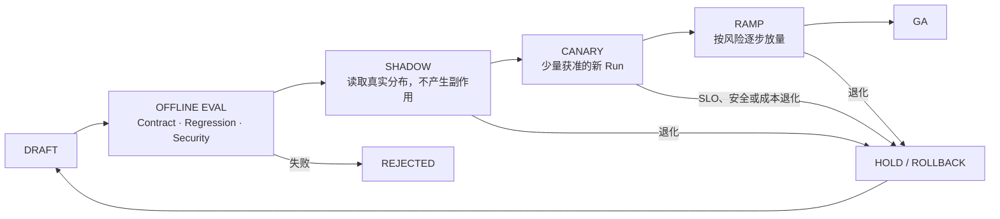

# 05 · 发布 Agent 行为系统

传统服务发布通常围绕代码与配置；Agent 应用的行为还取决于 Model、Prompt、Context Builder、Tool Schema、Policy、Retrieval Index 和 Runtime。只回滚容器镜像，未必能恢复上一版本行为。

例如，更换模型后文本质量看似提高，Tool Call 参数分布却发生变化；新 Policy 让旧审批失效；新 Context Builder 选择了另一版业务规则。生产发布的对象因此不是一个模型，而是一份可评测、可路由、可回滚的 **Behavior Bundle**。

## 1. 定义可追踪的发布单元

```ts
type BehaviorBundle = {
  releaseId: string;
  runtimeVersion: string;
  modelRouteVersion: string;
  promptVersion: string;
  contextBuilderVersion: string;
  knowledgeSnapshotVersion: string;
  retrievalIndexVersion: string;
  retrievalSchemaVersion: string;
  toolsetVersion: string;
  extensionSetVersion: string;
  policyVersion: string;
  workflowVersion: string;
};

type EvaluationManifest = {
  datasetVersion: string;
  graderVersion: string;
  environmentFixtureVersion: string;
};
```

`BehaviorBundle` 描述线上行为依赖，每个 Run 在创建时记录一份，长期 Run 还要记录后续显式迁移。`knowledgeSnapshotVersion` 固定可用知识集合，`retrievalIndexVersion` 与 `retrievalSchemaVersion` 固定检索派生物和字段语义；只有索引能够从同一 Snapshot 确定性重建时，回滚才可以省略实体快照。Skill、Hook、MCP Server 配置等扩展由 `extensionSetVersion` 统一引用。

`EvaluationManifest` 描述比较所用的 Dataset、Grader 与环境 Fixture。一次发布评测同时记录 Behavior Bundle 和 Evaluation Manifest，避免把“系统行为版本”与“如何测量该行为”混在同一个类型里。Feature Flag、Prompt、知识快照和模型路由都是发布内容，不能以“只是改配置”为由绕过 Eval、审批和回滚。

## 2. Model / Provider Fallback 不是无损切换

不同模型或 Provider 可能在以下方面存在差异：

- Tool Schema 支持范围与参数生成习惯；
- Structured Output、停止原因和拒绝语义；
- Stream Event、Usage 与错误分类；
- Context 长度、Latency、Cost 与数据边界；
- 对同一 Prompt、Policy Summary 和 Tool Result 的理解。

Fallback 必须通过同一 Dataset、Outcome/Trajectory Eval、协议 Contract Test 和安全 Protected Slice。主 Provider 出错时临时换一个模型，等于在故障期间引入未经验证的新版本。

系统也可以不配置自动 Fallback。对高风险写任务，有界等待、明确拒绝、返回有限结果或转人工，往往比静默切换更安全。生产级的要求是故障策略经过演练，而不是一定拥有第二个 Provider。

对于不同 Run 状态，切换边界不同：

| Run 状态                   | 默认策略                                            |
| ------------------------ | ----------------------------------------------- |
| 尚未创建的新 Run               | 可按已发布路由进入主版本或已验证备用版本                            |
| 尚未形成 Proposal 的旧 Run     | 仅在兼容契约允许时创建新 Attempt 并记录版本                      |
| 等待审批或已审批                 | 固定 Proposal、Policy 和版本；变化后重新 Preview / Approval |
| 正在执行 Command             | 不热切换执行器，先 Drain 并保存真实在途状态                       |
| `IN_DOUBT / RECONCILING` | 使用原 Intent、幂等键和权威查询，通常不需要模型                     |

## 3. 发布状态机



### Offline Eval

运行版本化 Dataset、Contract Test、故障 Case 和安全 Case。总体分数不能掩盖关键 Slice 退化。

### Shadow

复用脱敏且获准的生产输入，比较新旧版本的候选 Outcome、Trajectory、Latency 和 Cost。写工具必须替换成无副作用 Executor；“执行后再删除”不算 Shadow。

### Canary 与 Ramp

只接少量新 Run，并按 Tenant、任务类型、风险级别和工具范围切片。观察真实 Outcome、未知效果率、Time to Truth、P95/P99、每成功任务成本和安全不变量。

### Rollback

恢复完整 Behavior Bundle 和路由。Rollback 后的 Worker 仍需解码已有 Event、恢复旧 Run；无法回读持久状态的回滚方案并不完整。

## 4. Quota、Circuit Breaker 与降级

为 Provider、Tool、Tenant 和风险级别分别设置 Quota。Circuit Breaker 在连续失败、限流或延迟异常时经历：

```text
CLOSED → OPEN → HALF_OPEN → CLOSED / OPEN
```

Open 时停止创建相关新调用，Half-open 只允许有限探针。降级要保留任务语义：研究任务可以返回有来源的 Partial Result；高风险写动作不能静默换成未经评测的模型；未知效果仍通过独立 Reconciliation 通道收敛。

## 5. Stream Drain 与安全停机

发布或缩容时，Worker 应先停止领取新工作，再处理已有工作：

1. 停止新 Run / Step 的 Admission；
2. 等待 Model Stream、队列消息和 Tool Activity 到达安全边界；
3. 持久化尚未完成的 Item、Budget、Cancel 和在途 Intent；
4. 超过 Drain Deadline 的 Query 可取消，有副作用的 Command 进入 `IN_DOUBT`；
5. 新 Worker 按版本路由恢复。

关闭 Socket 或结束进程不等于完成 Drain。Kill Switch 也只阻止新 Planning/Command；在途和未知效果仍需有限收尾。

## 6. 长期 Run 的版本路由

长期任务跨越发布时，应优先保持原 Behavior Bundle：

- 新 Run 进入当前 Canary 或 GA；
- 等待 Approval 的旧 Run 保持原 Proposal 与 Policy；
- 执行中的 Command 保持原 Tool Contract 和幂等键；
- Reconciliation 路由到兼容恢复 Worker；
- 确需迁移时，显式执行 State Migration、Replay Test 和重新审批。

“新模型更好”不足以重新解释旧提案。用户批准的是具体动作，不是未来任意版本的 Agent 行为。

## 7. 灾备验证真实恢复能力

为 State Store、Event History、Queue、Artifact、Secret 和领域系统声明 RTO/RPO，并实际演练：

- 从备份恢复后，Fencing/CAS 是否仍阻止双写；
- Queue Replay 是否保持幂等，不产生重复效果；
- 旧 Run 是否还能找到兼容 Workflow、Prompt、Policy 和 Tool Contract；
- Provider 或区域不可用时，Fallback 或非 Fallback 降级是否与声明一致；
- 删除 Tombstone、Audit 与权限状态是否随恢复保持正确。

没有恢复演练的 RTO/RPO 只是目标，不是证据。

## 8. 发布演练清单

对同一候选版本注入 Provider 限流、Tool 延迟、ACK 丢失、用户 Cancel、Worker Drain Deadline 到期和 Rollback，验证：

1. Shadow 不产生真实写效果；
2. Canary 只影响获准的新 Run；
3. Circuit Open 后停止新调用，未知效果仍能核对；
4. Drain 后没有孤儿 Run；
5. Rollback 恢复完整 Bundle，并能继续旧 Run；
6. Fallback 或明确的非 Fallback 路径与设计一致；
7. Kill Switch 不把在途效果伪装成已失败或已取消。

## 本章小结

Agent 发布的对象是一套版本化行为系统。Offline Eval、Shadow、Canary、Ramp、Drain、Rollback、Circuit Breaker、Kill Switch 和灾备共同约束版本更替：新版本只接收受控流量，旧 Run 仍可按原版本恢复，效果未知的 Command 仍能通过对账收敛。完成这些机制后，可以进入 [综合系统心智模型](/masterpiece-static-docs/11-综合实践与作品设计/01-综合系统心智模型.md) 对整套架构进行总装。

## 一手资料

- [Google SRE Workbook: Canarying Releases](https://sre.google/workbook/canarying-releases/)
- [AWS Circuit Breaker Pattern](https://docs.aws.amazon.com/prescriptive-guidance/latest/cloud-design-patterns/circuit-breaker.html)
- [OpenAI Evaluation best practices](https://developers.openai.com/api/docs/guides/evaluation-best-practices)
- [Kubernetes Pod termination flow](https://kubernetes.io/docs/concepts/workloads/pods/pod-lifecycle/#pod-termination-flow)
