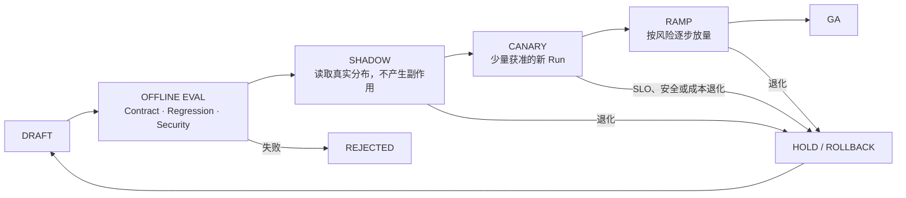

# 05 · 发布 Agent 行为系统

Resolution Desk 已具备从退款请求、证据检索、原生 Approval、Command、未知效果核对到跨 Worker 恢复的完整路径，并能用 Trace、SLO 和成本证明当前行为。最后一步是让新的 Model、Prompt、Context Builder、Tool Schema、Policy、Retrieval Index 和 Runtime 以同一套门禁进入流量；只回滚容器镜像，未必能恢复上一版本行为。

例如，更换模型后文本质量看似提高，Tool Call 参数分布却发生变化；新 Policy 让旧审批失效；新 Context Builder 选择了另一版业务规则。生产发布的对象因此不是一个模型，而是一份可评测、可路由、可回滚的 **Behavior Bundle**。

本章的边界是“发布什么行为，以什么证据放量或回滚”：Behavior Bundle、Model Routing、Offline Eval、Shadow、Canary 和行为回滚策略以本章为准。下一章再负责“这些策略如何落到运行环境”：进程拓扑、Health、Drain、Migration 与 CI/CD 编排。

## 1. 定义可追踪的发布单元

```ts
type BehaviorBundle = {
  releaseId: string;
  runtimeVersion: string;
  modelRouteVersion: string;
  promptVersion: string;
  contextBuilderVersion: string;
  knowledgeSnapshotVersion: string;
  retrievalIndexVersion: string;
  retrievalSchemaVersion: string;
  toolsetVersion: string;
  extensionSetVersion: string;
  policyVersion: string;
  workflowVersion: string;
};

type EvaluationManifest = {
  datasetVersion: string;
  graderVersion: string;
  environmentFixtureVersion: string;
};
```

`BehaviorBundle` 描述线上行为依赖，每个 Run 在创建时记录一份，长期 Run 还要记录后续显式迁移。`knowledgeSnapshotVersion` 固定可用知识集合，`retrievalIndexVersion` 与 `retrievalSchemaVersion` 固定检索派生物和字段语义；只有索引能够从同一 Snapshot 确定性重建时，回滚才可以省略实体快照。Skill、Hook、MCP Server 配置等扩展由 `extensionSetVersion` 统一引用。

`EvaluationManifest` 描述比较所用的 Dataset、Grader 与环境 Fixture。一次发布评测同时记录 Behavior Bundle 和 Evaluation Manifest，避免把“系统行为版本”与“如何测量该行为”混在同一个类型里。Feature Flag、Prompt、知识快照和模型路由都是发布内容，不能以“只是改配置”为由绕过 Eval、审批和回滚。

## 2. Model / Provider Fallback 不是无损切换

不同模型或 Provider 可能在以下方面存在差异：

- Tool Schema 支持范围与参数生成习惯；
- Structured Output、停止原因和拒绝语义；
- Stream Event、Usage 与错误分类；
- Context 长度、Latency、Cost 与数据边界；
- 对同一 Prompt、Policy Summary 和 Tool Result 的理解。

Fallback 必须通过同一 Dataset、Outcome/Trajectory Eval、协议 Contract Test 和安全 Protected Slice。主 Provider 出错时临时换一个模型，等于在故障期间引入未经验证的新版本。

系统也可以不配置自动 Fallback。对高风险写任务，有界等待、明确拒绝、返回有限结果或转人工，往往比静默切换更安全。生产级的要求是故障策略经过演练，而不是一定拥有第二个 Provider。

对于不同 Run 状态，切换边界不同：

| Run 状态                   | 默认策略                                            |
| ------------------------ | ----------------------------------------------- |
| 尚未创建的新 Run               | 可按已发布路由进入主版本或已验证备用版本                            |
| 尚未形成 Proposal 的旧 Run     | 仅在兼容契约允许时创建新 Attempt 并记录版本                      |
| 等待审批或已审批                 | 固定 Proposal、Policy 和版本；变化后重新 Preview / Approval |
| 正在执行 Command             | 不热切换执行器，先 Drain 并保存真实在途状态                       |
| `IN_DOUBT / RECONCILING` | 使用原 Intent、幂等键和权威查询，通常不需要模型                     |

## 3. Model Routing 与 Cascade 是一项受评测的策略

Model Routing（模型路由）根据任务、风险与运行条件选择已经发布的模型配置；Model Cascade（模型级联）先使用成本较低的路径，在证据不足或置信条件不满足时升级。它们的目标不是让请求总能找到一个模型，而是在明确质量约束下优化延迟、成本和可用性。

路由输入应优先来自确定性事实：

- 任务类型、允许动作和风险级别；
- 是否需要特定 modality、Context 长度、Structured Output 或 Tool 能力；
- tenant 的数据区域、Provider allowlist 与保留策略；
- deadline、剩余预算、配额与 Circuit Breaker 状态；
- 当前 Run 是否已产生 Proposal、Approval 或外部 Intent。

模型自报“这个任务很难”只能作为候选信号，不能决定访问权限或高风险执行路径。简单做法是先用规则覆盖不可协商约束，再由轻量 classifier 在获准候选中选择；路由结果记录：

```ts
type ModelRouteDecision = {
  routeVersion: string;
  selectedConfigId: string;
  reasonCodes: string[];
  eligibleConfigIds: string[];
  riskClass: "low" | "medium" | "high";
  fallbackPolicyId: string;
};
```

典型 Cascade 可以是“确定性解析 → 小模型形成只读候选 → verifier 检查 → 必要时升级强模型或人工”。低成本阶段不能获得更宽权限，也不能为了节省成本先执行不可逆动作。升级必须携带来源化 Artifact 和剩余预算，不应把前一级的全部对话未经筛选地复制过去。

Router 本身需要独立 Eval：在同一 Dataset 上比较固定强模型、固定低成本模型和路由策略，报告 protected slice success、误路由、升级率、P95/P99、单位成功任务成本与 Provider 集中度。只看平均成本会掩盖高风险 Slice 被错误下放；只看总体成功率也会掩盖 Router 把困难任务全部转人工。

每个 Run 固定 `modelRouteVersion` 与实际选择。只有在尚未产生不可变 Proposal 的安全边界，才允许按兼容策略创建新 Attempt；等待审批、写入中和核对中的 Run 不应被动态 Router 重新解释。

## 4. 发布状态机



### Offline Eval

运行版本化 Dataset、Contract Test、故障 Case 和安全 Case。总体分数不能掩盖关键 Slice 退化。

### Shadow

复用脱敏且获准的生产输入，比较新旧版本的候选 Outcome、Trajectory、Latency 和 Cost。写工具必须替换成无副作用 Executor；“执行后再删除”不算 Shadow。

### Canary 与 Ramp

只接少量新 Run，并按 Tenant、任务类型、风险级别和工具范围切片。观察真实 Outcome、未知效果率、Time to Truth、P95/P99、每成功任务成本和安全不变量。

### Rollback

恢复完整 Behavior Bundle 和路由。Rollback 后的 Worker 仍需解码已有 Event、恢复旧 Run；无法回读持久状态的回滚方案并不完整。

## 5. Quota、Circuit Breaker 与降级

为 Provider、Tool、Tenant 和风险级别分别设置 Quota。Circuit Breaker 在连续失败、限流或延迟异常时经历：

```text
CLOSED → OPEN → HALF_OPEN → CLOSED / OPEN
```

Open 时停止创建相关新调用，Half-open 只允许有限探针。降级要保留任务语义：研究任务可以返回有来源的 Partial Result；高风险写动作不能静默换成未经评测的模型；未知效果仍通过独立 Reconciliation 通道收敛。

## 6. Drain 是行为发布的不变量

行为发布策略必须声明 Drain 边界：已进入旧版本的 Run 继续固定原 Behavior Bundle；停止向退出版本分配新 Run 或 Attempt；在途 Command 不得被新版本重新解释；未知效果仍须进入 Reconciliation。这里规定发布语义，Worker Readiness、Lease、Checkpoint、Grace Period 和进程终止的实现见下一章 [生产拓扑](/masterpiece-static-docs/09-可靠性与可观测/06-生产拓扑-部署与迁移验收.md) 的第 8 节。

## 7. 长期 Run 的版本路由

长期任务跨越发布时，应优先保持原 Behavior Bundle：

- 新 Run 进入当前 Canary 或 GA；
- 等待 Approval 的旧 Run 保持原 Proposal 与 Policy；
- 执行中的 Command 保持原 Tool Contract 和幂等键；
- Reconciliation 路由到兼容恢复 Worker；
- 确需迁移时，显式执行 State Migration、Replay Test 和重新审批。

“新模型更好”不足以重新解释旧提案。用户批准的是具体动作，不是未来任意版本的 Agent 行为。

## 8. 恢复兼容性必须进入发布门禁

Behavior Bundle 不只要通过新 Run 的质量评测，还要声明旧 Run 能否找到兼容的 Workflow、Prompt、Policy 与 Tool Contract，以及 Provider 或区域不可用时采用哪条已验证的降级路径。恢复兼容性是发布准入条件；State Store、Event History、Queue、Artifact 与 Secret 的 RTO/RPO、备份恢复和拓扑演练，在下一章的物理运行环境中验收。

## 实践：发布 Resolution Desk 的完整行为包

### 进入本章时已有能力

Resolution Desk 的正常退款链、越权拒绝链和 ACK 丢失恢复链均可重复运行，Trace 能计算 Task Outcome、Time to Truth、Tail Latency 与单位成功任务成本；系统尚未证明新版本能安全放量和回滚。

### 本章增加的能力

将 Model Route、Prompt、Context Builder、Knowledge Snapshot、Retrieval Index、Toolset、Policy、Workflow 与 Runtime 固定为一个 Behavior Bundle，并为同一候选版本实现 Offline Eval、无副作用 Shadow、受限 Canary、Ramp、Rollback、Circuit Breaker、Kill Switch 以及已验证的 Fallback 或明确的非 Fallback 路径。为一个低风险只读 Slice 建立 Model Cascade，并与固定强模型、固定低成本模型比较。随后注入误路由、Provider 限流、Tool 延迟、ACK 丢失、用户 Cancel 和 Rollback，并将 Drain 的行为不变量写入发布策略。Worker 终止与迁移演练留待下一章的拓扑实践。

### 验收证据

验证：

1. Shadow 不产生真实写效果；
2. Canary 只影响获准的新 Run；
3. Circuit Open 后停止新调用，未知效果仍能核对；
4. 退出版本不再接收新 Run，在途 Run 仍固定原 Bundle；
5. Rollback 恢复完整 Bundle，并能继续旧 Run；
6. Fallback 或明确的非 Fallback 路径与设计一致；
7. Kill Switch 不把在途效果伪装成已失败或已取消；
8. 新版本退化时恢复的是完整 Behavior Bundle，旧 Run 仍按原 Proposal、Policy、Tool Contract 和幂等键继续或安全转人工；
9. Router 在 Protected Slice 上没有把高风险任务错误下放，Cascade 的成本收益按成功任务而不是按请求计算。

## 本章小结

Agent 发布的对象是一套版本化行为系统。Offline Eval、Shadow、Canary、Ramp、Rollback、Circuit Breaker 和 Kill Switch 共同约束版本更替：新版本只接收受控流量，旧 Run 仍固定原 Behavior Bundle，效果未知的 Command 仍能通过对账收敛。下一章将把这些发布语义放入可扩缩、可迁移的 [生产拓扑](/masterpiece-static-docs/09-可靠性与可观测/06-生产拓扑-部署与迁移验收.md)，检查 Application Server、Worker、Queue、Store 与 Tool Gateway 如何共同承载真实运行生命周期。

## 一手资料

- [Google SRE Workbook: Canarying Releases](https://sre.google/workbook/canarying-releases/)
- [AWS Circuit Breaker Pattern](https://docs.aws.amazon.com/prescriptive-guidance/latest/cloud-design-patterns/circuit-breaker.html)
- [OpenAI Evaluation best practices](https://developers.openai.com/api/docs/guides/evaluation-best-practices)
- [OpenAI Latency optimization](https://developers.openai.com/api/docs/guides/latency-optimization)
- [OpenAI Cost optimization](https://developers.openai.com/api/docs/guides/cost-optimization)
