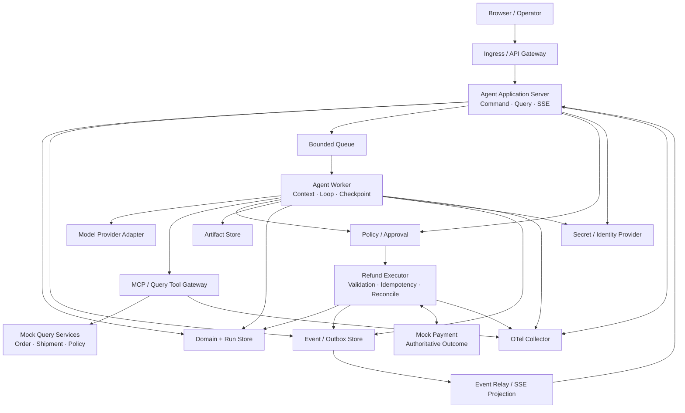

# 06 · 从 Runtime 到生产拓扑：部署与迁移验收

本地练习中，一个 Node.js 进程可以同时接收 HTTP 请求、调用模型、执行 Tool、保存内存状态并向浏览器发送 SSE。它适合验证第一条纵向切片，却隐藏了生产环境最重要的事实：浏览器连接会中断，模型调用可能持续数十秒，Worker 会被滚动替换，审批可能等待数小时，外部副作用必须在进程死亡后继续核对。

生产拓扑的目标不是把系统拆成尽可能多的服务，而是让不同生命周期、伸缩方式和信任级别的工作拥有明确边界。小规模系统仍可以从模块化单体开始；只要持久状态、异步任务、权限和恢复契约已经分离，进程边界可以按测量结果逐步调整。

上一章已定义 Behavior Bundle、Shadow、Canary 与 Rollback 的行为语义和准入证据。本章不重新定义评分阈值或分流策略，而是将它们落到物理运行环境：进程拓扑、Health、Drain、Migration 和 CI/CD 编排以本章为准。

> 时效性核验：2026-07-15。本章涉及 Kubernetes、OpenTelemetry 与云原生健康检查的行为依据文末官方资料；具体平台配置需要按所选运行环境重新验证。

## 本章目标

- 将 Web/API、Agent Worker、Queue、Store、Tool 与观测系统放入一张生产拓扑。
- 区分 Liveness、Readiness、Startup、Drain 与业务可恢复性。
- 设计横向扩展、Ownership、Fencing、SSE 重连和背压。
- 让数据库、Event、Checkpoint 与 Behavior Bundle 跨版本迁移。
- 将行为发布门禁编排进 CI/CD，验证拓扑中的 Drain、Canary 执行、Rollback 与 Manual Takeover。

## 1. 先按生命周期拆分职责

一个可运营的最小拓扑可以表达为：



各组件的职责不同：

| 组件                   | 持有的责任                                                | 不应持有                                       |
| -------------------- | ---------------------------------------------------- | ------------------------------------------ |
| Application Server   | 认证、Command/Query、Public State、Event cursor、Admission | 长时间阻塞的模型 Loop、浏览器私有事实                      |
| Agent Worker         | 获取 Run ownership、执行有界 Loop、checkpoint、故障收尾           | 用户 Session、永久高权限凭证                         |
| Queue                | 调节生产与消费速率、延迟投递、重试调度                                  | 领域真相、无限重试策略                                |
| Domain / Run Store   | Run、Proposal、Approval、Intent、Outcome 引用/投影与版本        | 把投影视为外部效果的权威来源；把 Provider 原始对象作为领域模型       |
| Event / Outbox Store | Canonical Event、可靠发布、重放依据                            | 任意可变聊天文档                                   |
| Artifact Store       | 大型输入输出、Evidence、Trace attachment，按 digest 引用         | 未分类、无保留期的敏感转储                              |
| Policy / Approval    | Authorization、不可变 Proposal 与人工决定校验                   | 提交外部副作用、证明支付 Outcome                       |
| Refund Executor      | 参数与资源版本复核、稳定 Intent、幂等提交与 Reconciliation             | 重新规划用户目标、把 Timeout 当作未执行                   |
| Tool Gateway / MCP   | 只读能力发现、调用适配、网络与凭证边界                                  | 替代资源服务 Authorization、把 Query 升格为退款 Command |
| OTel Collector       | 接收、处理、脱敏和导出 Telemetry                                | 业务恢复所需的唯一 Event 副本                         |

这里不要求每一行都成为独立微服务。Application Server、Policy、Executor 与 Mock Domain 可以部署在同一代码库甚至同一进程中，但它们仍需通过可测试接口分离：Policy 决定动作资格，Executor 是外部效果的唯一提交边界，Mock Payment 才持有权威 Outcome。这样即使日后因模型延迟、伸缩或安全要求拆分进程，领域契约也无需重写。

## 2. 同步请求只负责创建和观察 Run

浏览器发起“分析工单”时，HTTP Handler 不应一直占用请求直到 Agent 完成：

```text
POST /runs
→ authenticate + authorize admission
→ validate Task Contract
→ persist Run(QUEUED) + outbox event
→ enqueue run_id
→ return 202 + run_id + snapshot_version
```

后续通过 Query 与 Event Stream 观察状态。这个边界带来三项收益：

- 浏览器断线不等于取消 Run；
- Application Server 可以独立扩缩容；
- Worker 重启、等待审批和 Reconciliation 不依赖原 HTTP 连接。

短时只读请求可以保留同步 fast path，但必须使用相同 Run/Event 语义，不能形成一套无法恢复的旁路。

## 3. SSE 是状态投影通道，不是任务所有者

Server-Sent Events（SSE）适合服务端单向推送 Run Event，但 TCP 连接不是持久状态。客户端采用：

```text
GET snapshot(version=N)
→ subscribe from sequence=N+1
→ idempotent reduce events
→ detect duplicate / gap
→ gap or retention miss: fetch new snapshot
```

负载均衡不必依赖 sticky session，前提是任何 Application Server 都能从共享 Event/Projection Store 读取 cursor 之后的事件。SSE Relay 只推送已经持久化的 Canonical Event；未经持久化的模型 token 可以作为可丢失的 transient signal，但不能驱动 Proposal、Approval 或 Outcome 状态。

连接数、每连接缓冲、Event 保留和慢消费者策略必须设限。慢客户端落后超过窗口时，关闭增量流并要求 Snapshot 恢复，比在服务器内存中无限积压更可靠。

## 4. Queue、Admission 与 Backpressure

Queue 不能修复无限制的请求入口。Admission Controller 在创建 Run 前检查：

- tenant 与用户并发上限；
- 当前 Queue depth、oldest age 和预计 deadline；
- Provider、Tool 与数据库的可用配额；
- 任务风险、降级路径和剩余人工容量；
- Kill Switch、维护窗口与区域状态。

接受后，Queue Message 只携带 `run_id`、`attempt_id`、版本和 Trace Context 等最小引用。大型 Context、凭证和完整业务对象留在受控 Store。消费失败按分类决定 retry、requeue、dead letter、reconciliation 或 manual takeover，不能由 Queue 的默认次数统一处理。

优先级也不能只按付费等级设置。`IN_DOUBT` 核对、Approval 到期处理和安全收尾必须拥有独立容量，避免被新生成任务饿死。

## 5. 横向扩展必须配合 Ownership 与 Fencing

多个 Worker 可以消费不同 Run，但同一时刻只能有一个 owner 推进某个 Run 的可变状态。租约记录至少包含：

```text
run_id
owner_id
ownership_epoch
lease_expires_at
heartbeat_at
attempt_id
```

新 Worker 在租约过期后使用 Compare-and-Swap 获取更高 `ownership_epoch`。所有 checkpoint、Event 与外部 Command 准备记录都携带 epoch；旧 Worker 即使恢复网络，它的迟到写入也会被 Store 拒绝。

Lease 只解决运行权竞争，不解决外部副作用 exactly-once。退款 Executor 仍依赖稳定 Intent、Idempotency Key 与权威 Receipt；Worker 丢失 ownership 后不能以新参数创建第二个 Intent。

扩容指标应组合 Queue age、active Run、Provider concurrency、Tool latency 和数据库容量。仅按 CPU 扩容通常无效，因为 Agent Worker 经常在等待网络，同时已经占用 Provider 或 Tool 配额。

## 6. Secret、Identity 与 Egress 是生产数据平面

Application Server 使用用户身份处理 Command；Worker 使用 workload identity 获取本次 Run 所需的短期能力。不要把 Provider Key、支付凭证或 tenant token 写入 Queue、Checkpoint、Prompt、Trace 或 Artifact。

```text
effective permission
  = workload identity
  ∩ original actor authority
  ∩ tenant policy
  ∩ run purpose
  ∩ tool action/resource policy
```

网络 Egress 默认拒绝，只允许 Model Provider、受控 MCP/Tool Endpoint、Store 和 Telemetry Collector 等已登记目标。URL Tool 必须在解析、重定向和实际连接阶段防止 SSRF 与 DNS rebinding；Tool 返回的链接不能直接成为新的网络权限。

Secret 轮换需要验证新旧 Worker 的重叠窗口、撤销传播和失败降级。长期暂停的 Run 不保存旧 Secret，只在恢复时按固定业务身份重新换取当前短期凭证并重新授权。

## 7. 四种健康状态不能混为一个 `/health`

| 检查                | 回答的问题              | 失败后的动作                     |
| ----------------- | ------------------ | -------------------------- |
| Startup           | 进程是否完成必要初始化？       | 延后 Liveness/Readiness 判断   |
| Liveness          | 进程是否陷入无法自愈的坏状态？    | 重启进程                       |
| Readiness         | 当前实例能否安全接收新流量或新任务？ | 从 Service / Consumer 池摘除   |
| Business Recovery | 已接收 Run 是否能够恢复和收尾？ | 告警、迁移、Reconciliation 或人工接管 |

Readiness 不应强制所有下游都健康。Provider 故障时，Application Server 仍可能需要提供历史状态、Cancel 和人工接管；如果健康检查把它整体移除，用户反而失去控制入口。应按能力暴露 degraded state，并让 Admission 停止相应新任务。

Liveness 也不应执行昂贵的模型或数据库全链路请求。探针过重会在依赖退化时触发重启风暴，把可恢复故障扩大成系统抖动。

## 8. Drain 是一次状态迁移

滚动发布、缩容或节点维护时，Worker 依次执行：

1. Readiness 变为 false，停止获取新 Run/Step；
2. 标记 draining，等待当前 Model/Tool 到达安全边界；
3. 持久化完整 Item、Budget、Cancel、Intent 和 Effect State；
4. 释放或让 lease 到期，并记录可恢复 checkpoint；
5. 对超出 deadline 的只读调用取消，对未知写效果进入 Reconciliation；
6. 在 grace period 内完成 Telemetry flush，但不让观测故障阻塞业务状态持久化。

Application Server Drain 还要停止接收新 Command，保留已有 SSE 连接一段时间并发出 reconnect hint。Ingress 摘除与进程终止之间必须留出传播时间；否则终止信号到达后仍可能收到新请求。

## 9. 迁移要同时覆盖四个版本面

Agent 应用的迁移不仅是数据库 DDL：

| 版本面                | 典型变化                               | 发布前验证                                 |
| ------------------ | ---------------------------------- | ------------------------------------- |
| Domain Schema      | Proposal、Approval、Outcome 字段       | Expand/Contract、双读写窗口、回滚兼容            |
| Event Schema       | Event type、payload、sequence 语义     | Upcaster、旧 Event Replay、Projection 重建 |
| Runtime Checkpoint | Node、State、Reducer、Loop 位置         | 旧 checkpoint resume、不可迁移时人工接管         |
| Behavior Bundle    | Model、Prompt、Tool、Policy、Knowledge | Dataset、Shadow、Canary、旧 Run 版本路由      |

推荐先 Expand：新增兼容字段、Reader 同时理解旧新版本；再部署 Writer 和迁移后台任务；确认旧 Run、Event Replay 与回滚窗口后才 Contract。破坏性删除之前必须证明保留期内不再存在依赖旧 Schema 的暂停 Run。

Checkpoint 迁移尤其需要失败策略。无法证明安全的旧 Run 不应被新代码“尽力继续”，而应冻结原 Artifact、显示原因并进入 Manual Takeover。

### 备份恢复是迁移的逆向验收

为 State Store、Event History、Queue、Artifact、Secret 和领域系统分别声明 RTO/RPO，并在隔离环境中实际恢复：确认 Fencing/CAS 仍能阻止双写，Queue Replay 不会产生重复效果，旧 Event、Checkpoint 和 Behavior Bundle 仍可解码，删除 Tombstone、Audit 与权限状态不会因恢复而回退。还要在 Provider 或区域不可用的演练中，验证实际拓扑与上一章声明的 Fallback 或非 Fallback 降级路径一致。没有恢复演练的 RTO/RPO 只是目标，不是证据。

## 10. Tenant、Region 与 Retention 从数据流设计

多租户隔离至少贯穿：

- Store partition key 与每次 Query 的 tenant predicate；
- Queue topic/attribute、Worker admission 与并发配额；
- Artifact namespace、encryption key 与 signed URL；
- Model Provider、MCP Server 和 Telemetry exporter 的区域 allowlist；
- Cache key、Vector Index、Eval sample 与调试导出；
- 删除、Legal Hold、Audit 和备份恢复。

Region 不是部署标签。一个 EU Run 如果把 Prompt 发往未获准区域的 Provider，或把 Trace 导出到另一地区，仍然违反数据边界。创建 Run 时固定 `data_region` 与允许的 dependency set；恢复和 fallback 不能静默跨区。

Retention 也按数据类型设定：Domain Outcome、Audit、Run Event、Prompt/Response、Artifact 和 Telemetry 的用途不同，保留时间与访问权限不应相同。删除流程需要覆盖 Cache、Index、备份标记和第三方导出，而不是只删主表。

## 11. CI/CD 门禁验证的是行为和恢复

候选版本的 Dataset、Protected Slice、Shadow、Canary 分流与停止阈值由 [发布 Agent 行为系统](/masterpiece-static-docs/09-可靠性与可观测/05-发布-模型依赖与生产运营.md) 定义。拓扑流水线负责证明该策略能在真实运行边界中执行：

```mermaid
flowchart LR
    A["Type / Lint / Unit"] --> B["Protocol + Schema Contract"]
    B --> C["Recorded Stream + Fault Tests"]
    C --> D["Security / Dependency / Secret Scan"]
    D --> E["Offline Behavior Gate<br/>见上一章"]
    E --> F["Migration + Old Run Replay"]
    F --> G["Ephemeral Topology Smoke"]
    G --> H["Drain + Ownership Takeover"]
    H --> I["Shadow / Canary Execution<br/>+ SLO Gate"]
    I --> J["Ramp / GA"]
```



门禁不仅检查新 Run Happy Path，还要检查：

- 旧 Event、Checkpoint 和 Proposal 是否能被新 Reader 读取；
- Rollback 后的旧 Worker 是否能读取新版本在兼容窗口写出的数据；
- Drain、Lease 接管、SSE 重连和 Queue Replay 是否幂等；
- Kill Switch 是否只阻止新 Planning/Command，同时保留状态查询和 Reconciliation；
- Telemetry 或 Eval 后端不可用时，业务是否按声明降级；
- Canary 是否只接收获准的新 Run，不重新解释等待审批或写入中的 Run。

Rollback 恢复的是完整 Behavior Bundle 与兼容运行环境，不只是容器镜像。外部效果已经发生时，Rollback 不能撤销事实；系统继续用原 Intent 和 Receipt 核对，并把修复版本限制在后续控制流。

## 12. Manual Takeover 是正式终态路径

自动恢复预算用尽、Schema 无法安全迁移、依赖长时间不可用或证据冲突无法裁决时，系统进入 `MANUAL_INTERVENTION`。接管界面至少提供：

- 当前 Run、Execution/Effect Status 与最后权威时间；
- 已固定 Behavior Bundle、Proposal、Approval、Intent 和资源版本；
- 已完成动作、未知效果、重试和 Reconciliation 记录；
- Evidence 与 Artifact 引用，不暴露无权敏感数据；
- 可执行的有限 Command，以及每个 Command 的授权与后果；
- 接管 actor、时间、原因和后续 Audit。

人工接管不是“查看聊天后自行处理”。如果操作员需要跳出系统猜测发生了什么，生产拓扑仍缺少状态和证据。

## 实践：为 Resolution Desk 设计可演练的部署拓扑

### 进入本章时已有能力

Resolution Desk 在独立练习项目中已经具备 Run/Event、Queue、Worker 恢复、Trace、Behavior Bundle 与 Mock 外部服务。本章不要求把所有组件拆成微服务，也不在教材仓库创建部署代码。

### 本章增加的能力

在练习项目中先部署最小三进程拓扑：

1. Application Server：Command、Query、Snapshot 与 SSE；
2. Agent Worker：Queue Consumer、Loop、Checkpoint 与 Reconciliation；
3. Mock Domain/MCP：订单、政策与支付权威状态。

配套共享 Store、Bounded Queue、Artifact Store、Secret Provider 和 OTel Collector。为每个组件写明 owner、scale signal、health、drain deadline、data classification、RTO/RPO 和失败降级。然后进行一次兼容 Schema 扩展与一次 Behavior Bundle Canary。

### 故障与迁移演练

至少演练：

1. 两个 Worker 竞争同一 Run，旧 epoch 写入被拒绝；
2. Worker 在支付 Commit 后、Receipt 写入前终止，新 Worker 用原 Intent 收敛；
3. SSE Server 重启，客户端使用 sequence 或 Snapshot 恢复；
4. Queue 积压触发 Admission 降级，Reconciliation 仍有保留容量；
5. Provider、MCP 或 Telemetry Collector 分别不可用，系统按不同能力降级；
6. 新版本 Readiness 通过后开始 Canary，Drain 期间没有新任务进入旧 Worker；
7. 旧 checkpoint 遇到 State Schema 变化，安全迁移或进入人工接管；
8. Rollback 后新旧 Run 都可读取，已发生退款不会被重复提交。

### 验收证据

产出拓扑图、责任表、数据流、健康矩阵、迁移兼容矩阵、故障 Trace 和恢复结果。验收标准不是“Pod 都是 Running”，而是正常路径可完成、禁止路径不能发生、未知效果能收敛、旧 Run 能恢复、用户在依赖故障时仍能看到状态并接管。

## 常见误区

- 上 Kubernetes 就自动获得 durable Agent Runtime。
- Queue 可以替代 Event Store、Checkpoint 或领域状态。
- Pod 重启成功说明业务 Run 已经恢复。
- Readiness 依赖所有下游健康，失败时应关闭整个用户入口。
- Sticky Session 可以替代 SSE cursor 与共享状态。
- 横向增加 Worker 一定提高吞吐，不需要考虑 Provider 与 Tool 配额。
- 数据库迁移通过后，旧 Event 和 Checkpoint 一定兼容。
- Rollback 容器镜像可以撤销已经发生的外部副作用。

## 本章小结

生产拓扑把不同生命周期的工作分开：Application Server 接收和展示任务，Queue 调节速率，Worker 在租约与预算下推进 Run，Store 持有领域事实与恢复证据，Tool Gateway 控制外部能力，OTel 连接因果链。Health、Drain、Fencing、Schema Migration、Canary 与 Manual Takeover 共同保证系统能在发布和故障中继续解释真实状态。完成这些验收后，Resolution Desk 才从“可运行 Demo”进入“可运营系统”；下一章再利用这些生产证据建立受控改进闭环。

## 官方资料

- [Kubernetes: Pod lifecycle](https://kubernetes.io/docs/concepts/workloads/pods/pod-lifecycle/)
- [Kubernetes: Liveness, Readiness and Startup Probes](https://kubernetes.io/docs/concepts/configuration/liveness-readiness-startup-probes/)
- [Kubernetes: Graceful node shutdown](https://kubernetes.io/docs/concepts/cluster-administration/node-shutdown/)
- [Kubernetes: Horizontal Pod Autoscaling](https://kubernetes.io/docs/tasks/run-application/horizontal-pod-autoscale/)
- [OpenTelemetry: Context propagation](https://opentelemetry.io/docs/concepts/context-propagation/)
- [W3C Trace Context](https://www.w3.org/TR/trace-context/)
- [Google SRE Workbook: Canarying Releases](https://sre.google/workbook/canarying-releases/)
- [AWS: Transactional outbox pattern](https://docs.aws.amazon.com/prescriptive-guidance/latest/cloud-design-patterns/transactional-outbox.html)

[下一章：受控改进——从生产证据到候选 Behavior Bundle](/masterpiece-static-docs/09-可靠性与可观测/07-受控改进-从生产证据到候选Behavior-Bundle.md)
