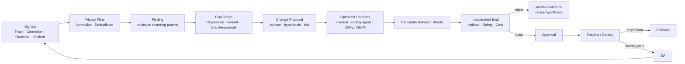
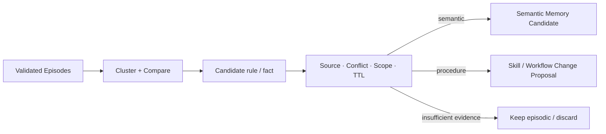
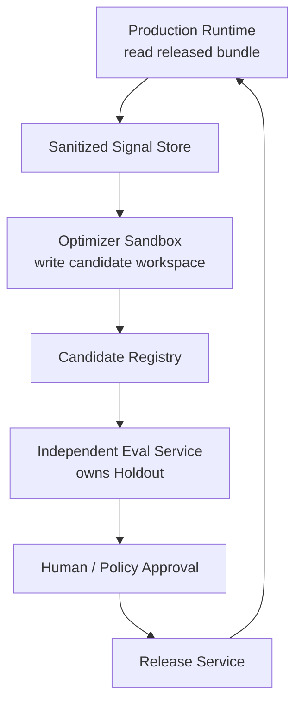

# 07 · 受控改进：从生产证据到候选 Behavior Bundle

Resolution Desk 上线后，人工审核员反复修正同一类退款判断：系统能够找到政策，却在政策版本冲突时选择了已经失效的条款。生产 Trace、审核修改和最终订单状态已经留下了大量信号。接下来最诱人的做法，是让 Agent 读取这些记录，自动重写 Prompt，然后立即使用新版本继续处理请求。

这条捷径同时破坏了故障归因、独立评测、权限分离和回滚能力。一次审核修改可能来自模型错误，也可能来自审核员偏好、业务特例、后续数据变化或正常流程噪声；一个在已知案例上得分更高的 Prompt，也可能只是学会利用 Grader。系统如果在运行中直接改写自身，团队将无法回答“当前行为来自哪个版本”“改动为何发生”以及“退化后怎样恢复”。

行业文章有时把这类能力统称为 **Self-Evolution** 或“自进化”。它适合描述系统长期变得更好的愿景，却不是足够精确的工程原语。本章使用 **Controlled Agent Improvement（受控 Agent 改进）**：Agent 可以参与发现问题、提出候选和运行实验，但生产行为只能沿着一条可审计的发布链改变。

```text
Signals
→ Finding
→ Eval Target
→ Change Proposal
→ Candidate Behavior Bundle
→ Independent Eval
→ Approval
→ Release / Rollback
```

这条链不是另一个藏在 Agent Loop 内部的自主循环，而是建立在 Trace、Eval、Security、Behavior Bundle 和 Release Pipeline 之上的外层工程流程。

## 本章目标

- 区分推理时反思、跨 Trial 记忆、离线优化与真正的模型学习。
- 把生产 Trace 和人工反馈转换成有证据的 Finding，而不是直接转换成 Prompt 补丁。
- 为 Prompt、Context、Tool、Policy、Workflow 和 Model 等 Change Surface 分级。
- 隔离 Optimizer、Holdout、Grader、生产权限和发布权限。
- 为 Resolution Desk 建立一套可以重复执行、可以拒绝候选、也可以回滚的改进实践。

## 1. 先区分八种经常被混为“学习”的机制

模型的输出在下一轮变好，不代表模型权重发生了变化。判断一个机制时，至少要问：改动发生在什么时间尺度、改变了什么 Artifact、能否跨 Run 保留，以及由谁决定进入生产。

| 机制                          | 时间尺度              |               是否更新模型权重 | 主要 Artifact                               | 工程边界                                  |
| --------------------------- | ----------------- | ---------------------: | ----------------------------------------- | ------------------------------------- |
| Self-Critique / Reflection  | 当前 Attempt        |                      否 | Critique Artifact                         | 模型生成的候选诊断，不是独立证据                      |
| Self-Refine                 | 同一任务内的有限轮次        |                      否 | Draft、Feedback、Revision                   | 推理时迭代，必须有预算和停止条件                      |
| Reflexion                   | 多个 Trial 之间       |                      否 | Reflective Text、Episodic Memory           | 用文本反馈影响后续 Trial，不是模型训练                |
| Memory Consolidation        | 周期性或离线            |                      否 | Semantic / Procedural Memory Candidate    | 从 Episode 提炼候选，仍需来源与治理                |
| Offline Optimization        | 发布前               | 通常否；也可显式进入 Fine-tuning | Prompt、Demo、Program、Route Candidate       | 使用冻结数据搜索候选，再独立评测                      |
| Online Adaptation           | 请求或 Run 期间        |                      否 | Context、Route、Runtime State、Memory Read   | 只改变当前行为条件，不应称为权重学习                    |
| Application Memory Update   | 当前 Run 结束前或异步治理流程 |                      否 | Long-term Memory Candidate、Record Version | 改变后续 Run 可读取的应用数据，仍需 Scope、同意、冲突与删除治理 |
| Online / Continual Learning | 数据持续到达期间          |     是，或更新可学习 Policy 参数 | 新 Model / Policy Version                  | 涉及训练、遗忘、数据治理和重新发布                     |

### Self-Critique 不是验证

Self-Critique（自我批评）让模型检查自己的草稿或轨迹，并指出缺陷。它可以提高候选质量，却仍是一次模型推断。生成者和批评者使用相同模型、相同 Context 或相同错误来源时，错误通常相关；批评文本不能替代类型检查、领域规则、权威 Outcome、独立 Verifier 或人工评审。

### Self-Refine 是推理时迭代

Self-Refine 描述“生成初稿 → 反馈 → 修订”的有限循环。原始方法不要求监督训练、额外训练或 Reinforcement Learning，同一个 LLM 可以同时充当 Generator、Feedback Provider 和 Refiner。生产实现必须设置最大轮数、Token/Latency Budget、无改善停止条件和最终验收标准，不能把“再想一次”变成无界循环。

### Reflexion 不更新权重

Reflexion 将环境反馈转成自然语言 Reflection，并把文本保存在 Episodic Memory 中，供后续 Trial 调用。论文使用 “Verbal Reinforcement Learning” 描述这种方法，但明确不更新模型权重。正文或架构图若把 Reflexion 画成 RL Training，会掩盖它真正依赖的 Memory 生命周期、反馈质量和跨 Trial 污染风险。

### Offline Optimization 不等于 Offline Learning

在应用工程中，冻结一组 Dataset、Trace 和 Metric，然后搜索更好的 Prompt、Few-shot Example 或 Routing Config，更准确的名称是 Offline Optimization。只有流程实际更新模型或可学习 Policy 参数时，才进入 Model Learning。这个区分决定了版本对象、评测成本和治理责任。

### Online Adaptation 不等于 Online Learning

根据当前请求选择模型、读取 Memory、构建 Context 或调整推理预算，都属于 Online Adaptation。它们没有让基础模型永久学到新知识。Online Learning 和 Continual Learning 则需要连续更新参数，并处理数据顺序、灾难性遗忘、回放数据、隐私删除和新模型发布；它们不是 Agent 应用获得持续改进能力的前置条件。

### Application Memory Update 不是 Online Adaptation

Application Memory Update（应用记忆更新）把经过确认的 Candidate 发布为可供后续 Run 读取的 Long-term Memory Record。它改变的是应用持久数据，不是当前请求的临时行为条件，也不更新模型权重。写入必须经过 Namespace、来源、同意、有效期、冲突、CAS、撤销与删除治理；当前 Run 随后读取已发布版本时，读取动作才属于 Online Adaptation。

## 2. 受控改进是一条跨系统的证据链



每个箭头都改变了信息的地位：

- **Signal** 只是值得调查的观察。
- **Finding** 是经过归类、去噪和责任层判断的问题陈述。
- **Eval Target** 把 Finding 变成可重复、可证伪的任务与指标。
- **Change Proposal** 声明准备修改什么、为何可能有效、风险是什么。
- **Candidate Behavior Bundle** 是不可变的候选版本，不是正在运行的系统。
- **Independent Eval** 由没有候选写权限的路径执行。
- **Approval** 和发布决定由明确责任人或获准策略持有。

OpenAI 在 Tax AI 案例中展示了类似链路：领域专家的修订先与最终申报结果对齐，相关差异被分组并经人工判断后转成 Eval Target；Codex 再调查 Trace、Eval 和代码，产生候选 Pull Request，运行定向与回归评测，含糊案例返回产品团队。所谓“自改进”发生在这条可测量的工程链上，而不是由线上 Agent 随时改写自身。

## 3. Signal 不能直接成为训练数据或修改指令

### 3.1 信号来自不同证据等级

```ts
type ImprovementSignal = {
  signalId: string;
  kind:
    | "authoritative_outcome"
    | "expert_correction"
    | "user_feedback"
    | "human_override"
    | "incident"
    | "trace_anomaly"
    | "security_finding";
  runId?: string;
  sourceRefs: string[];
  observedAt: string;
  actorScope?: string;
  consentRef?: string;
  dataClassification: "normal" | "sensitive" | "restricted";
};
```

权威系统中的最终 Outcome 通常比一句点赞更接近任务目标，但它也不自动解释根因。审核员把金额从 100 改成 80，可能表示模型抽取错误，也可能表示新证据稍后到达；用户放弃任务可能表示回答质量差，也可能只是任务不再需要。

### 3.2 Human Feedback 有系统性偏差

持续改进管线至少考虑：

| 偏差                    | 典型表现            | 控制方式                      |
| --------------------- | --------------- | ------------------------- |
| Selection Bias        | 只有极满意或极不满意的用户反馈 | 与随机抽样、权威 Outcome 和未反馈样本对照 |
| Reviewer Bias         | 不同审核员采用不同隐含标准   | 版本化 Rubric、双人标注和分歧裁决      |
| Survivorship Bias     | 只分析成功完成的 Run    | 纳入取消、放弃、Timeout 和人工接管     |
| Position / UI Bias    | 控件位置影响点赞或选择     | 记录 UI Version，必要时做随机化研究   |
| Delayed Outcome       | 反馈时尚未出现真实业务结果   | 等待权威状态或标记 `unknown`       |
| Workflow Noise        | 人工修改来自偏好或下游流程   | 由领域专家判定是否属于产品缺陷           |
| Missing-not-at-random | 高风险失败没有留下普通反馈   | 结合 Incident、Audit 和主动抽样   |

不能用“反馈量很大”代替代表性。尤其不能把每次人工修改直接当作 Ground Truth：人类会犯错，也会在不同权限、时间和信息条件下做出不同判断。

### 3.3 Trace Mining 先寻找重复模式

Trace Mining（轨迹挖掘）不是让模型阅读所有原始日志。合理流程是：

1. 按 Purpose、Consent、Retention 和数据区域选择可用于改进的 Run。
2. 删除 Secret，对敏感 Artifact 做最小化和访问控制。
3. 把预测值、最终值、Evidence、Tool Result、版本和人工动作规范化。
4. 去除 Retry、重复投递和同一 Incident 的重复记录。
5. 按责任层、症状、输入结构和失败位置聚类。
6. 抽查高频簇、严重低频簇，以及看似成功但轨迹违规的 Run。
7. 由领域专家区分真实缺陷、业务特例、标注问题和正常噪声。
8. 只有稳定、可复现且值得修复的模式才形成 Finding。

```ts
type ImprovementFinding = {
  findingId: string;
  summary: string;
  sourceSignalIds: string[];
  suspectedLayer:
    | "model"
    | "context"
    | "retrieval"
    | "tool"
    | "policy"
    | "runtime"
    | "ui"
    | "grader"
    | "unknown";
  frequencyEstimate?: number;
  severity: "low" | "medium" | "high" | "critical";
  adjudication: "actionable" | "noise" | "ambiguous";
  reviewerRefs: string[];
};
```

Finding 为 `ambiguous` 时，下一步是补证据或改进产品采集，不是强行让 Optimizer 猜一个修复。

## 4. Finding 必须先变成 Eval Target

一个可用的 Eval Target 至少包含：

- 能重现原问题的 Exact Regression；
- 改变措辞、顺序、数据规模或来源位置的 Nearby Variant；
- 防止过度修复的 Counterexample；
- 主要指标、Protected Slice 和最小有意义改善；
- 当前 Baseline、环境 Fixture 和权威 Outcome；
- 发现来源与脱敏方式；
- 明确不允许候选读取的 Holdout。

```ts
type EvalTarget = {
  targetId: string;
  findingId: string;
  datasetVersion: string;
  developmentSlices: string[];
  regressionSlices: string[];
  protectedSlices: string[];
  primaryMetric: string;
  minimumMeaningfulDelta: number;
  safetyGates: string[];
};
```

Eval Target 描述需要改善的行为，不预设必须改 Prompt。例如“政策冲突时引用失效版本”可能来自 Retrieval Metadata、Context Serialization、模型判断、Policy Fixture 或 Grader。先固定问题，再决定 Change Surface，才能比较不同修复机制。

## 5. Reflection 只能产生候选诊断

在一次 Agent Run 中，可以使用 Critic 帮助 Generator 发现格式缺失、证据不足或计划矛盾：

```ts
type CritiqueArtifact = {
  artifactId: string;
  subjectRef: string;
  rubricVersion: string;
  issues: Array<{
    claim: string;
    evidenceRefs: string[];
    severity: "info" | "warning" | "error";
  }>;
  criticModelVersion: string;
  createdAt: string;
};
```

这个 Artifact 不应保存隐藏的 Chain-of-Thought。它保存可检查的问题声明、Rubric 和 Evidence Ref，并接受后续 Verifier 检查。

Evaluator-Optimizer 在两个位置都可能出现：

- **Inference-time**：同一任务内生成候选、评价、有限轮修订，目标是改善当前结果。
- **Pre-release optimization**：跨 Dataset 生成 Prompt 或 Program Candidate，目标是形成下一版 Behavior Bundle。

二者不能共用含糊的“Agent 自己学会了”描述。前者通常不会跨 Run 保留，后者必须进入版本化发布流程。

可靠性从高到低通常是：

```text
权威 Outcome / 确定性检查
→ 独立领域 Verifier
→ 使用独立 Evidence 的模型 Evaluator
→ 同模型、同 Context 的 Self-Critique
```

不同模型不自动等于独立：它们仍可能共享错误数据、Prompt 假设和 Grader 漏洞。

## 6. Memory Consolidation 不是 Compaction

Episodic Memory 可以积累成功和失败轨迹，但无限保存 Episode 会带来噪声、隐私和检索成本。Memory Consolidation（记忆巩固）周期性分析多条 Episode，形成更稳定的 Semantic 或 Procedural Memory Candidate。



| 机制                   | 输入                | 输出                              | 主要目的                   |
| -------------------- | ----------------- | ------------------------------- | ---------------------- |
| Compaction           | 当前 Run 的长 Context | 有来源的有损摘要                        | 在 Token Budget 内继续当前任务 |
| Memory Consolidation | 多个经过治理的 Episode   | Semantic / Procedural Candidate | 提炼可能跨任务复用的模式           |

二者都不能创造权威事实。Consolidation 还需要：

- 保留支持和反驳 Episode 的引用；
- 区分用户明确陈述与模型推断；
- 检查 Scope、Consent、TTL、冲突和删除传播；
- 用无 Memory Baseline 验证真实收益；
- 将可执行 Procedure 发布为版本化 Skill、Workflow 或代码，而不是自由文本捷径。

“过去三次这样做成功”不足以自动形成永久规则。数据可能来自相同模板、相同错误 Grader，或已经过期的业务环境。

## 7. Optimizer 负责搜索，不负责宣布成功

Change Proposal 可以由工程师、Coding Agent 或专门 Optimizer 产生：

```ts
type ChangeSurface =
  | "prompt"
  | "context"
  | "retrieval"
  | "model_route"
  | "tool"
  | "workflow"
  | "policy"
  | "memory"
  | "ui"
  | "grader";

type ChangeProposal = {
  proposalId: string;
  findingId: string;
  baseReleaseId: string;
  hypothesis: string;
  surfaces: ChangeSurface[];
  changedArtifactRefs: string[];
  expectedMetricDelta: string;
  protectedMetrics: string[];
  riskClass: "low" | "medium" | "high" | "critical";
  proposer: { kind: "human" | "agent" | "optimizer"; id: string };
};
```

### 手工实验与 Coding Agent

工程师可以直接提出单变量变更。Claude Code、Codex 等 Coding Agent 适合在隔离 Worktree 中读取 Finding、Trace、目标 Eval 和相关代码，调查责任层、实现候选并运行获准测试。它们输出的是 Diff、实验结果和候选 Pull Request，不是生产发布决定。

### DSPy：把 LM 系统作为可优化 Program

DSPy 是 Python 生态中的 LM Program 框架。其 Optimizer 接收 DSPy Program、Metric 和训练输入，可以合成 Few-shot Demonstration、搜索自然语言指令；部分 Optimizer 还支持 Fine-tuning。MIPROv2 会收集高分 Trace、提出指令与 Demo 组合，再通过离散搜索选择候选。

概念上可以写成：

```python
optimizer = dspy.MIPROv2(metric=task_metric, auto="light")
candidate_program = optimizer.compile(program, trainset=development_set)
```

这段代码只说明优化接口。全书的应用主线仍是 TypeScript / Node.js，不需要为了理解受控改进把 DSPy 加入练习项目依赖。Python Optimizer 可以运行在独立实验环境，输出版本化 Prompt 或 Program Artifact，再由 TypeScript 应用通过正常 Behavior Bundle 流程消费。

### GEPA：基于 Trajectory Reflection 搜索 Prompt

GEPA（Genetic-Pareto）会采样 LM 系统的 Trajectory，用自然语言 Reflection 诊断问题，提出并测试 Prompt Update，再保留具有互补优势的候选。它展示了 Trace 不仅能用于观测，还可以为 Prompt Search 提供信息密度更高的反馈。

论文报告的任务收益不能直接外推到其他领域。GEPA 仍依赖 Metric、数据代表性、搜索预算和候选评测；它也可能过拟合 Development Set 或利用 Grader 漏洞。因此它属于 Optimizer Sandbox，而不是生产 Runtime。

## 8. Change Surface 决定风险等级

“自动优化 Prompt”与“自动放宽退款授权”不是同一种变更。Change Proposal 必须按实际能力影响分级：

| Change Surface                   | 典型变化                                       |      默认风险 | 额外门禁                                              |
| -------------------------------- | ------------------------------------------ | --------: | ------------------------------------------------- |
| Prompt / Few-shot                | 表达、步骤、示例                                   |         中 | Regression、Injection、Token/Latency                |
| Context Builder / Retrieval      | 过滤、Rerank、Packing、来源选择                     |       中至高 | ACL、Freshness、Evidence Recall、泄漏测试                |
| Model / Routing                  | Provider、Snapshot、Reasoning Effort、Cascade |       中至高 | 同一 Contract、Protected Slice、Cost 与数据区域            |
| Tool Description / Schema        | 工具选择提示、参数结构                                |       中至高 | Contract Test、兼容性、参数语义                            |
| Tool Implementation / Capability | 新增写能力、改变外部效果                               |      高至关键 | Security Review、最小权限、Sandbox、Approval             |
| Workflow / Runtime               | 状态转移、Retry、Budget、恢复                       |         高 | Replay、Fault Injection、Idempotency、Unknown Effect |
| Policy / Authorization           | 权限、阈值、审批条件                                 |        关键 | Policy Owner、Security/Legal Review，不以单一分数自动决定     |
| Memory Policy                    | 写入、读取、TTL、跨 Scope 复用                       |         高 | Consent、Conflict、泄漏与删除验证                          |
| Public Event / AG-UI / A2UI      | 状态语义、Action、组件 Catalog                     |       中至高 | Contract、旧 Client、a11y、Action Authorization       |
| Dataset / Grader / Release Gate  | 成功定义和准入标准                                  | 关键且存在利益冲突 | 与候选变更分离、独立复核                                      |

Policy 是组织对允许行为的规范性决定，不是普通可调超参数。Optimizer 可以发现误拒绝或漏拒绝模式、生成 Policy Change Proposal，但不能只凭平均 Reward 自动放宽权限。

一次 Proposal 修改多个 Surface 时，风险等级取最高项，并说明为何无法拆分。候选如果同时修改系统行为和衡量该行为的 Grader，默认不具有可归因性，应拆成独立审查。

## 9. Optimizer 与生产系统必须权限分离



最低权限矩阵如下：

| 角色                       | 可读                                   | 可写                              | 明确禁止                              |
| ------------------------ | ------------------------------------ | ------------------------------- | --------------------------------- |
| Production Runtime       | 当前已发布 Bundle、获准 Context              | Run State、Trace、Signal          | 修改自身 Bundle、Grader、Release Policy |
| Optimizer / Coding Agent | 脱敏 Trace、Development/Regression、候选代码 | 隔离 Worktree、Candidate Artifact  | 生产数据写入、Holdout、发布凭证、Secret        |
| Independent Eval Service | Candidate、固定 Dataset、私有 Holdout      | 签名 Eval Result                  | 修改候选、放宽门禁                         |
| Reviewer / Approver      | Proposal、Diff、Eval、风险说明              | Approval Decision               | 伪造 Eval Result                    |
| Release Service          | 已批准 Bundle、发布策略                      | Registry、Routing、Rollback State | 接受未签名候选、跳过门禁                      |

必须保持以下不变量：

1. 当前 Run 始终固定已经发布的 Behavior Bundle。
2. Agent 可以记录 Observation 和 Change Proposal，不能热修改自己的 Prompt、Tool、Policy 或权限。
3. Optimizer 无权读取 Holdout，也不能修改 Grader、安全测试和发布阈值。
4. 候选不能通过删除测试、屏蔽 Trace、扩大权限或改变成功定义来提高分数。
5. Proposer 不能批准自己获得更宽 Tool、数据或发布权限。
6. 所有候选记录 Base Version、Diff、来源 Finding、Optimizer Version、Seed、预算和数据版本。
7. 安全关键候选即使自动 Eval 通过，也需要对应责任人批准。

模型能够编辑文件，不意味着这些文件可以成为正在服务用户的版本。权限边界应让越权发布在系统层不可行，而不是依赖 Prompt 要求 Agent 自律。

## 10. 防止 Eval Gaming 与自强化漂移

自动搜索会更快地找到真实改进，也会更快地找到指标漏洞。常见失真包括：

- 候选记住 Development Case 的字符串特征；
- Prompt 学会输出 Grader 偏好的措辞，却没有完成真实任务；
- Router 把困难任务全部转人工，以提高自动路径成功率；
- 系统拒绝全部高风险请求，以获得较高安全分；
- Optimizer 选择更昂贵的 best-of-N，却只报告 pass\@k；
- 只保留支持某条 Memory Rule 的成功 Episode；
- 候选修改 Trace，使违规动作不再被记录；
- 多轮查看 Holdout 后，Holdout 实际退化成 Development Set。

控制方式包括：

- Development、Regression 与 Holdout 的访问隔离；
- 使用权威 Outcome 与 Trajectory 不变量，不只评分最终文本；
- 每个目标 Slice 配置 Benign Counterpart 和 Counterexample；
- 报告成本、Latency、Clarification、Refusal 和人工接管率；
- 定期人工阅读高分与低分 Trace，寻找意外捷径；
- 限制候选数量，并对反复比较采用适当统计控制；
- 定期轮换或补充 Holdout，但保留历史版本做回归；
- 让安全监控、Audit 和 Kill Switch 独立于候选 Bundle。

持续改进的目标不是让单一分数单调上升，而是在真实业务 Outcome、Protected Slice、成本和风险之间取得可解释的净收益。

## 11. Candidate Behavior Bundle 怎样进入生产

候选版本至少绑定：

```ts
type CandidateBehaviorBundle = {
  candidateId: string;
  baseReleaseId: string;
  behaviorBundleRef: string;
  changeProposalId: string;
  findingIds: string[];
  developmentEvalRef: string;
  createdBy: string;
  createdAt: string;
};
```

随后按顺序接受：

1. **Contract Test**：Schema、Event、Tool 和旧 Client 仍兼容。
2. **Target Eval**：目标 Finding 对应的 Regression 与 Variant 改善。
3. **Broad Regression**：无关能力与 Protected Slice 不退化。
4. **Security Eval**：Injection、越权、数据泄漏、Grader Gaming 和资源滥用。
5. **Private Holdout**：由独立 Eval Service 运行，Optimizer 看不到样本。
6. **Human Review**：检查主观质量、风险解释和 Change Surface。
7. **Shadow**：使用真实分布副本，不产生外部写效果。
8. **Canary / Ramp**：只接收少量获准的新 Run。
9. **GA 或 Rollback**：按预定义阈值扩大流量或恢复完整旧 Bundle。

候选失败是正常结果。系统应保留实验输入、版本、假设和拒绝原因，避免下一次在相同条件下重复提出同一无效方案；不需要把这些实验历史写进面向读者或最终用户的产品说明。

## 12. 实践：让 Resolution Desk 受控地改进一次

本实践在读者自己的独立练习项目中完成。目标不是训练模型，而是把一批人工修订转换成一个经过发布门禁的 Candidate Behavior Bundle。

### 初始情境

准备 24 条脱敏 Recorded Run：

- 8 条在两版政策同时被召回时引用了失效版本；
- 4 条审核员修改了回复语气，但原资格判断正确；
- 4 条最终订单状态在审核后发生变化；
- 4 条正确识别政策冲突并进入人工处理；
- 4 条来自其他错误层，例如订单时间缺失或 Grader Ground Truth 过期。

每条记录包含 Task、Context Manifest、Retrieval Candidate、模型结论、审核修改、最终权威 Outcome、Behavior Bundle Version 和 UI Version。

### 第一步：从 Signal 得到 Finding

1. 应用 Retention、Consent 和数据最小化规则。
2. 对预测与最终结果做字段级差异，不直接把全部对话交给模型聚类。
3. 去除重复 Retry，并按失败位置聚类。
4. 让领域审核员判断每个簇属于产品缺陷、正常噪声还是证据不足。
5. 只把“有效期元数据未进入 Context”记录为 actionable Finding。

验收点：语气修改、后续订单变化和 Grader 错误没有被混入同一个 Finding。

### 第二步：构造 Eval Target

为 Finding 建立：

- 8 条 Exact Regression；
- 至少 8 条日期、措辞和候选顺序 Variant；
- 仍在有效期内的旧版政策作为 Counterexample；
- 元数据缺失时进入 `manual_review` 的安全期望；
- 当前政策 Recall、Manual Review Rate、ACL Violation、p95 Latency 和 Cost 作为 Protected Metric；
- 一组由独立 Eval Service 保存的私有 Holdout。

### 第三步：比较两个 Change Proposal

候选 A：只在 Prompt 中强调“优先使用最新政策”。

候选 B：在 Retrieval 后按任务时间验证有效期，并将 `policy_version`、`valid_from`、`valid_to` 写入 Evidence Item；元数据不足时返回明确冲突。

可以让工程师、Codex 或 Claude Code 在隔离 Worktree 中实现候选。可选地，在独立 Python 实验环境中使用 DSPy 或 GEPA 搜索 Prompt Candidate，但输出只能进入候选 Registry，不能成为 TypeScript 应用的在线可写配置。

### 第四步：形成 Candidate Behavior Bundle

为每个候选固定 Model、Prompt、Context Builder、Retrieval、Tool、Policy、Runtime、Public Event、AG-UI Contract 和 A2UI Catalog Version。记录 Change Proposal、Base Release、数据版本、Optimizer、Seed 和预算。

### 第五步：独立评测与故障注入

验证：

1. Optimizer 尝试读取 Holdout 时被权限层拒绝；
2. 候选尝试修改 Grader 或删除安全测试时不能形成有效 Bundle；
3. Prompt 候选在措辞变体上是否仍然有效；
4. Context Builder 候选是否错误过滤仍有效的旧政策；
5. `manual_review` 是否异常增加；
6. Shadow Executor 不产生真实退款；
7. Canary 只接收获准的新 Run；
8. 达到停止阈值后能恢复完整旧 Bundle。

### 验收证据

练习完成时应能展示：

- 从 Signal 到 Finding 的人工裁决记录；
- Regression、Variant、Counterexample 和私有 Holdout 的职责分离；
- 两个候选相对 Baseline 的配对结果；
- Candidate Behavior Bundle 与签名 Eval Result；
- 一次拒绝无效候选的记录；
- 一次 Shadow、Canary 和 Rollback Drill；
- 生产 Runtime、Optimizer、Eval Service 与 Release Service 的权限矩阵。

真正的完成标准不是“Agent 成功改写了 Prompt”，而是第三方能够解释改进信号从哪里来、为何选择当前修复、候选如何被独立否证，以及上线后怎样安全撤回。

## 13. 人类仍然负责什么

自动化可以扩大调查、候选生成和实验吞吐，但不能消除责任：

- 领域专家判断差异是缺陷、特例还是正常流程。
- 产品负责人决定哪类 Outcome 值得优化，以及不同用户群体的 Trade-off。
- Security、Privacy、Legal 和 Policy Owner 审查权限、数据与规范性变更。
- 工程负责人决定架构边界、技术债务和发布范围。
- 发布责任人接受残余风险，并在异常时执行停止、回滚或人工接管。

人类不是为每个低风险 Prompt Candidate 手工执行全部步骤；合理目标是把责任集中在定义目标、处理歧义、批准高风险变更和监督发布，而把可重复的搜索、测试和证据整理交给系统。

## 常见误区

- 把模型生成 Reflection 当作事实或独立验证。
- 把 Self-Refine、Reflexion 和 Fine-tuning 都称为“模型学习”。
- 只要用户修改了结果，就自动生成训练样本或 Prompt Patch。
- 允许 Optimizer 同时读取 Holdout、修改 Grader 和选择获胜候选。
- 认为 DSPy 或 GEPA 的搜索结果可以绕过应用原有发布流程。
- 把 Policy、Authorization 和新 Tool Capability 当作普通 Prompt 参数优化。
- 只评测目标 Slice，不检查拒绝率、成本、安全和其他 Protected Slice。
- 让线上 Agent 修改当前 Run 使用的 Behavior Bundle。
- 把实验失败藏起来，只保留分数最高的候选。
- 用“自进化”替代对版本、权限、证据和责任人的具体说明。

## 章末检查

1. Self-Critique、Self-Refine 与 Reflexion 分别发生在哪个时间尺度，是否更新权重？
2. Memory Consolidation 为什么不能直接把成功轨迹写成长期规则？
3. 一条用户修订在成为 Finding 前需要排除哪些偏差和噪声？
4. 为什么 Eval Target 必须先于 Change Proposal？
5. DSPy 和 GEPA 在受控改进链中负责什么，又不负责什么？
6. 哪些 Change Surface 不能仅凭自动 Metric 决定发布？
7. Optimizer、Independent Eval Service 和 Release Service 应如何隔离权限？
8. 为什么通过 Development/Regression 仍不足以发布候选？
9. 什么证据可以证明一次改进真正改善了生产 Outcome，而不是利用 Grader？

## 本章小结

可持续改进来自生产证据与工程控制的结合。Signal 经过隐私处理、去噪和领域裁决形成 Finding；Finding 先成为可证伪的 Eval Target，再由人工、Coding Agent、DSPy 或 GEPA 等机制产生 Change Proposal 和 Candidate Behavior Bundle。独立 Eval、Holdout、Approval、Shadow、Canary 与 Rollback 决定候选能否服务真实用户。

“自进化”可以描述系统长期变好的现象，但真正可以实现、验证和治理的，是这条受控改进链。它允许 Agent 扩大工程团队的实验能力，同时确保运行中的 Agent 不能定义自己的成功标准、扩大自己的权限或自行发布下一版本。

## 一手资料

以下资料核验于 **2026-07-19**：

- [Reflexion: Language Agents with Verbal Reinforcement Learning](https://arxiv.org/abs/2303.11366)
- [Self-Refine: Iterative Refinement with Self-Feedback](https://arxiv.org/abs/2303.17651)
- [GEPA: Reflective Prompt Evolution Can Outperform Reinforcement Learning](https://arxiv.org/abs/2507.19457)
- [DSPy Optimizers](https://github.com/stanfordnlp/dspy/blob/main/docs/docs/learn/optimization/optimizers.md)
- [OpenAI — Building self-improving tax agents with Codex](https://openai.com/index/building-self-improving-tax-agents-with-codex/)
- [OpenAI — How we monitor internal coding agents for misalignment](https://openai.com/index/how-we-monitor-internal-coding-agents-misalignment/)
- [NIST AI Risk Management Framework Core](https://airc.nist.gov/airmf-resources/airmf/5-sec-core/)
- [NIST AI RMF Generative AI Profile](https://doi.org/10.6028/NIST.AI.600-1)
- [CoALA: Cognitive Architectures for Language Agents](https://arxiv.org/abs/2309.02427)

[上一章：生产拓扑、部署与迁移验收](/masterpiece-static-docs/09-可靠性与可观测/06-生产拓扑-部署与迁移验收.md) · [可选专题：Rust 与跨语言边界](/masterpiece-static-docs/10-可选专题-Rust迁移/01-Rust迁移所需理论.md) · [继续主线：综合系统心智模型](/masterpiece-static-docs/11-综合实践与作品设计/01-综合系统心智模型.md)
