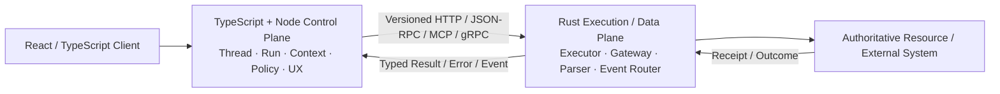

# 02 · 跨语言契约：连接 Node 控制面与 Rust 执行面

把一个 Parser 从 TypeScript 改写成 Rust 并不困难；证明两者对金额、时间、取消、错误、权限和审计具有相同语义，才是迁移的主要工作。类型都能编译并不代表业务没有变化：JavaScript 的 `number` 可能丢失大整数精度，`undefined` 与 Rust `Option` 的序列化可能不同，Timeout 也可能在两侧映射成完全不同的状态。

因此，跨语言迁移的核心交付物不是 Rust 代码，而是一份双方都能执行、测试和演进的协议契约。

## 1. 优先进程边界



进程边界带来独立部署、Shadow、Canary、资源限制和回滚能力。它不会自动提供安全隔离：CPU、内存、文件、网络、系统调用和 Secret 仍要由容器、cgroup、Sandbox、网络策略和 Workload Identity 明确限制。

默认优先 HTTP、JSON-RPC、MCP 或 gRPC。只有 Profile 证明 IPC 与序列化是主要瓶颈，且进程内耦合不会破坏安全与回滚要求时，才考虑 N-API 或 FFI。

## 2. Schema 单一来源仍不等于语义单一来源

协议至少要覆盖：

- Request / Response / Event 的 Discriminated Union；
- Protocol Version、Schema Version 与 Capability；
- Trace、Run、Call、Attempt、Intent 和 Idempotency ID；
- Actor、Tenant、Purpose、Scope 与 Delegation Chain；
- Deadline、Cancellation Correlation 与 Ownership Epoch；
- Error Code、Retryable 标记与 Unknown-effect 语义；
- Resource Version、Receipt Reference 和 Audit 字段。

可以从 JSON Schema 或 Protobuf 生成 TS/Rust 类型，但生成器只保证结构。金额单位、时间边界、Unicode 处理、权限来源和失败语义仍需写入规范并用 Fixture 验证。

## 3. Wire Type 要明确到编码层

| 概念                   | 推荐 Wire 语义                                     | 不应依赖的默认行为                         |
| -------------------- | ---------------------------------------------- | --------------------------------- |
| ID / Idempotency Key | 不透明、区分大小写的 String，声明命名空间                       | 转成 JS `number` 或做数学运算             |
| 金额                   | Currency + 最小货币单位整数；超出 JS 安全整数时用十进制 String     | IEEE-754 Float                    |
| 时刻                   | RFC 3339 UTC String；若用 Epoch，明确单位与范围           | 无时区本地字符串、无单位 Number               |
| 持续时间                 | 明确单位的 Integer；本地 Timeout 使用 Monotonic Clock    | 把时刻与时长混用                          |
| Deadline             | 绝对 Deadline；接收方按本地当前时间重算并 Clamp                | 跨主机传 Monotonic 值                  |
| Missing / Null       | 明确区分未提供、显式空、默认和删除                              | 假设 TS Optional 自动等于 Rust `Option` |
| Bytes                | 指定 Base64 Variant、Content Type 与大小上限           | 把任意 Byte 当 UTF-8 Text             |
| Text                 | UTF-8；业务需要时固定 Normalization / Case-fold 规则     | 视觉相同就认为字节相同                       |
| Canonical Hash       | 固定 Canonical Serialization、编码、字段与 Hash Version | 对两侧普通 JSON Stringify 直接求 Hash     |

金额、ID、Deadline、Missing/Null 与 Canonical Hash 是最容易“类型通过、业务漂移”的位置，必须进入 Golden Vector。

## 4. 协议错误必须映射到同一状态机

两侧需要共享前文 `ToolError` 的 canonical error code，而不只是 HTTP Status。跨语言协议不应为同一语义另造 `VERSION_CONFLICT` 或 `DEPENDENCY_UNAVAILABLE` 等别名：

```ts
type WireErrorCode = ToolError["code"];

type RemoteError = {
  code: WireErrorCode;
  retryable: boolean;
  effect: "absent" | "unknown";
  detailsRef?: string;
};
```

Wire 层使用同一个 code：资源版本冲突映射为 `CONFLICT`，依赖不可用映射为 `UNAVAILABLE`，编解码或帧语义违反映射为 `PROTOCOL_ERROR`。`effect` 不能只由 error code 推断：同一个断连在 Command 发出前是 `absent`，发出后且缺少权威证据时必须是 `unknown`。关键要求是 Node 与 Rust 对同一错误得出相同的 Retry、State Transition 和 Reconciliation 决策。

## 5. 执行面不能信任普通 JSON 中的授权结论

Node 发送的 `authorized: true` 只是一个可伪造字段。Rust 执行面至少需要：

- mTLS 或等价 Workload Identity 验证调用服务；
- Audience-bound、短期、最小 Scope 的委派凭证；
- 可核验的 Policy Decision Reference，绑定 actor、resource、action、Arguments Hash、Expiry 和 Nonce；
- Call / Idempotency ID、Deadline 与服务端去重，防止 Replay；
- 最终 Resource Service 在执行时重新授权并检查 Resource Version；
- Receipt 和重要 Event 具有可归属 Audit 与必要的完整性保护。

控制面负责提出和协调动作，执行面负责拒绝缺少可信身份、过期决策或语义不完整的请求。两侧都不能把另一侧视作无条件可信。

## 6. Contract、Golden 与 Property Test 各自解决什么

### Contract Test

验证版本协商、字段要求、错误码、Timeout、Cancellation、Unknown Effect 和兼容行为。测试应同时运行 TS Client → Rust Server 与记录回放。

### Golden Test

使用人工选定的边界向量覆盖：

- 前导零与大小写敏感 ID；
- `Number.MAX_SAFE_INTEGER` 两侧的金额和时间；
- 时区、Epoch 单位和 Deadline 已过期；
- Missing、Null、Empty 与 Default；
- Unicode 组合字符、空 Bytes 和 Canonical Hash；
- 未知 Enum、未知字段与旧版 Payload。

### Property Test

生成大量输入验证 Round-trip、无溢出、大小上限、Canonicalization、去重和幂等不变量。Property Test 不替代业务 Golden Case，两者覆盖面不同。

## 7. Streaming、Cancel 与迟到响应

流式协议至少要定义：

- Event ID、Sequence / Cursor 与 Item 完成标记；
- 重复 Event 幂等、Gap 检测与 Snapshot 恢复；
- 半个 Item 不能进入业务执行；
- Cancel Request 与 Cancel Acknowledgement 的关联；
- Deadline 传播、Late Response 丢弃或核对规则；
- Command 断流后的 Unknown-effect 状态。

Node 取消 HTTP 请求，不代表 Rust 已停止 Activity；Rust 停止 Task，也不代表外部系统未 Commit。跨语言协议必须保留这种不确定性，而不是用传输层断开覆盖业务状态。

## 8. 迁移证据链

```text
Freeze TypeScript baseline
→ Record production-like fixtures
→ Replay against old and new implementations
→ Shadow Rust without side effects
→ Compare Outcome / Error / Trace / Audit parity
→ Limited Canary
→ Observe SLO / Cost / Security
→ Expand or Roll back
```

比较对象不能只是一段相同 JSON，还包括真实业务状态、错误分类、Span 关系、Audit 字段、Latency 分布、资源消耗和副作用次数。

变更优先采用 Additive Evolution：Consumer 先兼容，Producer 再发送新字段。协议要说明未知字段何时可忽略、未知 Enum 何时必须失败，以及回滚后的旧 Node / 新 Rust 或新 Node / 旧 Rust 组合是否仍兼容。

## 9. 实作：迁移一个只读 Tool

为现有 TypeScript Tool 增加 Rust 双实现：

1. 固定 Schema、错误分类、Deadline、Cancel 与 Trace 语义；
2. 建立包含金额、时间、Unicode、Null/Missing 和未知字段的 Golden Vector；
3. 用 Property Test 检查 Round-trip、大小上限和 Canonical Hash；
4. 注入断流、迟到响应、重复 Call 与权限上下文缺失；
5. Shadow 对比 Outcome、Error、Span、Latency、CPU 与内存；
6. 写出 Canary 停止条件和一键 Rollback 方案。

若为了迁移不得不同时重写 Agent 状态机、授权和 Eval，应先缩小候选边界，而不是扩大项目。

## 本章小结

跨语言迁移是一项协议与证据工程。稳定 Wire Semantics、可验证身份、共享错误状态机和多层测试，才能证明 Node 控制面与 Rust 执行面仍属于同一个系统。完成实验后，使用 [Rust 迁移决策清单](/masterpiece-static-docs/11-综合实践与作品设计/07-Rust迁移决策清单.md) 判断是否继续；没有收益时保留 TypeScript + Node 是正常且正确的工程结论。

## 一手资料

- [JSON-RPC 2.0](https://www.jsonrpc.org/specification)
- [Protocol Buffers](https://protobuf.dev/)
- [W3C Trace Context](https://www.w3.org/TR/trace-context/)
- [MCP Specification](https://modelcontextprotocol.io/specification/2025-11-25)
- [RFC 3339](https://www.rfc-editor.org/rfc/rfc3339)
- [RFC 8785: JSON Canonicalization Scheme](https://www.rfc-editor.org/rfc/rfc8785)
- [SPIFFE/SPIRE Concepts](https://spiffe.io/docs/latest/spiffe-about/overview/)

> MCP 规范版本状态核验日期为 2026-07-15；实施时应重新核对稳定版本与 SDK 兼容性。
