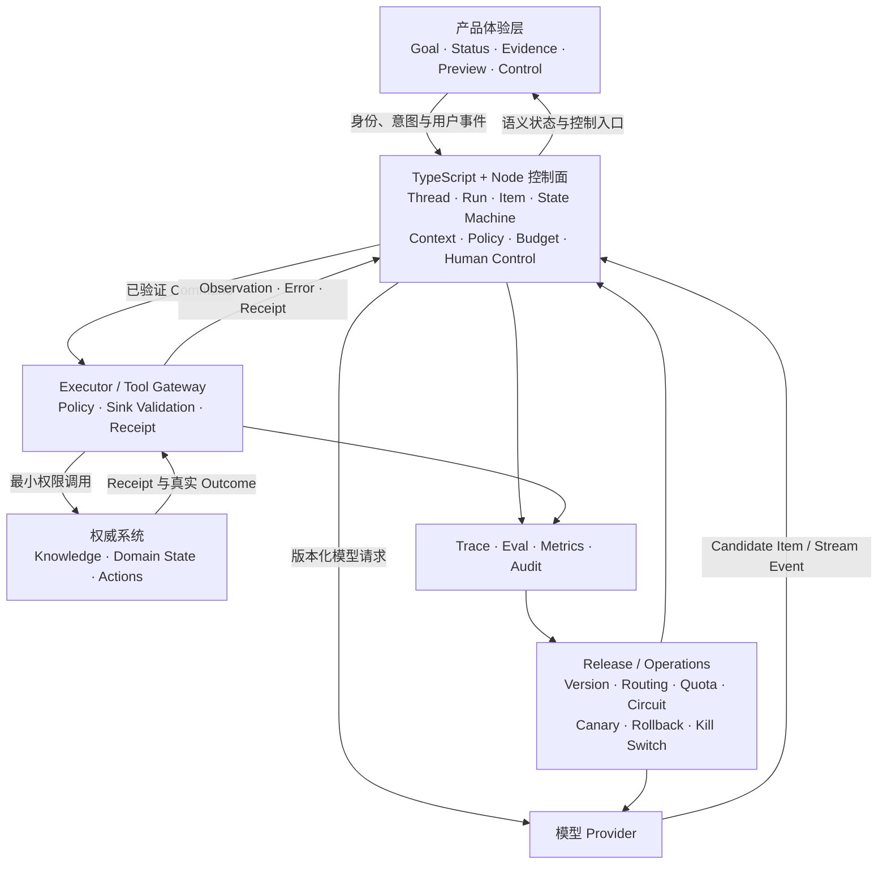

# 01 · 综合系统心智模型

现在回看小林的 `order_123`：政策冲突被澄清，100 元提案经过审批，支付 Commit 后 ACK 丢失，用户点击 Cancel，Worker 重启，系统通过原幂等键核对到唯一退款，Trace 最终解释了全过程。没有任何一个组件单独“完成了 Agent”；完成来自模型候选、确定性控制、外部系统和人类责任的协作。

本章是全书的总装图。阅读时始终追问两个问题：**模型候选在哪里变成系统决定？一次 Run 的真实效果在哪里被验证？**

## 1. 系统分层

首个实现中，TypeScript + Node 是主语言与权威控制面。Rust 是由稳定性、隔离或性能证据驱动的可选迁移，不是为了补全架构图而预留的强制服务。

## 2. `order_123` 怎样穿过整套系统

1. Runtime 验证小林的身份，引用 M0 Task Contract，创建版本化 Run。
2. Context Builder 发现两份退款政策冲突，只选择获准来源并请求澄清。
3. 模型基于当前订单与有效政策生成 100 元候选提案；它不能直接退款。
4. Runtime 等待完整 Item，依次执行 Schema、语义、资源版本、授权和 Sink 校验。
5. UI 展示订单、金额、政策、外发效果和有效期；审批绑定 Proposal Hash 与 `resource_version=42`。
6. Executor 使用短期凭证和 `refund:order_123:v42` 提交 Command。
7. 支付系统 Commit 成功，ACK 丢失；本地 Timeout 只证明 Attempt 结束，不证明效果不存在。
8. 小林点击 Cancel；Runtime 持久化 Cancel Intent、停止新工作，并进入 `IN_DOUBT`。
9. Backpressure/Quota 停止故障期间的新规划，预留 Reconciliation 通道继续收敛在途风险。
10. Worker A 重启，Worker B 以新 Ownership Epoch 恢复 Proposal、幂等键、Cancel 与未知效果。
11. Worker B 查询权威支付状态，得到 `refund_id=rf_789`；旧 Worker 的迟到写入被 Fencing/CAS 拒绝。
12. Run 进入 `COMPLETED_WITH_EFFECT_AFTER_CANCEL`，UI 如实说明退款已发生且停止请求较晚。
13. Outcome/Trajectory Grader、Trace、Audit 与成本使用同一 `run_id` 对齐。
14. 修复版本经过 Offline Eval、Shadow、Canary、Drain 与 Rollback 演练后才扩大新 Run 流量；旧 Run 保持兼容版本。

这条路径里，模型负责提出模糊判断与候选动作；确定性系统持有身份、状态、权限、预算、执行资格和真实 Outcome。

## 3. 十二条核心不变量

1. 模型不能直接修改权威状态或外部系统。
2. 外部数据、工具描述与结果默认是不可信数据，不自动获得指令权。
3. Schema 合法不跳过语义、授权、资源版本与 Sink 校验。
4. 用户身份、Tenant、凭证与权限上下文不由模型填写。
5. 检索在候选生成前按 Tenant/ACL 缩小范围。
6. 审批绑定 Actor、精确参数、资源版本、期限与业务意图。
7. Timeout、断连或 Cancel 不被解释为“副作用未发生”。
8. 终态后不产生新业务动作；未知效果只能查询、按原意图幂等收敛或转人工。
9. Context、Memory、Knowledge、Cache、Trace 与 Eval 数据都遵守 ACL、Tenant 和删除传播。
10. 每个 Run 都有 Step、Token、时间、费用、Fan-out 和在途副作用上限。
11. UI 的 Status/Stop/Retry/Resume 与持久状态转移一致。
12. 模型、Prompt、Context、Tool、Policy、Runtime 与配置共同版本化，并用同一 Eval 和发布状态机进入流量。

## 4. 失败注入矩阵

| 注入                         | 必须观察的行为                           |
| -------------------------- | --------------------------------- |
| 模型返回错误 Schema/断流           | 不执行，保留不完整 Item 证据                 |
| Schema 合法但跨租户/危险 Sink      | 资源服务或 Executor 拒绝                 |
| 文档含恶意指令                    | 即使模型受骗，策略与环境阻止越权效果                |
| Command Commit 后 ACK 丢失    | `IN_DOUBT`，使用原幂等键查询权威状态           |
| 用户在未知效果时 Cancel            | 停止新工作，继续有界 Reconciliation         |
| Worker 在核对前退出              | 新 Epoch 接管；旧 Worker 迟到写入被拒绝       |
| 队列/Provider 过载             | 新工作有界拒绝或降级，安全收尾不被饿死               |
| 新模型/Provider Fallback（若采用） | 先通过 Eval/Contract；不改写已审批提案        |
| 发布中 Worker Drain 超时        | 保存 Checkpoint；在途 Command 不被当作失败丢弃 |
| Memory 删除后仍从缓存命中           | 删除门禁失败，定位传播缺口                     |

## 5. 风险按证据递增

- **无工具/单次模型**：3 锚点任务草案、前置接口探针、正式 M0、非 Agent Baseline、多 Trial 与敏感数据边界。
- **只读工具**：Context/RAG、ACL 前置、来源、Tool Contract、Prompt Injection、Trace 与有界并发。
- **写工具**：服务端授权、精确审批、幂等、Resource Version、Sink 安全、Receipt 与效果核对。
- **跨进程/跨小时**：Checkpoint、Event History、Lease/Fencing/CAS、流程版本与故障矩阵。
- **生产流量**：Provider/Model Eval、Quota/Circuit、Shadow/Canary、Drain、Rollback、Kill Switch 与灾备。
- **专项复杂度**：Multi-Agent、Computer Use、Advanced Memory 等必须相对简单 Baseline 证明收益。

## 6. 八周启动验收不等于全书毕业

八周主线的合理终点是：正式 M0、可运行 L0 Adapter、手写 L1 Runtime，以及 Context、知识和受控行动的薄切片。它证明你已经能边学边造，不代表系统已具备生产运营和场景专长。

全书毕业还要求至少 100 个版本化案例、Provider/Model 故障与发布演练、跨小时恢复、真实 UI 状态、生产级 Trace/SLO/成本证据，以及一个经过准入门禁的 L6 专项。具体标准在[场景专项与全书毕业](/masterpiece-static-docs/10-毕业门禁/08-场景专项与全书毕业.md)中统一说明。

## 本章小结

一个可上线的 Agent 应用，是候选、控制、效果与责任共同构成的系统。只要某一步还不能回答“谁持有决定、谁执行约束、什么证据确认结果、哪个版本正在运行”，总装就没有完成。接下来先用[八周综合闭卷检查](/masterpiece-static-docs/10-毕业门禁/02-动手前闭卷检查.md)暴露基础心智模型缺口；它是启动阶段诊断，不是全书终点。

## 章末检查

拿一张空白纸，在 20 分钟内重画系统分层，并复述 `order_123` 的 14 步路径。若无法解释候选如何变成 Command、Cancel 后为何仍需核对、Worker 如何接管或旧/新 Run 如何切流，回到对应章节。
