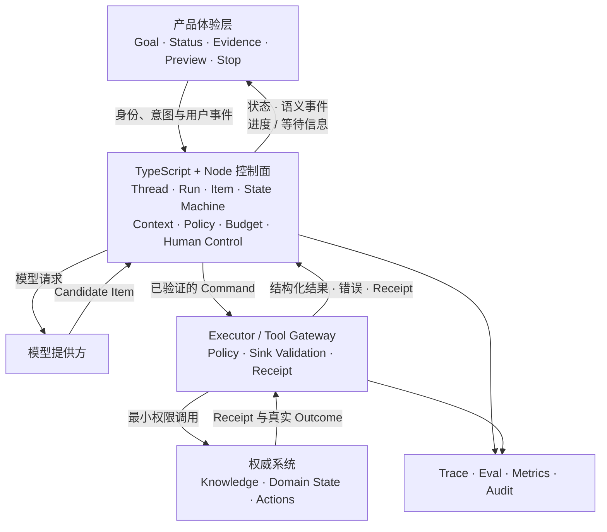

# 01 · 综合系统心智模型

前面的章节分别讨论模型、评测、运行时、上下文、工具、安全和可靠性。真正开始实现前，需要把它们重新合成一个系统：每个判断由谁做，数据穿过哪些信任边界，失败后由什么证据收敛。

本章不是新的知识点清单，而是全书的总装图。阅读时始终追问两个问题：模型的候选在哪里变成系统决定？一次 Run 的真实效果在哪里被验证？

## 1. 贯穿案例

目标：构建“研究—判断—行动 Agent”。它只读取当前 actor 有权限的资料，形成带证据与不确定性的判断，生成动作草案；外部写操作经语义校验、服务端授权、风险策略和具体审批。

## 2. 系统分层

首个实现中，TypeScript + Node 是主语言与权威控制面。Rust 是可选的渐进迁移目标，不是为了“架构看起来完整”而预留的强制服务。

## 3. 一次 Run 的完整路径

1. 验证用户身份，引用 M0 Task Contract，创建版本化 Run。
2. Policy 计算 actor 可见数据、可用工具、风险级别和预算。
3. 检索在 candidate generation **之前**用 tenant/ACL 限定语料范围；Runtime 从权威 State 组装 Context Manifest。
4. 模型返回最终候选或 tool proposal；它不直接执行。
5. Runtime 用类型化 event reducer 等待完整项，处理断流、重复和不完整输出。
6. 依次做协议、JSON Schema、领域语义和 sink-specific 校验。
7. 资源服务重新判断 actor–resource–action–purpose，不信任模型或客户端传入的身份/授权。
8. 高风险动作持久化不可变 proposal，进入 `WAITING_APPROVAL`。
9. 用户看到精确 diff、外发数据和可逆性；审批绑定 proposal hash、resource version 与 expiry。
10. Executor 用短期凭证、稳定幂等键、剩余 deadline、资源上限和沙箱执行。
11. Tool receipt 与权威 outcome 进入 event log；工具输出作为带来源的不可信 observation。
12. 若 timeout、断连或取消导致效果不明，状态进入 `IN_DOUBT → RECONCILING`，先查询再重试/补偿/转人工。
13. Runtime 原子更新 snapshot、预算和 Context，继续或进入表意明确的终态。
14. Outcome + trajectory graders 评分；Telemetry 记录用量、延迟、故障层和安全事件。

## 4. 十二条核心不变量

1. 模型不能直接修改权威状态或外部系统。
2. 所有外部数据、工具描述和结果默认不可信。
3. Schema 合法不跳过语义、授权和 sink-specific 执行校验。
4. 用户身份、tenant、凭证和权限上下文不由模型填写。
5. 检索在生成候选前就按 tenant/ACL 缩小范围，后置过滤只是防御性复查。
6. 审批绑定 actor、精确参数、资源版本、期限和 idempotency key。
7. timeout、断连或 cancel 不被解释为“副作用未发生”。
8. 进入终态后不产生新动作；未知效果必须先收敛或显式转人工。
9. Context、Memory、Knowledge、Cache、Trace 和 Eval 数据都不能跨 ACL/tenant 泄漏，删除要传播。
10. 每个 Run 有 step、Token、时间、费用、fan-out 和在途副作用上限。
11. UI 的 status/stop/retry/resume 与 Runtime 状态转移一致，不伪称已取消或已恢复。
12. 每次变更用同一版本化 Eval 比较 outcome、trajectory、安全、尾延迟和成功任务成本。

## 5. 失败注入矩阵

| 注入                      | 必须观察的行为                            |
| ----------------------- | ---------------------------------- |
| 模型返回错误 Schema/断流        | 不执行，保留不完整 event 证据                 |
| Schema 合法但 URL 指向内网/跨租户 | sink 或资源服务拒绝                       |
| 网页含恶意指令                 | 即使模型受骗，策略/环境阻止数据外泄                 |
| Tool commit 后 ACK 丢失    | 进入 `IN_DOUBT`，用幂等键/权威状态查询          |
| 用户中途 cancel             | 停止新工作，已提交/在途动作 reconcile           |
| 审批后参数或版本变化              | approval 失效                        |
| 检索器只在最后做 ACL filter     | 测出 recall starvation/旁信道，改为候选生成前过滤 |
| 100×10 fan-out          | 并发与队列有界，超载可解释                      |
| Memory 删除后缓存/索引仍命中      | 删除门禁失败，查找传播缺口                      |
| 模型/Prompt 升级            | 运行完整 regression/holdout 与统计门禁      |

## 6. 风险递增实施门禁

### G0 · 无工具

完成 M0 Task Contract、非 Agent baseline、多 trial、模型/API 实验和敏感数据边界。

### G1 · 只读工具

增加 Context/RAG、ACL 前置、来源、Tool Contract、Prompt Injection、Trace、超时/取消和有界并发。

### G2 · 写工具

增加服务端授权、具体审批、幂等、resource version、sink 安全、审计、补偿和沙箱。

### L1 后独立门禁

- Durable：只有长任务/恢复需求成立时，加 checkpoint/replay、lease/heartbeat/fencing/CAS、outbox/DLQ 和双 Worker 故障注入。
- Multi-Agent：只有有界独立子任务的评测证据时，加委派 envelope、身份链、预算/取消传播和级联失败测试。
- Rust：只有本地瓶颈/部署/资源证据时，按纯函数 → 只读工具 → sidecar 迁移，必须有 wire contract、shadow/canary/rollback。

## 7. 第一个实现的边界

理论毕业后的首个项目仍应很小：官方 TypeScript SDK、3–5 个 mock/只读工具、手写有限状态 Loop、类型化流事件 reducer、预算/取消/背压、Trace 和 M0 Eval。暂不使用 Agent 框架、真实不可逆工具、durable engine、多 Agent 或 Rust Runtime。

## 本章小结

一个可上线的 Agent 应用，是模型候选、确定性控制和人类责任共同构成的系统。只要一次 Run 仍有某个步骤无法回答“谁持有决定、谁执行约束、用什么证据确认结果”，系统就还没有完成总装。下一步先完成 [动手前闭卷检查](/masterpiece-static-docs/10-毕业门禁/02-动手前闭卷检查.md)，用暴露缺口代替快速重读。

## 章末检查

拿一张空白纸，在 20 分钟内重新画出系统分层、Run 路径和十二条不变量，并推演“commit 后丢 ACK + 用户 cancel”。无法解释任一 enforcement point 时，回到对应章节。
