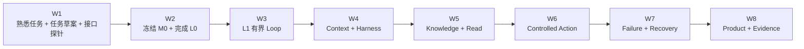

# 04 · 八周启动计划：边学边造一个 Agent Workbench

> 默认每周 8–12 小时。时间不足就延长周数，不压缩门禁。八周结束时应完成一个可运行、可回归的 L1，并在其中引入部分 Context、知识与受控行动能力，而不只是一叠图表和闭卷答案。

这份计划采用“刚好够用的理论 → 最小实现 → 故障注入 → 回放同一任务”的螺旋节奏。第 1 周先用 3 个锚点、baseline 与 Outcome Grader 做一次 L0 前置接口探针；第 2 周用真实反馈冻结正式 M0，再完成 L0 适配器；第 3 周手写 L1。这样早期反馈不被几十个案例挡住，能力里程碑仍严格保持 `M0 → L0 → L1`。

## 第 1 周 · 从熟悉体验跑通第一条反馈

### 先解开的谜题

为什么一次 Claude Code / Codex 任务“看起来不错”仍不足以比较系统，而第一次学习反馈又不该被 50 个案例挡住？

### 阅读

- 00/01–02：从熟悉会话识别 Context、Harness、Inner Loop 与 Outcome。
- 00/04：只完成任务草案；正式 M0 数据集与 Rubric 先知道存在，不在首次探针前填满。
- 03/01 的“首读边界”和第 1 节：只建立最小 Outcome Grader。多 Trial、区间、Judge、MDE/power、多重比较与停止策略留到第 3 周二刷。
- 04/03 的第一个原始请求示例；遇到 TypeScript/Node 基础缺口时再查 04/01。

### 动手与产出

1. 拆解最近一次真实 Coding Agent 轨迹；它只用于暖场，不自动进入 M0。
2. 选定正式贯穿任务；默认使用“研究政策—判断退款资格—生成提案—审批后提交—核对 Outcome”。
3. 写 3 个新锚点、一个非 Agent baseline 和一个查询 mock/权威环境的 Outcome Grader：正常、模糊、应停止。
4. 让 baseline 与一个固定候选 fixture 接受相同判定；保存 `task_id`、`trial_id`、输入、输出、Outcome 与 grader 结果。
5. 用官方 SDK 做一次单次模型、无工具、无副作用的 **L0 前置接口探针**，用同一 grader 判返回结果，记录原始响应、错误、usage 与 latency；把暴露的歧义写回任务草案。

### 退出证据

- 3 个锚点、非 Agent baseline 与 Outcome Grader 可以重复运行。
- 至少保存一条真实 API 记录，并指出一个由真实调用暴露的规格或 grader 问题；不把它申报为 L0 已通过。
- 能解释这次结果为什么是学习反馈，而不是模型优劣或项目 readiness 结论。

未通过就延长本周；不要为了“完成 M0”机械生成几十个相似案例。

## 第 2 周 · M0 → L0：冻结基线，再看原始模型 API

### 先解开的谜题

产品界面里一次自然流畅的回复，在 API 层究竟由哪些 Item、Event、错误和状态组成？

### 必读最小路径

- 01/01：概率、采样与多 trial 直觉。
- 02/01、02/04：Token、自回归生成与 Context/采样边界。
- 04/02–05：Prompt/Context、stream、JSON Schema、Structured Output 与 Tool Call。

### 按实现缺口查阅

- 01/02–03：embedding、泛化与分布偏移。
- 02/02–03：Transformer/KV Cache、预训练与后训练。
- 04/01：若 Node stream、`AbortSignal`、union 或背压基础不足再补。

### 实现

先用第 1 周的探针反馈完成 M0：

- 将 3 个锚点扩成 12–20 个平衡 seed cases，修订坏任务与坏 grader。
- 按 Rubric 达到 16/20，且 Outcome 与安全不为 0；扩展并冻结 30–50 个版本化案例。
- 时间不足就延长本周，不用机械生成的重复案例换取门禁。

正式 M0 通过后，只使用一家模型的官方 TypeScript SDK，完成一个薄 CLI：

- 原始 request/response/stream adapter。
- 从 SDK Event 归并出完整语义 Item。
- 自由文本与一个结构化输出 Schema。
- timeout/cancel、usage、latency、错误分类和版本记录。
- mock stream 测试：分片、重复、截断和非法 JSON。

这一周不写 Agent Loop。先把产品 Harness 隐藏的协议边界看清。

### 退出证据

- 正式 M0 的 Task Contract、baseline、30–50 个案例、Grader 与版本已冻结。
- 能从录制 stream 重建完整响应。
- 半个 Tool Call 永不执行。
- 能区分模型拒绝/截断、协议错误、网络错误和应用校验失败。
- 在 M0 的代表切片上记录多 trial、Token、延迟与失败分类。

本周的结果是先退出 M0，再退出 L0；如果 M0 尚未冻结，可继续检查接口细节，但不进入第 3 周的 L1 里程碑。

## 第 3 周 · L1：手写第一个有界 Agent Loop

### 先解开的谜题

“读文件—运行工具—看结果—继续”最少需要哪些确定性代码，为什么一个 `while` 不够？

### 阅读

- 03/01–03：复习最小 Eval，并深化区间、配对比较、Judge 校准与停止策略。
- 04/06：从最小 Loop 到状态、预算、取消和未知效果。
- 06/01 只读工具部分：三层工具契约与错误分类。

统计主线先掌握多 trial、配对比较、区间和 Judge 校准；MDE/power、多重比较与 cluster 方法标为二刷/实施参考。

### 实现

- `buildContext → model → validate item → dispatch tool → observation → reduce`。
- 3–5 个 mock/只读工具。
- step、wall-clock、Token、money、concurrency 预算。
- `AbortSignal` 传播、重复调用检测与表意明确的终态。
- 每步 Trace 与 M0 自动回归。

### 故障注入

错误 Schema、未知工具、Tool timeout、模型截断、重复调用、取消与预算耗尽。

### 退出证据

同一个失败能通过 Trace 定位到模型、Context、校验、工具或 Runtime；没有真实写工具，也没有 Agent 框架。

本周回归使用第 2 周已冻结的 M0；如果新失败暴露规格漏洞，通过新版本修订数据集，不在原版本上静默改题。

## 第 4 周 · 在 L1 中加入 Context 与 Harness

### 先解开的谜题

为什么同一个模型换一份项目规则、工具集合、Compaction 或 Reviewer 后，表现会明显变化？

### 阅读

- 04/07：Harness Engineering、架构模式与 Multi-Agent 边界。
- 04/08：框架/SDK 学习优先级，只读选择方法，不背生态清单。
- 04/09 的前三节：理解 Provider Event、Canonical RunEvent 与 UI State 的边界。
- 05/01：Context Builder、Manifest、Compaction/Reset/Isolation。

### 实现

- 把临时 Prompt 字符串改成显式 Context Builder。
- 记录 Context Manifest、来源/版本、纳入与排除理由、Token 预算。
- 实现最小 external artifact：计划、进度或证据引用不只存在聊天历史。
- 定义最小 Canonical `RunEvent` union，让 Provider 流事件先进 adapter，不直接驱动 UI。
- 为 Harness 组件建立“假设—收益—成本—移除条件”表。

### 对照实验

在同一 M0 切片比较：全量历史 vs 选择历史、全部工具 vs 动态工具、无 Reviewer vs 独立 Reviewer。只有可测收益才能保留新增脚手架。

### 退出证据

- 能区分 Prompt、Context、Inner Loop、Harness 与 Outer Loop。
- 能解释 Provider Event 为什么不是应用权威事件，重连为什么不应重新调模型。
- Compaction 前后关键禁止项、未决事项和证据引用不丢失。
- 没有因为“2026 流行”而默认引入 Multi-Agent。

## 第 5 周 · 在 L1 中加入可信知识薄切片

### 先解开的谜题

Coding Agent 的代码搜索为什么看起来像 RAG，又为什么“相关”仍不等于“有权、正确、最新”？

### 阅读

- 05/02–04：来源、ACL、新鲜度、检索、RAG、状态、记忆与压缩。
- 06/01 的 query Tool Contract。

### 实现

- 一个带 provenance 的只读知识工具。
- ACL/tenant 在候选生成前生效；结果进入 Context 前再做防御性复查。
- sparse/dense/hybrid 中只选择当前系统已有或最简单的一种 baseline，再按证据升级。
- Memory 先只设计 candidate/write/read/delete policy，不自动写入模型反思。

### 故障注入

无权高相似文档占满 top-k、过期政策、冲突来源、删除后 cache/index 残留、检索结果含 Prompt Injection。

### 退出证据

检索 recall、排序、证据忠实度和最终 Outcome 分开评测；无权内容不会先被模型看见再依赖模型“忘掉”。

本周不重新定义 M0；它用冻结任务检查检索能力，并把新发现作为下一个 `dataset_version` 的候选。

## 第 6 周 · 在 L1 中加入受控行动薄切片

### 先解开的谜题

Agent 能修改文件，为什么还不能直接退款、发信或改数据库？Permission、Authorization 与 Approval 到底差在哪里？

### 阅读

- 06/02–04：身份、授权、审批、MCP、幂等、补偿与沙箱。
- 07/01–03：威胁模型、Prompt Injection、最小权限与 Confused Deputy。

### 实现

- 一个 query、一个可逆 command、一个必须审批的 command 契约；先接 mock environment。
- actor–tenant–resource–action–purpose 授权矩阵。
- 绑定精确参数、资源版本、proposal hash 和期限的 approval record。
- 稳定幂等键、preview、receipt、audit 与效果核对接口。
- 一个最小 MCP client/server 只承载受控资源与工具，不承载业务授权。

### 故障注入

Schema 合法但越权、审批后参数变化、重复请求、间接注入、SSRF/path/shell sink、工具结果投毒。

### 退出证据

即使模型输出恶意或错误参数，Harness 与资源服务也能阻止真实越权；真实写操作仍需在测试环境和独立门禁下逐步开放。

## 第 7 周 · 在 L1 中注入故障与恢复

### 先解开的谜题

Tool timeout 时动作有没有发生？点击 Cancel 后为什么 UI 不能立刻显示“已撤销”？

### 阅读

- 07/04–05：纵深防御、人类控制与 Agent UX。
- 08/01–04：timeout/retry/cancel、背压、持久执行心智模型、Trace/SLO/成本。

`08/03` 的双 Worker、lease/fencing、outbox/DLQ 与流程版本实验属于 L1 后；本周可实现最小 checkpoint，也可以只完成故障矩阵，不把完整 Durable Engine 当作八周硬要求。

### 实现与推演

- `CANCEL_REQUESTED → CANCELLING → CANCELLED / EFFECT_AFTER_CANCEL / IN_DOUBT`。
- Tool commit 前、commit 后 ACK 前、checkpoint 后三点强杀推演。
- 有界队列、并发池、retry budget 与过载降级。
- UI 显示运行、等待输入、等待审批、取消核对中、部分完成与人工处理。

### 退出证据

timeout/cancel 不被解释成“副作用未发生”；任何未知效果都能查询、幂等重试、补偿或明确转人工。

## 第 8 周 · 总装、解释与作品证据

### 先解开的谜题

你现在拥有的是一个能演示的 Agent，还是一个能被他人复查、比较和安全停止的系统？

### 阅读

- 10/01 综合系统心智模型。
- 08/05 发布、Provider 依赖与生产运营，作为八周后的生产延伸地图，不要在本周搭完平台。
- 10/06 章节验收矩阵用于定位缺口，不快速重读全书。
- 10/02–03 综合闭卷检查与评分，用于验证八周后的系统整合能力。

### 最终证据包

- M0 Task Contract、3 个原始锚点、正式化后的 30–50 cases、baseline、grader 与版本；纯学习练习若未正式化，必须明确标注范围，不能伪装成项目毕业证据。
- 可运行的 L0 adapter 和 L1 Runtime skeleton。
- Context Manifest、Harness Component Map、Tool Contract 与状态机。
- Outcome + Trajectory 多 trial 报告。
- 威胁模型、授权/审批记录、故障矩阵与 UX 状态。
- Trace、关键 SLI/SLO、成功任务成本与明确不做项。

### 毕业判断

综合闭卷检查不再决定“可不可以写第一个 Agent”，而是检验你能否把已经实现的局部机制重新组成一个系统。未通过时保留可运行 baseline，针对缺口回到对应章节和失败案例迭代。

## 八周之后

继续沿同一个 Workbench 进入 L2–L6：按真实需求选择 UI 协议、Durable Workflow、框架、Outer Loop 或场景专项。Rust R0/R1 可并行学习；任何真实组件迁移必须等待稳定契约、profile、Trace/Eval 对拍、shadow、canary 与 rollback。

## 本章小结

时间表只安排投入，里程碑由可运行工件和证据决定。八周的正确终点不是“终于可以开始”，而是在第一周就获得真实反馈，随后完成 `任务草案 → 前置探针 → M0 → L0 → L1`，并让 Context、知识、受控行动与可靠性逐步进入同一个 Workbench。

[继续实作主线：创建 M0 最小草案](/masterpiece-static-docs/00-导读/04-M0任务契约-Baseline与数据集.md) · [顺读知识支线：综合系统心智模型](/masterpiece-static-docs/10-毕业门禁/01-综合系统心智模型.md)
