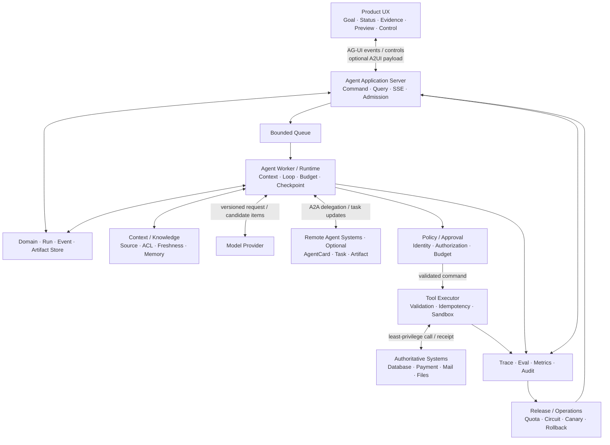

# 01 · 综合系统心智模型

完成前面的章节后，Agent 应用可以被重新看成一套熟悉的软件系统：模型负责处理开放语义，Runtime 负责控制状态与预算，Policy 决定动作是否合规，Executor 接触真实世界，UI 呈现事实与控制，Eval 和 Operations 决定版本能否进入生产。

这一视角比“模型 + Tool Calling”更接近真实工程。模型生成的 Tool Call 只是候选，不是系统命令；Runtime 收到的成功响应也不一定是最终业务结果。整套架构始终围绕两个问题展开：**候选在哪一层变成可执行决定，真实效果由什么证据确认。**

## 1. 一张完整的 Agent 应用图

TypeScript + Node 可以长期承担 Application Server、产品逻辑和高层编排。Rust 是在性能、隔离、资源或部署证据出现后才考虑的执行面选项，不是完整架构的必填方框。

## 2. 各层分别持有什么责任

| 层                               | 负责                                                                   | 不负责                                               |
| ------------------------------- | -------------------------------------------------------------------- | ------------------------------------------------- |
| Product UX                      | 展示目标、状态、证据、提案和合法控制                                                   | 推断业务终态、直接 Retry 写动作                               |
| Application Server              | 身份、Command/Query、Thread/Run、Public State、SSE 与 Admission             | 长时间阻塞的 Agent Loop、决定资源服务的最终授权                     |
| Queue / Agent Runtime           | 背压、Ownership、Context、Loop、预算、取消、Checkpoint 与恢复                       | 把 Queue Delivery 当成业务效果                           |
| Domain / Event / Artifact Store | Proposal、Approval、Intent、Outcome 引用/投影、Canonical Event 与可复查 Artifact | 把 Outcome 投影视为外部效果的权威来源；把 Provider Message 当作领域事实 |
| Context / Knowledge             | 选择来源、ACL、Freshness、压缩与 Memory Policy                                 | 用相关性替代真实性或权限                                      |
| Model                           | 语言理解、模糊判断、计划和候选动作                                                    | 持有硬约束、直接改变权威状态                                    |
| Policy / Approval               | 身份、授权、风险、审批、数据流策略                                                    | 证明第三方效果已经发生或未发生                                   |
| Executor                        | 参数/Sink 校验、最小凭证、幂等、Receipt、Sandbox                                   | 重新规划用户目标                                          |
| Authoritative System            | 领域事实、资源版本和真实业务效果                                                     | 理解自然语言任务                                          |
| Observability / Eval            | 归因、回归、SLO、安全与成本证据                                                    | 自动修复所有失败                                          |
| Release / Operations            | 路由、Quota、Canary、Rollback、Kill Switch                                 | 把未经评测的 Fallback 变得安全                              |

系统边界清晰时，模型能力升级或 Framework 替换只影响有限层；边界模糊时，一个 Provider SDK 的 Event、一个 UI Hook 或一个 Tool Result 都可能变成事实来源。

## 3. 一次有副作用的 Run 如何穿过系统

以“根据有效政策处理退款”为例：

1. Application Server 验证用户身份，创建带版本的 Thread 与 Run；
2. Context Builder 在 Tenant/ACL 范围内检索政策与订单，并记录 Source Manifest；
3. 出现政策版本冲突时，Run 进入 `WAITING_INPUT`，而不是让模型任选一份；
4. 模型根据获准 Context 生成退款候选；
5. Runtime 等待完整 Item，执行协议、Schema 和业务语义校验；
6. Policy 按 actor、resource、action、purpose 检查权限和风险；
7. UI 展示不可变 Proposal：订单、金额、依据、Resource Version、有效期与外部效果；
8. Approval 绑定 Proposal Hash，参数变化会使审批失效；
9. Executor 使用短期凭证和稳定幂等键提交 Command；
10. Authoritative System 返回 Receipt，或因 ACK 丢失让 Effect 进入 `unknown`；
11. 用户 Stop 只停止新工作，未知效果进入 Reconciliation；
12. Worker 重启时，新 Ownership Epoch 从 Checkpoint 恢复原 Intent 与幂等键；
13. 权威查询确认真实 Outcome，UI 展示已确认事实与仍未知部分；
14. Trace、Audit、Eval 与成本通过同一个 `run_id` 对齐；
15. 修复版本经过 Offline Eval、Shadow、Canary 和 Rollback 演练后才逐步放量。

这条路径没有要求模型“永不犯错”。它要求每个模型候选都经过确定性控制，并且每个外部效果都有可验证的收敛路径。

## 4. 十二条跨层不变量

1. 模型不能直接修改权威系统。
2. 网页、文档、Tool Result 和 Memory 默认是不可信数据，不自动获得指令权。
3. Schema 合法不能跳过语义、授权、Resource Version 与 Sink 校验。
4. 用户身份、Tenant、凭证与权限上下文由可信代码注入，不由模型生成。
5. Knowledge Retrieval 在候选生成前按 Tenant/ACL 缩小范围。
6. Approval 绑定 actor、精确参数、资源版本、期限和业务 Intent。
7. Timeout、Disconnect 与 Cancel 都不能被解释为“副作用未发生”。
8. 终态不能继续产生新业务动作；效果未知时，只能核对、按原 Intent 幂等收敛或转人工。
9. Context、Memory、Knowledge、Cache、Trace 与 Eval Dataset 都遵守权限、保留和删除传播。
10. 每个 Run 都有 Step、Token、Time、Money、Fan-out 与 In-flight Effect 上限。
11. UI 的 Stop、Retry、Resume 与持久状态转移一致。
12. Model、Prompt、Context Builder、Tool、Policy、Runtime 与配置共同版本化。

不变量应进入类型、状态机、服务端校验和故障测试，不能只留在架构文档中。

## 5. Framework 在这张图中的位置

Framework 只封装部分层：

- Model SDK 处理请求、Stream 与 Tool Calling 协议；
- Agent SDK 可能提供 Loop、Session、Guardrail 或 Trace；
- UI SDK 与 AG-UI Adapter 处理消息和语义 Event 的前端消费；
- A2UI Renderer 使用应用控制的 Catalog 解释声明式生成界面；
- Durable Workflow 处理等待、Activity、Replay 与 Worker 恢复；
- MCP 处理 Tool/Resource 的发现与传输；
- Agent Skills 提供可渐进加载的方法，Dynamic Tool Discovery 减少本轮进入 Context 的工具定义；
- MCP Apps、Tasks 与 Authorization Extensions 分别处理内嵌 View、长时协议句柄和特定 Token 获取方式；
- A2A 处理独立 Agent 系统的发现、Message、Task 与 Artifact；
- Observability Product 处理 Trace、Dataset 与 Experiment。

任何一个 Framework 都不会自动提供完整业务授权、正确 Context、第三方 Exactly-Once、生产 UX 和端到端 Eval。选型前应明确它替代了图中的哪一部分，剩余责任由谁持有，移除时哪些领域契约保持不变。

## 6. 用故障注入验证系统边界

| 注入                                | 预期系统行为                                       |
| --------------------------------- | -------------------------------------------- |
| Model 返回非法 Schema 或 Stream 中断     | 不执行；保留不完整 Item 证据                            |
| Schema 合法但跨租户或危险 Sink             | Policy、Resource Service 或 Executor 拒绝        |
| 外部文档包含 Prompt Injection           | 即使模型受影响，权限与环境阻止真实越权                          |
| Command Commit 后 ACK 丢失           | 进入 `IN_DOUBT`，使用原幂等键查询权威状态                   |
| 未知效果期间收到 Cancel                   | 停止新工作，继续有限 Reconciliation                    |
| Worker 在核对前退出                     | 新 Epoch 接管，旧 Worker 的迟到写入被拒绝                 |
| Queue / Provider 过载               | 新工作有界等待、降级或拒绝，安全收尾不被饿死                       |
| 新模型退化 Tool Call                   | Offline Eval / Shadow / Canary 阻止扩大流量        |
| Skill Digest 被替换或 Tool Catalog 污染 | 加载链拒绝；未授权 Tool Definition 不进入 Context        |
| Child Agent 返回恶意或迟到 Artifact      | Provenance、Attempt/Version、Join 与权限衰减阻止传播和覆盖 |
| 发布时 Drain 超时                      | 持久化 Checkpoint，在途 Command 不被丢弃               |
| 用户删除后 Cache 仍命中旧 Memory           | 删除验证失败，定位传播缺口并阻断服务                           |

## 7. 从原型到生产的证据递进

不需要一次性实现所有层。合理的递进顺序是：

1. **任务与评测基线**：明确输入、Outcome、禁止行为、简单 Baseline、Environment Simulator 和案例集；
2. **模型接口**：理解 Request、Item、Stream、错误和 Usage；
3. **单 Agent Runtime**：手写有界 Loop、Tool Contract、状态、Cancel 与 Trace；
4. **Context 与 Knowledge**：来源、ACL、Freshness、压缩和 Memory Policy；
5. **受控行动**：身份、授权、Approval、幂等、Receipt、Sandbox 与 Agent Red Team；
6. **持久与生产**：Checkpoint、Reconciliation、OpenTelemetry、SLO、生产拓扑、Canary、Migration、Rollback 与真实 UX；
7. **场景专项**：只有在 Baseline 证明收益后，再加入 Skills、Dynamic Discovery、Multi-Agent、Computer Use 等复杂能力。

阶段名称并不重要，进入下一阶段的证据才重要。

## 本章小结

一个可上线的 Agent 应用，是模型候选、确定性控制、外部效果和人类责任共同构成的系统。任何一步如果不能回答“谁持有决定、约束在哪里执行、结果由什么证据确认、哪个版本正在运行”，系统就还没有完成总装。下一章提供一份 [综合能力自测](/masterpiece-static-docs/11-综合实践与作品设计/02-综合能力自测.md)，用于定位具体知识缺口。

## 章末练习

在不查看本章的情况下重画 Resolution Desk 系统图，逐步说明退款候选如何成为 Command、Timeout 后为何不能直接 Retry、Worker 如何恢复、UI 如何展示未知效果，以及发布候选如何经过 Eval 与受控流量验证。随后与[总装与验收](/masterpiece-static-docs/11-综合实践与作品设计/09-Resolution-Desk总装与验收.md)中的架构核对责任边界。
