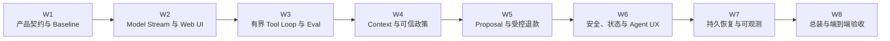

# 04 · 八周构建路径：完成 Resolution Desk

这条路径把全书主线压缩成八个连续迭代，适合每周投入 8–12 小时。时间可以延长，能力顺序不要颠倒：先有任务契约和只读纵向切片，再开放知识与写操作；先定义未知效果和恢复语义，再宣称系统完成。框架替换与 Multi-Agent 放在主线闭环之后；实验性协议只作为可跳过分支，不进入核心完成条件。

八周始终维护同一个 `resolution-desk` 练习项目。书籍仓库只用于阅读，不创建应用源码；练习项目位于独立目录，并使用 Mock 订单、物流、政策和支付服务。



## 开始前：固定一套轻量练习工程基线

八周路径默认使用 TypeScript、Node.js 与单体仓库。这里的“单体”指一次安装、一个版本和一组统一命令，不表示把职责混写在同一文件。Web、Application Service、Agent Runtime、Policy、Adapter、Store 与 Eval 仍通过窄接口分离；第 7 周需要独立生命周期时，再把 Worker 和 Mock Domain 作为单独进程启动。

```text
resolution-desk/
├─ src/
│  ├─ web/                 # 页面、Reducer、可信 Approval UI
│  ├─ application/         # Command、Query、Run 与公开状态
│  ├─ agent/               # Context Builder、Loop、Budget
│  ├─ domain/              # Case、Proposal、Approval、Outcome
│  ├─ policy/              # Authorization 与执行前复核
│  └─ adapters/            # Model、Tool/MCP、Store、Telemetry
├─ fixtures/
│  ├─ cases/               # Anchor Case 与逐周扩展的 Dataset
│  ├─ streams/             # 录制的 Provider Event
│  └─ environments/        # Clock、Tool Outcome 与故障脚本
├─ eval/                   # Outcome、Trajectory、Safety Grader
├─ tests/                  # Unit、Contract、Reducer 与集成测试
└─ package.json
```

目录名称可以调整，但四条命令的语义应从第一周起固定：

| 命令                   | 稳定契约                                                                |
| -------------------- | ------------------------------------------------------------------- |
| `npm run dev`        | 用合成数据启动本地 Web、Application Service 与所需 Mock 服务；不访问真实订单或支付系统          |
| `npm test`           | 运行确定性的 Unit、Contract、Reducer 与领域不变量测试；默认不访问公网、不调用在线模型               |
| `npm run eval`       | 在版本化 Dataset 上运行多次 Trial，输出 Outcome、Trajectory、成本与环境版本；明确区分无效 Trial |
| `npm run fault-test` | 在隔离环境运行断流、Timeout、重复事件、ACK 丢失、进程终止和安全攻击链；每轮重置外部状态                   |

四个命令的入口从第一周起保持稳定，覆盖范围则随能力逐周扩展。尚未实现的故障或安全场景必须明确报告为 `not-applicable` 或 `unsupported`，不能以空测试伪装通过。

状态存储按能力演进，不要在第一周预建生产平台：

| 阶段      | 状态形态                                                                                   | 本阶段必须证明                                      |
| ------- | -------------------------------------------------------------------------------------- | -------------------------------------------- |
| 第 1–2 周 | Process-local State + 可重置 Fixture；用窄 `StateStore` 接口隔离实现                               | 同一输入可重复，Snapshot 能重建已确认 UI 状态                |
| 第 3–4 周 | 继续使用单进程实现，但持久保存 Dataset、Run/Event 与知识版本                                                | Trial 可复现，应用重启后已提交事件不依赖聊天文本恢复                |
| 第 5–6 周 | 事务化 Durable Store 保存 Proposal、Approval、Intent 与 Mock Outcome                           | Approval 与写入边界不会因进程重启、重复请求或状态变化漂移            |
| 第 7–8 周 | Durable Store + Queue + Checkpoint + Outbox；Application Server、Worker、Mock Domain 可分进程 | Ownership、重放、Drain、迁移和 Reconciliation 在故障后收敛 |

从第一周保留一条纵向 Fixture：`fixture_refund_clear_e2e`。它从客服在 UI 打开 `case_refund_clear` 开始，穿过 Application Service、当前 Runtime/Baseline、Policy 和 Mock Payment，最后由 Outcome Grader 读取 Run State、Access Log 与 Mock Ledger。Fixture 的输入身份、订单、政策和期望不变量保持稳定，验收结果逐周升级：第 1 周得到固定建议且 Ledger 无变化；第 2–4 周得到带证据的只读结果；第 5 周停在 `command_ready`；第 6 周通过 08/07 的全部适用门禁后得到唯一 Receipt；第 7–8 周还要在 ACK 丢失与 Worker 重启后得到同一 Outcome。

每周结束时保留下表所列产物。后续章节在这些产物上增量修改，不以新 Demo 替换旧证据。

| 周次 | 必须保留的版本化产物                                                              |
| -- | ----------------------------------------------------------------------- |
| W1 | Task Contract、领域类型、3 个 Anchor Fixture、Baseline 与 Grader 结果              |
| W2 | Provider Adapter Contract、Recorded Stream、Canonical Event 与 UI Snapshot |
| W3 | Dataset Manifest、Outcome/Trajectory Grader、Trace 与 Simulator Manifest   |
| W4 | Knowledge Manifest、ACL/版本 Fixture、Context Manifest 与 Memory Policy      |
| W5 | Proposal/Approval Contract、Intent/Idempotency 记录与隔离 Harness 结果          |
| W6 | Threat Model、可信 UI Snapshot、Security Regression Set 与写路径门禁报告            |
| W7 | Event/Checkpoint Schema、Outbox、故障 Trace、SLO 与拓扑演练结果                     |
| W8 | 端到端验收报告、可回放证据包、发布与回滚检查结果                                                |

## 第 1 周 · 产品契约与非 Agent Baseline

### 本周目标

建立一个尚未使用模型、但已经可以重复验证的退款处置工作台。产品范围固定为退款相关工单；延迟配送、商品损坏和重复扣款是可能的退款原因，不对应独立的换货、补发或拒付动作。

### 实现

1. 建立工单列表、工单详情、订单摘要、政策证据区和任务时间线的静态 Web Shell；
2. 定义 `Case`、`Order`、`Policy`、`Proposal`、`Approval`、`Refund` 与 `Outcome` 的领域类型；
3. 使用 Fixture 提供三个 Anchor Case：正常退款、信息不足、跨租户请求；
4. 实现固定规则 Baseline：读取同租户订单、匹配确定性政策、生成静态建议；
5. 实现 Outcome Grader，直接读取 Mock 支付与 Access Log，而不是判断回复文字；
6. 写明自动读取、必须审批、必须拒绝和必须转人工的边界。

### 故障验收

- 重新载入 Fixture 后，三张工单得到相同结果；
- 信息不足时不会猜测订单；
- 跨租户订单不会进入页面数据或后续输入；
- 未审批时 Mock 支付系统始终没有退款记录。

### 周末系统状态

工作台已经可浏览、可重复测试，但所有判断仍由固定规则完成。它提供后续 Agent 版本必须超过且不能破坏的 Baseline。

## 第 2 周 · Model Stream 与第一条动态界面

### 本周目标

直接观察 Model API 的 Request、Item、Streaming Event、Usage 与错误，将模型输出接到已有 Web Shell，但仍不允许模型调用真实 Tool。

### 实现

1. 选择一家 Provider 的官方 TypeScript SDK，建立薄 Model Adapter；
2. 为工单摘要定义 Structured Output，包含 `classification`、`missing_fields`、`summary` 与 `next_action`；
3. 将 Provider Event 收敛成内部 `RunEvent`，前端只消费内部事件；
4. UI 展示 `queued / running / waiting_input / completed / failed / canceled`；
5. 记录 Model、配置、Token、Latency、停止原因和完整 Item；
6. 准备正常流、截断流和半个 Structured Item 三组 Recorded Fixture。

### 故障验收

- 只有完整闭合且通过 Schema 校验的 Item 才能更新领域结果；
- Stream 中断不会伪造成 `completed`；
- 用户 Cancel 后不再发起新的模型请求；
- 刷新页面时可从保存的 Snapshot 恢复已确认状态。

### 周末系统状态

客服已经能看到流式分析和明确状态。模型只能解释工单，不能读取订单或产生退款。

## 第 3 周 · 有界 Tool Loop 与 Eval

### 本周目标

把一次模型调用扩展为有状态反馈循环，同时建立能够比较版本的 Dataset、Grader 与 Trace。

### 实现

1. 接入 3–5 个只读 Mock Tool：读取当前工单、查询订单、查询物流、列出政策元数据；
2. 实现 `buildContext → callModel → reduceItem → validateProposal → executeTool → recordObservation → transitionState`；
3. 加入 Step、Token、Wall-clock、Money、Concurrency 与重复调用预算；
4. 区分 Model、Protocol、Validation、Tool 与 Runtime Error；
5. 将三个 Anchor Case 扩展为正常、信息不足、工具错误、重复调用和安全拒绝等 8–12 个 Case；
6. 分别建立 Outcome Grader 与 Trajectory Grader，并保存结构化 Trace；
7. 建立确定性 Environment Simulator，使用 fake clock、seeded randomness 与可脚本化 Tool Outcome 复现断流、超时、乱序和状态变化；
8. 只用 Simulator 补足罕见故障和安全边界 Case，合成数据保留生成来源，并抽样进入人工复核。

### 故障验收

- 未知 Tool、非法 Schema、Tool Timeout、Model Truncation、循环调用与 Budget Exhausted 都有明确终态；
- 模型只产生候选，Tool Dispatcher 才能执行；
- 同一 Case 的多次 Trial 报告分布，不用单次成功代替稳定性；
- 相同 seed 与环境版本可以复现同一故障，Simulator 不替被测 Agent 兜底；
- 任何失败都能定位到具体层。

### 周末系统状态

Resolution Desk 已经是一个真正的只读 Agent：可以动态选择查询路径，仍不能改变订单或支付状态。

## 第 4 周 · Context Engineering 与可信政策知识

### 本周目标

让 Runtime 从版本化知识库检索政策，并保证来源、权限、时效和冲突在进入模型前得到治理。

### 实现

1. 建立包含正式政策、草案、过期版本和租户定制政策的测试语料；
2. 实现带 Source、Tenant、ACL、Valid Time 与 Version 的 Ingest；
3. 从 Sparse 或简单过滤 Baseline 开始，再用 Eval 决定是否加入 Dense、Hybrid 与 Rerank；
4. 建立 Context Builder，按本轮决策选择指令、事实、证据、工具和输出契约；
5. UI 展示政策标题、版本、生效时间、引用片段和冲突状态；
6. Memory 只保存客户明确确认的语言或沟通渠道偏好，并支持读取、删除与过期。

### 故障验收

- 无权文档在 Candidate Generation 前被过滤；
- 过期政策、草案和当前政策冲突时不会由模型凭语气裁决；
- 删除 Memory 后，Cache、Index 与派生 Context 不再命中；
- 恶意政策文本不能取得指令或执行权限。

### 周末系统状态

系统可以基于当前有效政策形成有来源的建议，能暴露证据不足与冲突，仍不会执行退款。

## 第 5 周 · Proposal、Approval 与隔离退款实验

### 本周目标

把模型建议转换成不可变 Proposal，并在隔离故障 Harness 中验证 Mock 退款 Command。常规 Resolution Desk Run 仍不能调用 Mock Refund Executor。

### 实现

1. 将订单、物流和政策 Query 通过 MCP Adapter 暴露给 Runtime；
2. 定义退款 Proposal：订单、金额、币种、目标账户、政策证据、资源版本、期限和 Proposal Hash；
3. 在服务端按 `actor / tenant / resource / action` 执行 Authorization；
4. 原生 Approval UI 展示不可变 Proposal，并把批准绑定到 actor、hash、resource version 与 expiry；
5. 让隔离 Harness 中的 Refund Executor 使用稳定业务 Intent 和 Idempotency Key 调用 Mock 支付；
6. 保存 Receipt，并提供按 Intent 查询权威 Outcome 的接口；
7. 保持常规业务 Run 的 `commit_refund` 开关关闭，只允许到达 `command_ready`。

### 故障验收

- 没有 Approval、Approval 过期、参数变化或订单版本变化时，Command 不会执行；
- 相同 Intent 的重复请求只产生一笔退款；
- Commit 后 ACK 丢失时进入 `IN_DOUBT`，使用原 Intent 对账；
- MCP 只承载能力协议，不替代业务 Authorization。

### 周末系统状态

客服可以审查 Proposal；隔离 Harness 已证明退款效果能幂等收敛，但应用尚未向常规业务 Run 开放提交能力。

## 第 6 周 · Security、Application State 与 Agent UX

### 本周目标

让界面忠实表达 Runtime 和 Effect State，在开放写能力前完成纵深防御，并且只在完成 08/07、通过全部适用安全门禁后，启用常规业务 Run 的 Mock 退款。

### 实现

1. 画出从工单附件、政策库、模型、Tool 到支付系统的数据流与信任边界；
2. 为 Prompt Injection、跨租户读取、Confused Deputy、Approval TOCTOU 和危险 Sink 建立 Abuse Case；
3. 将 Thread、Run、Item、Proposal、Approval、Command 与 Receipt 持久化为明确状态；
4. UI 显示证据、等待澄清、等待审批、Cancel Requested、In Doubt、Reconciling、Partial 与 Manual Intervention；
5. 实现服务端命令式控制：clarify、approve、reject、cancel、resume、take over；
6. 可选加入 A2UI 低风险澄清表单；退款 Approval 继续使用应用原生受信 UI；
7. 建立 Safety Eval 与 Red Team Case：直接/间接 Prompt Injection、Tool Description 污染、权限升级、数据外泄、资源耗尽与 Approval 绕过；启用 Multi-Agent 时再加入跨 Agent Artifact；
8. 完成 08/07 的完整 Red Team 演练并通过全部适用门禁后，向常规业务 Run 开放 Mock Executor，跑通第一条原生 Approval → Mock Receipt 正常路径。

### 故障验收

- 文档或 Tool Result 中的注入无法扩大模型可见凭证与执行权限；
- UI 不会把 Streaming Token 当作真实进度，也不会把 Cancel Requested 显示为“退款已撤销”；
- 启用 A2UI 时，未知 Component、危险 URL、伪造 Action 与重复点击均被拒绝或幂等处理；
- Red Team 发现的问题进入版本化 Regression Case；模型是否识别攻击与系统是否阻断效果分别评分；
- Kill Switch 可以阻止新的退款 Command，同时保留在途效果核对能力。

### 周末系统状态

工作台已经具备可信状态、人工控制和安全边界；常规业务 Run 此时才可以在原生 Approval 后提交 Mock 退款，并向用户展示仍未知的效果。

## 第 7 周 · 持久恢复、Backpressure 与可观测

### 本周目标

让 Run 跨越断线、进程崩溃和依赖故障，并把质量、延迟、安全与成本变成可运营指标。

### 实现

1. 建立 Event Log、Snapshot、Checkpoint、Outbox 与 Workflow Version；
2. 区分 Execution Status 与 Effect Status，完整实现 `IN_DOUBT → RECONCILING → Outcome`；
3. 加入 Bounded Queue、Semaphore、Bulkhead、Deadline、Retry Budget 与过载降级；
4. SSE 使用 sequence、gap detection、resume cursor 与 Snapshot fallback；
5. 用 W3C Trace Context 把 Application Server、Queue、Worker、Model Adapter 与 MCP/Tool 串成同一 Trace；
6. 通过 `run_id` 对齐 Trace、Log、Audit 和 Eval；Metric 只保留低基数维度，并通过 Exemplar 定位代表性 Trace；同时拆分 Queue、Context/Retrieval、TTFT、Decode、Tool 与 Reconciliation 延迟；
7. 定义 Task Success、Time to Truth、P95/P99、Violation Rate、Unknown Outcome Rate 与 Cost per Successful Task；
8. 在本地或隔离环境演练 Application Server、Worker 与 Mock Domain/MCP 三个进程的 Readiness、Drain、Lease 接管和 SSE 重连。

### 故障验收

- 在 Command 前、Commit 后 ACK 前、Receipt 后 Checkpoint 前分别终止 Worker；
- 重启后原 Intent、Approval、Idempotency Key 与 Effect State 不丢失；
- 旧 Worker 的迟到写入不能覆盖新所有权；
- 断线重连、重复 Event 和序号缺口不会让 UI 漂移；
- Provider 或 Tool 过载不会耗尽队列，也不会饿死安全收尾任务；
- Worker Drain 后没有孤儿 Run；新 owner 的 epoch 能拒绝旧 Worker 迟到写入。

### 周末系统状态

Resolution Desk 已经能从主要故障中恢复，并能用 Trace、Audit 和 SLO 解释一次任务的质量、风险与成本。

## 第 8 周 · 总装与端到端验收

### 本周目标

把分散通过的组件验证成完整用户旅程，并形成一套可以复查的成品。

### 必跑路径

1. 正常退款：证据 → Proposal → Approval → 一次退款 → Receipt；
2. 信息不足：进入澄清，不猜测、不写入；
3. 跨租户请求：检索前拒绝，模型不接触无权内容；
4. Prompt Injection：模型可能受影响，确定性控制仍阻断危险数据流；
5. ACK 丢失：进入 In Doubt，重启后用原 Intent 核对并收敛；
6. 浏览器断线：按 sequence 重放或 Snapshot 恢复，界面状态一致；
7. 可选 A2A 风险复核：远程 Agent 只返回 Artifact，没有退款权限；
8. 可选 A2UI 澄清表单：Renderer 受 Catalog 约束，Action 回服务端重新授权。

### 最终交付

- 可运行的 Web 工作台、Application Server 与有界 Agent Runtime；
- 30–50 个逐周积累的版本化 Case，以及 Outcome/Trajectory/Safety Grader；
- Context Manifest、政策来源链、Tool Contract、状态机和 Threat Model；
- Proposal、Approval、Authorization、Idempotency、Receipt 与 Reconciliation 证据；
- 正常、拒绝和故障恢复路径的 Trace 与 Audit；
- Environment Simulator Manifest、Safety/Red Team Regression 与人工抽样记录；
- SLO、成本报告、生产拓扑、发布门禁、Drain、Rollback 与 Kill Switch 演练结果。

### 完成判定

最终成品必须同时满足：正常路径能完成，禁止路径不能发生，未知效果能够收敛，用户可以停止或接管，系统行为可以回放和评测。任何一项只能用“模型应该能够处理”解释，都表示还缺少工程控制或证据。

## 八周之后：四个可独立删除的进阶实验

核心项目在第 8 周已经闭环。后续实验必须保留现有 Baseline，并在没有净收益时可以删除：

1. **Framework Port 与 Ejection Test**：用相同 Slice、Domain、Event、Dataset 和故障矩阵分别适配 AI SDK 与 LangGraph，确认替换 Runtime 不需要重写领域与 UI。见 [AI SDK 与 LangGraph 对照实践](/masterpiece-static-docs/05-模型接口与Agent内核/12-AI-SDK与LangGraph对照实践.md)。
2. **Multi-Agent 双 Worker**：只对证据量大且可并行的 Case 启动 Policy Evidence Worker 与 Case Evidence Worker，用不可变 Artifact 和确定性 Join 汇合；与单 Agent、固定 Workflow 和 best-of-N 比较。见 [Multi-Agent：协作、状态与验证](/masterpiece-static-docs/05-模型接口与Agent内核/11-Multi-Agent协作状态与验证.md)。
3. **Skills 与动态能力范围**：为售后分析建立只读 Skill 和 Tool Discovery；按需验证 MCP App、MCP Task 与授权扩展，退款 Command 继续由本地受控 Executor 持有。见 [Agent Skills 与 MCP 扩展](/masterpiece-static-docs/07-工具-协议与行动控制/06-Agent-Skills与MCP扩展.md)。
4. **场景或运行边界扩展**：真实企业身份、更多工单类型、A2A 远程协作、A2UI 多端 Renderer、Voice、Computer Use，或在 Profile 证明需要时迁移 Rust 组件。

这些实验用于扩大边界，不能补救主线缺失的 UI、恢复、安全或评测能力。

## 本章小结

八周路径把知识学习与产品增量绑定在同一条线上：每周从已有系统出发，增加一项可观察能力，主动制造对应失败，再用权威状态和自动验收确认边界。完整实现的详细总装顺序见[Resolution Desk 总装与验收](/masterpiece-static-docs/11-综合实践与作品设计/09-Resolution-Desk总装与验收.md)。
