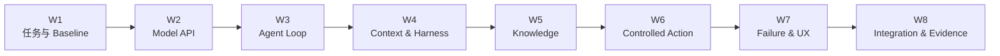

# 04 · 八周学习与实践路径：从熟悉工具走向 Agent Runtime

这条实践路径面向具备前端与 TypeScript 工程经验、已经熟悉 Claude Code、Codex 等 Agentic Coding Tool 的读者。已有经验提供了直觉：项目规则会影响结果，搜索和测试会形成反馈，工具需要权限，长任务需要计划与恢复。八周工作的目标，是把这些产品体验拆解成能够独立设计和验证的工程机制。

八周只是一个可调整的节奏参考，默认每周投入 8–12 小时。各周先完成一条可运行的核心实践，再根据时间选做扩展实验；Dataset 与故障用例会在八周内逐步累积，不集中到某一周。时间不足时可以延长周期，不需要通过删减测试来追赶日历。



## 贯穿项目

建议维护一个持续演进的 Agent Workbench，逐周增加能力。所有场景共有的最小主线只要求：

- 一项需要从结构化输入或多个来源完成判断的任务；
- 一项只读工具调用；
- 一个可以从权威系统验证的真实 Outcome。

研究、内容或分析类选题不需要为了覆盖目录而制造真实写操作。第 6～7 周会使用一个独立的 **Transactional Safety Lab**，在 Mock 支付环境练习可逆 Command、高风险 Approval、Timeout、重复请求和 ACK 丢失；主项目本身已经具备交易动作时，也可以直接复用同一场景。这样既覆盖行动安全，又不让架构反过来支配选题。

## 第 1 周 · 定义任务，而不是先选 Framework

### 核心问题

一次 Agent 任务“看起来完成了”，依据是什么？更简单的程序或人工流程是否已经足够？

### 学习内容

- 从一次熟悉的 Coding Agent Session 中识别 Context、Tool、Loop、Permission、Artifact 和验证信号；
- 区分模型生成的完成声明与测试、Diff、Receipt 等外部证据；
- 学习 Task Contract、Case、Grader、Trial 和 Baseline 的最小定义。

### 动手

1. 选择贯穿任务，写明用户、输入、允许动作、禁止动作、成功 Outcome 和成本/时间上限；
2. 创建三个 Anchor Case：正常完成、信息不足、必须拒绝；
3. 实现一个非 Agent Baseline，例如固定 Workflow、搜索 + 模板或人工规则；
4. 编写读取 Mock 权威状态的 Outcome Grader；
5. 保存输入、输出、Outcome、Grader Result 与版本，不只保存聊天截图。

### 本周应形成的成果

- 三个 Case 与 Baseline 可重复运行；
- Outcome 不依赖模型自我评价；
- 至少发现一个任务描述或 Grader 的歧义并完成修订。

## 第 2 周 · 直接理解 Model API

### 核心问题

产品界面中的一次流畅回复，在 API 层由哪些 Item、Event、Usage 和错误组成？

### 学习内容

- Token、自回归生成、Context Window 与 Sampling 的工程边界；
- Request / Response Item、Streaming Event、Structured Output 与 Tool Call；
- JSON Schema 能保证的结构，以及不能保证的语义与授权。

### 动手

只使用一家 Provider 的官方 TypeScript SDK，实现一个薄 Adapter。核心实践只包含：

- 普通响应与一条 Streaming 路径；
- 将 SDK Event 收敛成内部语义 Event，并重建一个完整 Item；
- 一个 Structured Output Schema，以及 Timeout、Cancel、Usage 和版本记录；
- 三个 Mock Stream 测试：正常分片、中途截断、非法 JSON。

选择 OpenAI 时，以 Responses API 的类型化 SSE Event 为练习对象，明确 `response.output_text.delta`、`response.function_call_arguments.done`、`response.output_item.done` 与 `response.completed` 的不同闭合边界；不把 Chat Completions Chunk 与 Responses Event 放进同一个字符串拼接器。

作为扩展，再处理重复 Event、序号缺口和更细的错误分类。本周只需在三个 Anchor Case 上新增 5–8 个平衡 Case；后续每周将新发现的边界和故障加入 Dataset，到第 8 周再形成 30–50 个 Case 的第一个完整版本。

### 本周应形成的成果

- 能从录制 Event 重建完整响应；
- 半个 Tool Call 永远不会执行；
- 能区分 Model Refusal、Truncation、Transport Error 与 Application Validation Error；
- 至少一个 Case 有多次 Trial、Latency、Token 和失败分类记录。

## 第 3 周 · 手写有界 Agent Loop

### 核心问题

“观察—调用工具—继续”最少需要哪些确定性代码，为什么一个开放 `while` 不够？

### 学习内容

- Model Candidate、Tool Contract、Observation 与 Runtime State；
- Query / Command、错误分类、预算、Cancel 与终态；
- Outcome Eval 与 Trajectory Eval。

### 动手

实现：

```text
buildContext
→ callModel
→ reduceCompleteItem
→ validateCandidate
→ dispatchTool
→ recordObservation
→ transitionState
```

只接入 3–5 个 Mock 或只读 Tool，加入 Step、Token、Wall-clock、Money 和 Concurrency Budget，以及每步 Trace。

### 故障注入

非法 Schema、未知 Tool、Tool Timeout、Model Truncation、重复调用、用户 Cancel、Budget Exhausted 和循环计划。

### 本周应形成的成果

任一失败都能定位到 Model、Context、Validation、Tool 或 Runtime；模型不直接执行 Tool，真实写操作尚未开放，也不引入 Agent Framework。

## 第 4 周 · Context Engineering 与 Harness

### 核心问题

为什么同一模型在更换项目规则、工具集合、Compaction 或 Reviewer 后会产生明显不同的行为？

### 学习内容

- Prompt、Context、Agent Loop 与 Harness 的职责；
- Context Source、Trust、Freshness、Token Budget 与 Manifest；
- Skill、Hook、Reviewer 和 Subagent 的收益与边界。

### 动手

- 将拼接 Prompt 改成显式 Context Builder；
- 记录每个 Context Item 的来源、版本、信任级别、纳入/排除理由与 Token 占用；
- 将计划、进度和证据保存为 External Artifact，而不是只留在对话历史；
- 定义 Canonical `RunEvent`，Provider Event 不直接驱动 UI；
- 为每个 Harness 组件写“假设、预期收益、成本、移除条件”。

### 对照实验

在同一 Dataset Slice 比较全量历史与选择性历史、全量 Tool 与动态 Tool、无 Reviewer 与独立 Reviewer。无可测收益的组件不保留。

### 本周应形成的成果

Compaction 前后关键约束、未决事项和证据引用不丢失；能够解释 Context 与 Runtime State 的区别，也不因流行度默认引入 Multi-Agent。

## 第 5 周 · 可信 Knowledge Plane

### 核心问题

Code Search 与 RAG 都在找相关内容，但为什么“相关”仍不代表“有权、最新、可信”？

### 学习内容

- Source、Provenance、ACL、Tenant、Freshness 与 Conflict；
- Sparse / Dense / Hybrid Retrieval 与 Rerank；
- Context、Knowledge、Runtime State 与 Long-term Memory 的边界。

### 动手

- 实现一个带 Provenance 的只读知识 Tool；
- 在候选检索前应用 ACL / Tenant Filter，Context Packing 前再次防御性检查；
- 从最简单的 Retrieval Baseline 开始，再由 Eval 决定是否加入 Hybrid 或 Rerank；
- 只设计 Memory Candidate / Write / Read / Delete Policy，不自动写入模型反思。

### 故障注入

无权高相似文档占满 Top-k、过期政策、来源冲突、删除后 Cache/Index 残留，以及检索结果中的 Prompt Injection。

### 本周应形成的成果

Retrieval Recall、Ranking、Evidence Faithfulness 和最终 Outcome 分开评测；无权内容不会先进入模型再依赖模型忽略。

## 第 6 周 · 受控行动与安全边界

### 核心问题

能够修改代码文件的 Agent，为什么仍不能直接退款、发信或改生产数据库？

### 学习内容

- Authentication、Authorization、Delegation、Consent 与 Approval；
- Query / Command、Preview、Resource Version、Idempotency、Receipt 与 Compensation；
- Prompt Injection、Confused Deputy、Sink Validation 与 Sandbox；
- MCP 作为能力协议的边界。

### 动手

在主项目或独立 Transactional Safety Lab 中完成一条最小的受控写操作：

- 一个 Query 和一个 Mock 环境中的可逆 Command；
- 一条 actor–tenant–resource–action 授权规则；
- 绑定精确参数、Proposal Hash、Resource Version 与期限的 Approval Record；
- Stable Idempotency Key、Preview、Receipt、Audit 与 Outcome Query；
- 三个必做故障用例：越权、Approval 后参数变化、重复请求。

时间充足时，再扩展 purpose-based policy、一个高风险 Command、最小 MCP Client/Server，以及 Indirect Prompt Injection、SSRF / Path / Shell Sink 与 Tool Result Poisoning 实验。MCP 只承载受控 Tool，不承载业务授权。

### 本周应形成的成果

恶意或错误的模型参数不能绕过服务端 Policy；所有写操作仍在 Mock / Sandbox 环境中验证。

## 第 7 周 · Failure、Recovery 与 Agent UX

### 核心问题

Tool Timeout 时动作是否发生？点击 Stop 后，界面为什么不能立即显示“已撤销”？

### 学习内容

- Execution Status 与 Effect Status；
- Deadline、Timeout、Retry、Cancellation 与 Reconciliation；
- Backpressure、Bounded Queue、Bulkhead 与任务预算；
- Public Run State、Approval、未知效果和人工接管 UX。

### 动手与故障注入

- 实现 `CANCEL_REQUESTED → IN_DOUBT → RECONCILING → Outcome`；
- 在 Commit 前、Commit 后 ACK 前、ACK 后 Checkpoint 前中断；
- 加入 Bounded Queue、Semaphore、Retry Budget 与过载降级；
- UI 展示等待输入、等待 Approval、执行、Cancel Requested、效果核对、Partial 与 Manual Intervention。

核心界面先消费自己的 Canonical RunEvent。时间充足时增加一个 AG-UI Adapter，用同一 Snapshot / Event Fixture 对拍 Native UI 与 AG-UI Client；这项练习验证互操作边界，不要求把领域状态改造成 AG-UI 类型。

完整的跨 Worker Durable Engine 可以在八周后实现，本周至少完成状态机、Checkpoint 设计与故障矩阵。

### 本周应形成的成果

Timeout / Cancel 不被解释为“副作用未发生”；任何未知效果都有权威查询、同 Intent 幂等收敛或人工接管路径。

## 第 8 周 · 总装与作品证据

### 核心问题

当前成果是一个可以演示的功能，还是一个能够被他人复查、比较和安全停止的系统？

### 总装任务

- 使用 [综合系统心智模型](/masterpiece-static-docs/11-综合实践与作品设计/01-综合系统心智模型.md) 重画架构与信任边界；
- 运行 [综合能力自测](/masterpiece-static-docs/11-综合实践与作品设计/02-综合能力自测.md)，建立错误模型清单；
- 对完整 Dataset 做多 Trial 回归；
- 运行至少一条正常路径和一条与主项目风险相符的拒绝或故障恢复路径；Transactional Safety Lab 另外演练 ACK 丢失；
- 写出当前明确不做的能力及理由。

### 可复查成果

- Task Contract、30–50 个版本化 Case、Baseline、Grader 与实验报告；
- 可运行的 Model Adapter 与手写 Agent Runtime；
- Context Manifest、Harness Component Map、Tool Contract 和状态机；
- Outcome / Trajectory Eval 与多 Trial 结果；
- Threat Model、故障矩阵与 UX 状态；存在受控写操作时再附 Authorization / Approval 证据；
- Trace、关键 SLI、成本和未解决风险。

## 八周之后

八周终点表明已经具备持续构建能力，不代表系统可以直接承接生产写流量。后续仍需按场景补齐跨小时恢复、多 Worker 所有权、真实 UI、SLO、Provider 故障策略、Shadow / Canary / Rollback，以及一个经过 Baseline 证明收益的场景专项。

A2UI 与 A2A 不进入八周核心门禁。只有产品确实需要跨端声明式生成界面，才实现受控 Catalog 与 A2UI Renderer；只有协作对象成为独立、跨进程或跨组织 Agent 系统，才实现 A2A AgentCard、Task 与 Artifact Contract。两者都应先做限时 Spike 和故障 Fixture，再决定是否进入主系统。

Rust 基础可以并行学习；任何真实组件迁移都应等待稳定 TypeScript Baseline、Profile、跨语言 Contract、Shadow、Canary 与 Rollback 证据。

## 本章小结

八周路径的主线不是按目录刷完知识，而是在同一 Workbench 中循环执行“机制 → 最小实现 → 故障注入 → Eval → 证据”。日历只安排投入，真正决定进度的是可运行工件与可复查成果。
