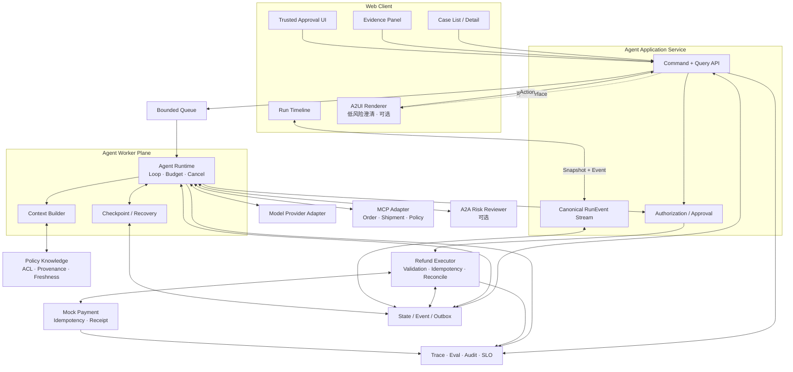

# 09 · Resolution Desk：总装与验收

前面的章节分别建立了 Model Adapter、Agent Loop、Context Builder、Knowledge、Tool Contract、Authorization、Agent UX、Recovery 和 Eval。本章不再增加新的核心概念，而是把它们装配成一条可以运行、失败、恢复并接受复查的产品纵切面。

最终应用仍运行在 Mock 或 Sandbox 中。功能完备指目标范围内的状态和故障语义完整，不表示已经接入真实支付或能够处理任意售后任务。

本章是第 11 部分核心路径的终点。进入顺序应为：综合系统心智模型、综合能力自测、参考答案、八周构建路径，再到本章总装。资料索引、Rust 清单和场景迁移属于后续附录，不插入这条连续路径。

## 1. 最终产品边界

Resolution Desk 面向处理退款相关工单的客服人员。工单可以描述延迟配送、商品损坏、重复扣款或一般退款诉求，但系统只负责解释政策、补充事实、生成或拒绝退款 Proposal、提交获准的 Mock 退款，以及在边界外转人工。完整能力包括：

- 创建并恢复 Thread / Run；
- 流式展示分析状态，而不是只显示 Token 打字效果；
- 查询获准访问的订单、物流和政策；
- 展示政策来源、版本、生效时间和冲突；
- 在信息不足时请求澄清；
- 生成带证据、资源版本和有效期的退款 Proposal；
- 在服务端完成 Authorization，并由有资格的人执行精确 Approval；
- 使用稳定 Idempotency Key 提交 Mock 退款；
- 在 Timeout、断线和进程重启后核对真实 Outcome；
- 提供 Cancel、Resume、Reject 和 Manual Takeover；
- 用 Dataset、Grader、Trace、Audit、SLO 和成本指标验证系统；
- 用 Environment Simulator、合成边界 Case、人工复核和 Agent Red Team 验证状态化行为与安全不变量；
- 在 Application Server、Queue、Worker、Store 与 Mock Domain/MCP 的生产形态中演练 Drain、迁移、回滚和接管。

下列能力明确排除在核心产品之外：

- 真实支付、真实邮件和生产订单；
- 换货、补发、拒付和其他非退款业务动作；
- 任意网页浏览、Shell、SQL 或代码执行；
- 自动训练、自我修改或自主发布；
- 未经场景证明的通用 Multi-Agent；
- 使用生成式界面承载高风险最终确认。

## 2. 总装后的架构



图中最重要的不是组件数量，而是权威边界：Model 只产生候选；Application Service 定义 Run 生命周期与公开状态语义，Run Store 是持久化事实来源；Worker 只在有效 Lease 与 Ownership Epoch 下推进 Run；Knowledge Store 持有版本化证据；Policy 与资源服务决定动作资格；Refund Executor 执行参数复核、幂等提交与核对；Mock Payment 持有退款 Outcome；UI 只展示公开状态并发送 Command。

## 3. 先冻结六组领域契约

总装前先确保下面六组契约可以在不依赖 Provider SDK 的情况下表达。

| 契约              | 最少包含                                                         | 权威持有方                           |
| --------------- | ------------------------------------------------------------ | ------------------------------- |
| `Case`          | tenant、customer、issue、attachments、created\_at                | 工单 Fixture / 服务                 |
| `Run`           | goal、execution\_status、effect\_status、budget、version         | Application Service / Run Store |
| `Evidence`      | source、version、valid\_time、ACL、content\_ref                  | Knowledge Plane                 |
| `Proposal`      | order、amount、currency、evidence、resource\_version、hash、expiry | Application Service / Policy    |
| `Approval`      | actor、proposal\_hash、scope、approved\_at、expires\_at          | Approval Service                |
| `RefundOutcome` | intent、idempotency\_key、effect、receipt、observed\_at          | Mock Payment System             |

Provider Response、AG-UI Event、MCP Result、A2A Task 和 A2UI Envelope 都通过 Adapter 进入这些领域契约。任何外部协议升级都不应直接改写 `Run`、`Proposal` 或 `RefundOutcome` 的语义。

## 4. 用两条状态轴表达真实进度

一次 Run 至少需要区分执行过程与外部效果：

```text
ExecutionStatus:
QUEUED → RUNNING → WAITING_INPUT | WAITING_APPROVAL
       → CANCEL_REQUESTED → RECONCILING
       → COMPLETED | FAILED | CANCELED | MANUAL_INTERVENTION

EffectStatus:
NOT_STARTED → SUBMITTING ─┬→ CONFIRMED
                         ├→ REJECTED
                         └→ UNKNOWN ─┬→ CONFIRMED
                                    └→ REJECTED
```

两条轴不能合成一个 `loading / success / error`：

- `CANCEL_REQUESTED + UNKNOWN` 表示停止了新工作，但退款效果仍在核对；
- `COMPLETED + CONFIRMED` 表示任务完成且外部效果已由权威系统确认；
- `MANUAL_INTERVENTION + UNKNOWN` 表示自动核对已经用尽预算，需要人工接管；
- `CANCELED + NOT_STARTED` 才能安全表示任务取消且没有发起写操作。

UI 的文本、按钮和颜色都从 Public Run State 推导，不能在前端自行猜测。

## 5. 按依赖顺序装配正常路径

### 5.1 创建工单与 Run

从 `case_refund_clear` Fixture 创建 Thread 和 Run。Application Server 固定：

- 当前 actor、tenant 和 purpose；
- Model、Prompt、Context Builder、Toolset 与 Policy 版本；
- Step、Token、Time、Money 与 Concurrency Budget；
- Runtime State、Event Sequence 与 Trace ID。

浏览器首先读取 Snapshot，再从 `last_sequence + 1` 订阅 Event。即使此时模型尚未返回内容，页面也能准确显示 `QUEUED` 或 `RUNNING`。

### 5.2 构建最小 Context

Context Builder 只为当前决策选择必要对象：稳定指令、用户目标、获准访问的工单事实、当前 Runtime State、可用 Tool Schema 和输出契约。订单、物流与政策内容按需查询，不把全部历史或整个知识库塞入窗口。

每个 Context Item 带来源、版本、信任标签和纳入原因。模型看见的信息可以回放，但 Secret、原始凭证和无权候选永不进入 Context。

### 5.3 运行只读 Tool Loop

模型可以在预算内选择：

- `get_case`；
- `get_order`；
- `get_shipment`；
- `search_policy`；
- `request_clarification`；
- `propose_resolution`。

模型输出先闭合成完整 Item，再经过协议、Schema、领域语义和权限验证。Tool Result 被转换成带来源的 Observation；超大结果保存在外部 Artifact 中，只把引用和必要摘要放回下一轮 Context。

### 5.4 展示证据与建议

当系统找到当前生效政策后，UI 同时展示结论与证据：政策标题、版本、生效时间、引用片段、订单事实和仍未解决的冲突。模型生成的自然语言解释不是事实源，用户可以沿引用回到原始 Fixture。

正常只读路径的验收条件是：建议与政策匹配、引用可定位、无权内容未进入候选或 Context、Run 在预算内停止。

## 6. 装配受控退款路径

本节默认已经完成 08/07 的完整 Red Team 演练，并通过核心 Tool、MCP、Memory、原生 UX 与重复副作用门禁；启用 Multi-Agent、A2A 或 A2UI 时，还要通过对应附加门禁。若门禁尚未通过，只能把下面的路径执行到 `command_ready`，不得让常规业务 Run 调用 Mock Refund Executor。

### 6.1 从模型候选到不可变 Proposal

模型只能提出候选字段。Application Server 重新读取订单与可退余额，检查政策、币种、金额和资源版本，然后生成不可变 Proposal 与 Canonical Hash。

Proposal 必须包含用户真正需要判断的信息：

- 哪个订单、退多少、退到哪里；
- 使用了哪些政策证据；
- 当前订单版本与可退余额；
- 预计外部效果与不可逆部分；
- Approval 的有效期和失效条件。

### 6.2 Authorization 与 Approval

Authorization 根据当前 actor、tenant、resource、action 和 purpose 决定是否允许进入审批。Approval 则确认这一份精确 Proposal。二者缺一不可，也不能互相替代。

提交前重新检查：actor 仍有效、订单仍属于同一 tenant、resource version 未变化、Proposal Hash 一致、Approval 未过期、金额仍在权限上限内。

### 6.3 幂等提交与权威 Outcome

Refund Executor 为同一业务 Intent 使用稳定 Idempotency Key。支付响应只是一条 Observation；真正结果来自 Mock Payment 的幂等记录与 Receipt。

```text
Proposal approved
→ effect = SUBMITTING
→ commit_refund(intent, idempotency_key)
→ receipt received       → effect = CONFIRMED
→ authoritative rejection → effect = REJECTED
→ timeout / disconnect   → effect = UNKNOWN
```

`UNKNOWN` 只能进入 Reconciliation：按原 Intent 查询、使用相同 key 幂等重试，或转人工。Runtime 不能让模型规划一笔“新的退款”来处理旧请求的不确定性。

## 7. 将故障恢复接入主流程

恢复不是单独的运维 Demo，而是同一状态机的常规分支。

### 7.1 浏览器断线

客户端保存最后应用的 sequence。重连后先请求缺失 Event；Event 已过保留期或出现 gap 时，改为读取新 Snapshot。Event Reducer 对 `event_id` 幂等，重复传输不会重复更新状态。

### 7.2 Worker 在安全边界崩溃

至少注入三个崩溃点：

1. Command 尚未发送；
2. Mock Payment 已 Commit，但 ACK 尚未返回；
3. Receipt 已收到，但新 Checkpoint 尚未提交。

恢复 Worker 从 Event/Checkpoint 重建 Intent、Proposal、Approval、Idempotency Key 与 Effect Status。新的 Ownership Epoch 接管后，旧 Worker 的迟到写入被 Fencing 或 Compare-and-Swap 拒绝。

### 7.3 Cancel 与未知效果竞态

Cancel 首先阻止新的模型调用和新业务动作。若 Command 已提交或效果未知，Reconciliation 仍要在独立预算内继续。最终界面可能显示“停止请求晚于退款提交，退款已确认”，而不是虚构“已经撤销”。

## 8. 将安全控制放进真实数据流

针对 Resolution Desk，至少运行以下攻击路径：

| 攻击输入                 | 目标         | 必须生效的控制                              |
| -------------------- | ---------- | ------------------------------------ |
| 政策文档写入“忽略审批”         | 提升外部数据为指令  | Trust Label、Context 分层、服务端 Policy    |
| 其他租户的高相似政策           | 泄露数据或改变结论  | Candidate Generation 前 ACL Filter    |
| Tool Result 返回危险 URL | 诱导前端或服务端访问 | Sink Validation、Network Allowlist    |
| Approval 后替换金额       | 利用 TOCTOU  | Proposal Hash、Resource Version、执行前复核 |
| 重复点击批准               | 产生重复效果     | Command 去重、稳定 Idempotency Key        |
| 启用 A2UI 时伪造 Action   | 绕过原生权限     | Action Gateway 重新认证与授权               |

测试目标不是让模型永远识别攻击，而是即使模型判断错误，危险数据流仍无法穿透全部边界。

完整安全门禁还要从单点 Fixture 扩展为攻击链：附件或 Tool Result 进入 Context，经 Tool/MCP、Memory，以及启用时的 Multi-Agent Artifact 或 A2UI 传播，最终试图触达数据外发、Approval 或 Mock Payment。每条已确认问题保留 Exact Regression、Nearby Variant 与 Benign Twin，分别报告 ASR Effect、ASR Boundary、False Refusal 和带单位的 Blast Radius。执行方法见 [Agent 安全评测与 Red Team](/masterpiece-static-docs/08-安全与治理/07-Agent安全评测与Red-Team.md)。

## 9. 接入可删除的能力与互操作扩展

核心单 Agent 路径通过后，再验证协议 Adapter。

### AG-UI

把 Canonical RunEvent 映射为 AG-UI Event，同时保留内部 Snapshot、sequence、终态和错误语义。Native Client 与 AG-UI Client 消费同一组 Fixture 后，应得到等价 Public State。

### A2A

仅对高金额或证据冲突工单创建风险复核 Task。远程 Agent 获得最小化输入，只返回带来源的 Review Artifact；它没有支付凭证，也不能修改 Proposal 或执行退款。断线后通过 Task ID 对账，不能把重新提交当作恢复。

### A2UI

只生成低风险澄清或证据收集 Surface。Renderer 使用本地 Catalog、Schema、URL Policy 和资源上限；Action 回到 Application Server 重新验证。高风险退款 Approval 始终由应用原生受信界面呈现。

### Agent Skills 与 Dynamic Tool Discovery

只读售后分析 Skill 固定 Publisher、Version 与 Digest，按 Progressive Disclosure（渐进式披露）加载；Dynamic Tool Discovery 先按 actor、tenant 和 risk 过滤，再展开少量 Query Tool Schema。Skill 指令和发现结果都不能把 `commit_refund` 加入本轮可用工具集。

### MCP Apps、Tasks 与 Authorization Extensions

MCP App 只用于查看政策证据，不能承载可信退款 Approval；实验性的 MCP Task 只在长时只读 Fixture 中验证 durable handle、poll、input、cancel 和 TTL，不替代 Application Workflow。机器或企业身份取得 Token 后，资源服务仍按 tenant、resource、purpose 与 Intent 重新授权。完整边界见 [Agent Skills、动态工具发现与 MCP 扩展](/masterpiece-static-docs/07-工具-协议与行动控制/06-Agent-Skills与MCP扩展.md)。

## 10. 先验证部署可恢复，再验收启用的进阶能力

Production Topology Test 是核心总装门禁；另外两组只在采用相应进阶能力时执行：

1. **Production Topology Test（核心）**：Application Server 负责 Command/Query/SSE，Queue 调节速率，Worker 在 Lease/Epoch 下推进 Run，Store 持有 Event、Checkpoint 与 Outcome 引用/投影，Mock Payment 保持效果权威，MCP/Tool Gateway 控制 Egress。演练 Readiness、Drain、SSE 重连、旧 checkpoint 迁移、Rollback 与 Manual Takeover。
2. **Framework Ejection Test（采用候选框架时）**：手写 Runtime、AI SDK Adapter 与实际候选 Adapter 使用同一 `AgentRuntimePort`、Domain、Canonical Event、Dataset 和对应 durability tier 的故障矩阵。替换 Adapter 不修改 Policy、UI reducer 与权威 Outcome。
3. **Multi-Agent Admission Test（评估或启用协作扩展时）**：只对证据量大、来源独立的 Case 启动 Policy Evidence Worker 与 Case Evidence Worker。Child 只返回不可变 Artifact，Coordinator 保留唯一 ownership；与固定 Workflow、单 Agent 和 best-of-N 做等预算比较，没有净收益时删除。

OpenTelemetry 通过 W3C Trace Context 连接 HTTP、Queue、Worker、Model 与 MCP/Tool，但 Trace 不替代 Audit、Event Store 或 Eval。生产拓扑的完整演练见 [部署与迁移验收](/masterpiece-static-docs/09-可靠性与可观测/06-生产拓扑-部署与迁移验收.md)。

## 11. 九条端到端验收路径

| 路径               | 关键断言                                 | 权威证据                                     |
| ---------------- | ------------------------------------ | ---------------------------------------- |
| 正常退款             | 证据正确、Approval 有效、只退款一次               | Policy Fixture、Approval、Payment Receipt  |
| 信息不足             | 请求澄清，不猜测、不写入                         | Run State、Tool Trace、Payment State       |
| 跨租户请求            | 无权数据未进入候选和 Context                   | Retrieval Trace、Access Audit             |
| Prompt Injection | 危险指令不能改变权限或数据流                       | Policy Decision、Executor Audit           |
| ACK 丢失           | 进入未知效果并按原 Intent 收敛                  | Idempotency Record、Reconcile Trace       |
| 浏览器断线            | 重连后 UI 与 Public Snapshot 一致          | Event Sequence、Reducer State             |
| Worker 发布与迁移     | Drain 后无孤儿 Run；新 epoch 接管；旧状态可恢复或转人工 | Lease、Checkpoint、Migration/Replay Report |
| A2A 风险复核         | Remote Agent 只返回 Artifact            | A2A Task、Delegation Scope、Audit          |
| A2UI 澄清          | 非法组件/Action 被拒绝                      | Renderer Fixture、Action Gateway Audit    |

前七条是核心成品门禁；后两条在启用相应扩展时执行。Skills、Dynamic Tool Discovery、MCP Apps/Tasks 与 Multi-Agent 本地双 Worker 也只有在启用对应扩展时进入发布门禁。

## 12. 完整 Dataset 与指标

从 3 个 Anchor Case 逐步累积到 30–50 个高信息量 Case，覆盖正常、模糊、冲突、边界、权限、对抗、故障和反向行为。每个发布候选至少报告：

- Task Success Rate 与关键 Slice 成功率；
- Unauthorized Read / Action Violation，安全关键项为零容忍；
- Duplicate Effect Rate 与 Unknown Outcome Rate；
- Time to First Useful State 与 Time to Truth；
- P50/P95/P99 Latency；
- Token、Tool、基础设施成本与 Cost per Successful Task；
- Cancel、Reconnect、Recovery 与 Manual Takeover 成功率；
- Simulator invalid trial、环境版本与 Fidelity 校准结果；
- 启用 Router 或 Multi-Agent 时的误路由、证据重复、fan-out、冲突识别与取消收敛时间。

开放式解释可以使用人工 Rubric 或校准后的 LLM Judge；权限、金额、重复退款、状态收敛和真实效果优先使用程序断言与权威环境。

## 13. 最终完成清单

Resolution Desk 只有在下面各项同时成立时才算完成：

- [ ] Web UI 展示目标、证据、状态、Proposal、Approval、取消、恢复和人工接管；
- [ ] Application Service 定义 Thread / Run / Item 与 Canonical Event 语义，Run Store 保存权威状态；
- [ ] Runtime 有界，可取消，终态不会继续产生动作；
- [ ] Knowledge 在检索前执行 ACL，并保留来源、版本与时效；
- [ ] Memory 只保存经确认的低风险偏好，支持删除传播；
- [ ] 模型候选不能绕过 Schema、语义、Authorization、Approval 与 Sink 校验；
- [ ] Mock 退款使用稳定 Intent、Idempotency Key、Receipt 与 Reconciliation；
- [ ] Timeout、Disconnect 与 Cancel 不被解释为“效果未发生”；
- [ ] 正常、拒绝和故障恢复路径都有自动化验收；
- [ ] Environment Simulator 能重置、控制时间和外部效果；合成 Case 有来源，主观标准经过人工校准；
- [ ] Agent Red Team 覆盖核心 Tool、MCP、Memory 与 Native UX 攻击链；启用 Multi-Agent/A2UI 时追加对应 Case，并保留 Benign Twin；
- [ ] Trace、Log、Audit 与 Eval 能通过 `run_id` 对齐；Metric 只使用低基数维度，并可借助 Exemplar 定位代表性 Trace；
- [ ] Trace Context 跨 Application Server、Queue、Worker 与 MCP/Tool 传播，Telemetry 已脱敏；
- [ ] 发布候选经过 Offline Eval、受控流量验证与可执行 Rollback；
- [ ] 生产拓扑通过 Readiness、Drain、Ownership、SSE 重连和旧状态迁移演练；
- [ ] Secret、依赖目录、真实用户数据和生产凭证未进入练习工程或证据包。

## 本章小结

完整 Agentic 应用不是模型调用数量的累积，而是从模糊目标到权威 Outcome 的整条因果链。Resolution Desk 把开放判断、可信知识、受控行动、可恢复状态、用户控制和运行证据放进同一个产品：模型可以犯错，系统仍必须守住权限与副作用；网络可以失败，任务仍必须收敛到明确结果或人工接管。

[返回全书首页](/masterpiece-static-docs/index.md) · [查看八周构建路径](/masterpiece-static-docs/11-综合实践与作品设计/04-八周学习与实践路径.md) · [查看综合能力自测](/masterpiece-static-docs/11-综合实践与作品设计/02-综合能力自测.md) · [下一节（进阶实验）：AG-UI](/masterpiece-static-docs/05-模型接口与Agent内核/10-AG-UI与前端事件适配.md)
