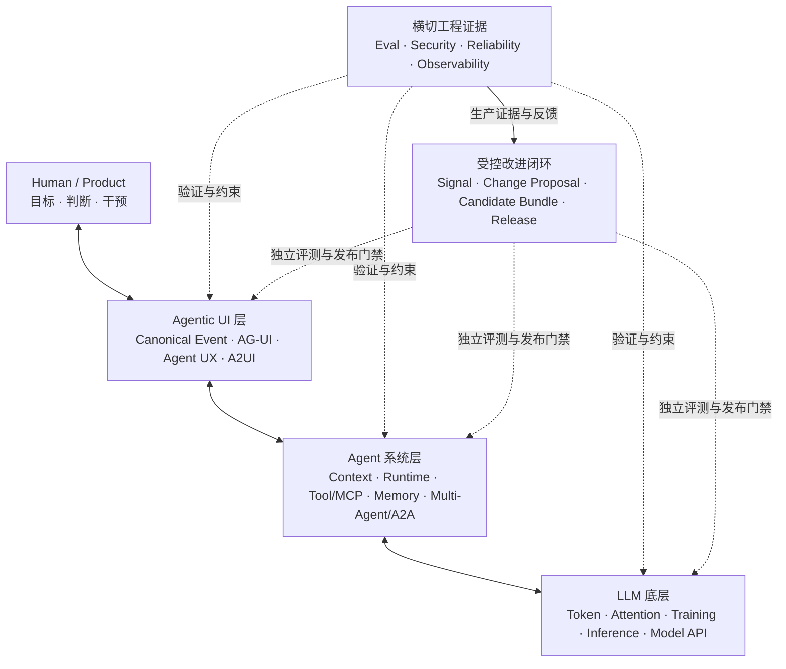
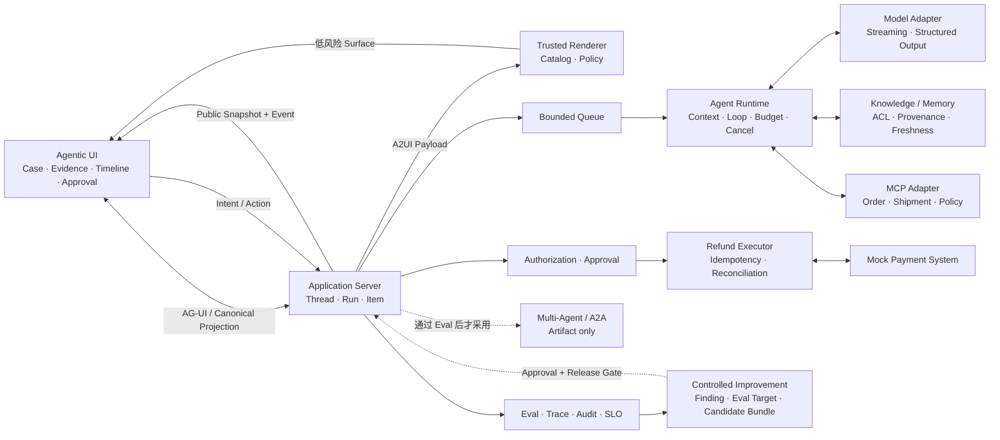

# Agent 应用工程：从原理到完整 Agentic 应用

Large Language Model（LLM）让软件能够在运行时解释模糊目标、选择工具，并根据环境反馈调整下一步。真正的 Agent 应用却远不止一次模型调用：模型输出具有概率性，工具可能产生真实副作用，任务会跨越连接与进程生命周期，而用户必须能够看见、理解、干预并恢复整个过程。

本书以一套持续生长的产品为载体，沿三条核心知识主线展开：

1. **LLM 底层知识**：解释 Token、Attention、训练、推理、Embedding、采样和 Context Window 如何影响模型行为；
2. **Agent 系统知识**：把概率能力组织成有状态、有预算、有权限、可恢复的 Runtime，进一步处理 Context、Knowledge、Memory、Tool、MCP、Multi-Agent 与 A2A；
3. **Agentic UI 与前端知识**：把后台 Run 投影为人类能够理解和控制的界面，系统学习 Canonical Event、Public Snapshot、Reducer、AG-UI、Agent UX、A2UI、Approval 与 Recovery。

Evaluation（Eval）、安全、可靠性和可观测性不构成孤立的第四层。它们是一条贯穿三层的**工程证据线**：从第一个模型实验开始，持续回答系统是否更好、是否越权、故障能否收敛，以及发布是否有充分证据。生产 Trace 和用户修订也只有经过这条证据线，才能成为下一版系统的改进候选；它们不能直接改变在线行为。



贯穿全书的工程原则是：

> 模型负责理解目标、处理开放语义和提出候选；确定性系统负责状态、权限、副作用与完成证据；Agentic UI 负责让人类看见、控制并验证这套系统。

## 适合的读者

本书面向具有资深前端或 TypeScript 工程经验、已经熟练使用 Claude Code、Codex 等 Agentic Coding 工具，但尚未系统开发过 Agent 应用的工程师。

前端工程中的类型系统、异步 I/O、Reducer、事件流、API Contract、运行时校验、测试和可观测性，在 Agent 应用中都有直接对应物。需要继续建立的是三类新判断：

- Model 的输出为什么会波动，哪些问题不能靠加长 Prompt 解决；
- Agent Runtime 如何管理状态、工具、副作用、预算与失败恢复；
- 前端如何消费可重放事件、表达不确定状态，并为用户提供可信的审批与接管入口。

阅读本书不要求预先具备 Agent 应用工程背景，也不把训练基础模型作为前置条件。

## 贯穿项目：Resolution Desk

全书持续构建 **Resolution Desk——可验证的退款处置工作台**。它处理一个边界清晰的任务族：退款相关售后工单。用户诉求可能源于延迟配送、商品损坏、重复扣款或一般退款申请；首版结果统一收敛为政策解释、信息澄清、退款 Proposal、安全拒绝或人工升级，不实现换货、补发和拒付等其他业务动作。

```text
读取工单与订单
→ 检索当前有效政策与历史事实
→ 以流式时间线展示任务进展
→ 必要时生成受控的澄清或证据收集界面
→ 形成带来源的处置建议与退款 Proposal
→ 服务端授权并请求精确 Approval
→ 在 Mock 支付系统中幂等提交退款
→ 查询权威 Outcome
→ 展示回执、回复草稿和可恢复任务状态
```

这个场景既包含列表、详情、时间线、表单、审批和断线恢复等前端问题，也覆盖 Agent 工程的核心风险：模型不确定性、外部知识、多租户权限、Prompt Injection、真实副作用、结果未知与故障恢复。

最终系统必须包含：

- 基于 Thread、Run、Item、Canonical Event 与 Public Snapshot 的 Web 工作台；
- Model Streaming、Structured Outputs、Tool Calling 与有界 Agent Loop；
- AG-UI Adapter，以及与原生事件投影共享 Fixture 的 Contract Test；
- 至少一个受 Catalog 约束的 A2UI Surface，用于低风险澄清或证据收集；
- 固定、可信的原生 Approval UI；A2UI 不承载退款等高风险最终确认；
- 带 Access Control List（ACL）、来源、版本、时效性和可回滚 Index Manifest 的政策检索；
- 可定位到 Claim 的引用校验，以及证据不足时的拒答或人工升级；
- 只保存经用户确认偏好的受治理 Memory，并支持跨 Thread 读取、更正、撤销和删除验证；
- 通过 Model Context Protocol（MCP）接入的订单、物流与政策查询能力；
- 不可变 Proposal、服务端 Authorization、Approval 与幂等退款 Command；
- Cancel、断线重连、Checkpoint、未知效果核对与人工接管；
- Dataset、Grader、Trace、Audit、Service Level Objective（SLO）与发布门禁；
- 跨 Application Server、Queue、Worker 与 Tool 的 OpenTelemetry 因果链；
- 一次从生产证据到 Change Proposal、候选 Behavior Bundle、独立 Eval 和回滚的受控改进演练。

Multi-Agent 设计和 Agent2Agent Protocol（A2A）属于 Agent 系统层的必懂能力，但不默认进入生产主路径。只有在相同 Dataset、近似总预算和明确故障模型下，相对单 Agent Baseline 取得可重复收益，Resolution Desk 才启用远程风险复核分支。



所有订单、物流、支付和外部 Agent 服务均由 Mock 实现，并运行在隔离的 Sandbox 中。项目不连接真实支付，不开放任意 Shell、SQL 或网页操作。

## 书籍仓库与实践项目

当前仓库只承载书籍正文、站点配置和发布工具，不维护 Resolution Desk 的应用源码。书中的 TypeScript 片段、接口和测试用于解释机制；需要动手时，在本仓库之外创建独立的 `resolution-desk` 练习项目。

阅读环境因此保持安静，实践工程则可以自由选择包管理器、框架和部署方式。读者不需要修改本书仓库，也不需要跟随本书的 Git 历史。

## 三条主线如何汇合

| 阅读部分                                                                                     | 所属主线                  | Resolution Desk 的可见增量                                |
| ---------------------------------------------------------------------------------------- | --------------------- | ---------------------------------------------------- |
| [01 导读](/masterpiece-static-docs/01-导读/01-如何阅读这本书.md)                                    | 系统全景                  | 固定产品边界、3 个 Anchor Case 与非 Agent Baseline             |
| [02 数学与机器学习直觉](/masterpiece-static-docs/02-数学与机器学习直觉/01-概率-信息量与采样.md)                    | LLM 底层                | 认识回答波动、政策检索指标与分布变化                                   |
| [03 LLM 工作原理](/masterpiece-static-docs/03-LLM工作原理/01-Token与自回归生成.md)                     | LLM 底层                | 解释 Streaming、截断和 Context 为什么改变结果                     |
| [04 评测与实验科学](/masterpiece-static-docs/04-评测与实验科学/01-Grader-Trial与统计.md)                  | 横切证据线                 | 将 Anchor Case 扩展成可复现、持续增长的评测基线                       |
| [05 模型接口与 Agent 内核](/masterpiece-static-docs/05-模型接口与Agent内核/01-TypeScript-Node运行时边界.md) | Agent 系统 → Agentic UI | 跑通有界 Loop、Canonical Event、Application Server 与 AG-UI |
| [06 Context、知识与记忆](/masterpiece-static-docs/06-上下文-知识与记忆/01-Context-Engineering.md)      | Agent 系统              | 检索当前有效政策，展示来源并隔离无权内容                                 |
| [07 Tool、协议与行动控制](/masterpiece-static-docs/07-工具-协议与行动控制/01-工具契约与错误模型.md)                | Agent 系统              | 将建议推进到受控、可幂等收敛的 Mock 行动                              |
| [08 安全与治理](/masterpiece-static-docs/08-安全与治理/01-Agent威胁建模.md)                            | Agentic UI + 横切证据线    | 建立可信交互、A2UI Surface、最小权限与安全门禁                        |
| [09 可靠性与可观测](/masterpiece-static-docs/09-可靠性与可观测/01-失败分类-超时-重试与取消.md)                    | 横切证据线                 | 从故障中恢复，建立生产证据，并把改进限制在候选、评测与受控发布闭环内                   |
| [10 综合实践](/masterpiece-static-docs/11-综合实践与作品设计/01-综合系统心智模型.md)                          | 三线总装                  | 完成端到端回归、故障演练和发布验收                                    |

第 02–04 部分的实验使用给定 Fixture 或小型独立实验，不要求读者提前拥有完整 Runtime。从第 05 部分开始，所有实现持续累加在同一个练习项目中。

## Agentic UI 核心路径

Agentic UI 不是主项目完成后的装饰层，也不等于“把模型文字放进聊天窗口”。建议按下面四章连续阅读：

1. [Application Server 与 UI 事件协议](/masterpiece-static-docs/05-模型接口与Agent内核/09-Agent-Application-Server与UI事件协议.md)：明确领域状态、Canonical Event、Snapshot 与客户端边界；
2. [AG-UI 与前端事件适配](/masterpiece-static-docs/05-模型接口与Agent内核/10-AG-UI与前端事件适配.md)：建立 Agent Backend 与用户界面的运行时交互平面；
3. [Agent UX 与可控交互](/masterpiece-static-docs/08-安全与治理/05-Agent-UX与可控交互.md)：设计 Stop、Interrupt、Approval、Recovery 和 Human Handoff；
4. [A2UI 与声明式生成界面](/masterpiece-static-docs/08-安全与治理/06-A2UI与声明式生成界面.md)：让 Agent 在受控 Catalog 内描述低风险界面，由本地可信组件渲染。

AG-UI 与 A2UI 都是核心学习和实践内容，但领域状态机、Authorization 和高风险 Approval 仍由应用持有。协议位于可替换的产品边界，不应反向成为领域真相。

## Claude Code 与 Codex 在书中的位置

Claude Code、Codex 等工具提供一组熟悉的直觉：项目规则进入 Context，搜索与测试构成反馈 Loop，Permission 与 Sandbox 限制动作，Diff 和测试结果比完成声明更可信。正文用这些体验解释抽象机制，也建议用 Coding Agent 生成 Fixture 骨架、运行测试和审查窄范围修改。

它们不是课程主角，也不替代系统判断。状态由谁持有、动作凭什么获准、失败如何收敛、Outcome 由什么确认，仍由应用设计明确回答。

## 阅读入口

第一次阅读按照侧栏的三条主线推进，并让工程证据线始终伴随实现：

1. 完成导读、LLM 底层知识和 Eval 基线；
2. 完成 05/01–08、06 与 07/01–04，建立单 Agent Runtime，再加入 Context、Knowledge、Tool 与受控行动；
3. 学习 Multi-Agent 与 A2A 的责任模型，并用对照 Eval 决定是否在生产采用；
4. 沿“05/09 → 05/10 → 08/05 → 08/06”连续完成 Agentic UI 核心路径；
5. 完成系统性安全、可靠性、可观测、发布门禁与受控改进演练；
6. 在综合实践中完成三层总装。

Agentic RAG / GraphRAG、Framework 对照、Skills、Rust、资料索引、能力索引和场景迁移用于定向查阅，不构成核心项目完成条件。

[开始阅读：如何阅读这本书](/masterpiece-static-docs/01-导读/01-如何阅读这本书.md)
