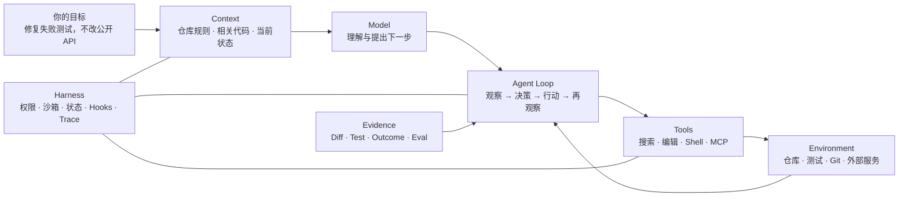
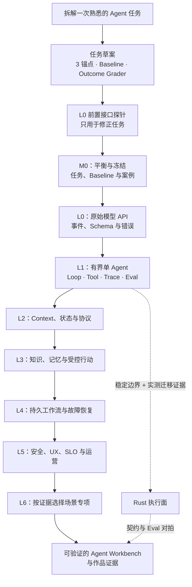

# Agent 应用工程：拆开你正在使用的 Agent，再亲手造一个

> 研究基准：2026-07-12
>
> 面向已经熟练使用 Claude Code、Codex 等 Agent Harness 的软件工程师：从“会指挥 Agent”走向“能解释、实现、评测和运营 Agent 应用”。

你可能已经很熟悉这样的过程：把一个失败测试交给 Claude Code 或 Codex，它会读取仓库规则，搜索代码，修改文件，运行测试；测试仍失败时，它会根据新结果继续调整；遇到越界操作，它会停下来请求许可。

表面上，你只写了一句话。实际上，一套完整系统已经在工作：



这本书做的事情，就是把这些熟悉的表象一层层拆开。你会不断获得类似的解释：

- `AGENTS.md` / `CLAUDE.md` 为什么只是 Context 的一部分，而不是可靠的策略引擎？
- “读文件—改代码—跑测试—继续修”为什么是反馈 Loop，而不只是更长的 Prompt？
- 工具、权限、沙箱、Hooks、Skills、状态与 Trace 怎样共同组成 Agent Harness？
- 为什么测试通过比 Agent 说“已经完成”更接近真实 Outcome？
- 为什么同一个模型换一套 Harness，表现可能明显不同？
- 怎样把这套骨架从编程任务迁移到研究、客服、数据分析与业务操作？

全书围绕同一个通用 Agent Workbench 逐步演进：先用 3 个锚点任务定义草案，写一个 Outcome Grader，立即做一次无工具的接口探针；用真实反馈修正任务后，再冻结正式 M0，进入 L0 原始模型 API 与 L1 有界 Loop。在它之上依次加入 Context、知识、受控行动、持久执行、安全、UX、评测与运营。TypeScript + Node 是主线；Rust 只在稳定边界与迁移证据出现后承接执行面。

## 先用 60–90 分钟跑通第一圈

第一次打开本书，不要先背术语，也不要先造一套完整评测平台。

1. 阅读[如何阅读这本书](/masterpiece-static-docs/00-导读/01-如何使用这套教材.md)，明确你要拆解的最近一次 Claude Code / Codex 任务。
2. 阅读[从一次 Agent 任务看懂全书](/masterpiece-static-docs/00-导读/02-知识地图与学习门禁.md)，在真实轨迹里找出 Context、Harness、Loop 与 Outcome。
3. 进入 [M0 任务草案](/masterpiece-static-docs/00-导读/04-M0任务契约-Baseline与数据集.md)：只写正常、模糊、应停止 3 个锚点，一个非 Agent baseline，以及一个检查真实结果的 Outcome Grader。
4. 按 [Grader、Trial 与统计](/masterpiece-static-docs/03-评测与实验科学/01-Grader-Trial与统计.md)的“首读最小路径”判一次 baseline，再做一次无工具、无副作用的 **L0 前置接口探针**，记录请求、响应、错误、用量与 Grader 结果。

第一圈结束时，你应同时拥有一张会话解剖图、一张最小任务卡和第一条真实 API 反馈。Coding Agent 暖场不自动成为正式任务族；这次接口探针也不等于通过 L0，不支持模型优劣或项目 readiness 结论。它的作用是让问题尽早撞上真实接口，再完成正式 M0。

## 两套坐标，不要混淆

- `00–10` 是书的章节坐标，用于定位知识。
- `M0、L0–L6` 是能力里程碑，用于决定 Workbench 下一步可以增加什么。

它们不是一一对应。你不需要读完 `00–08` 才第一次实现 Agent；首次实作主线是：

```text
熟悉任务：解剖一条 Claude Code / Codex 轨迹
  → 任务草案：3 个锚点 + baseline + Outcome Grader
  → 前置接口探针：用真实 API 暴露坏任务，不申报里程碑
  → M0：平衡、扩展并冻结可比较基线
  → L0：完成原始模型 API 适配器、事件与错误语义
  → L1：手写一个有界单 Agent Loop
  → L2–L6：随能力增加，按需补读并实现后续模块
```

12–20 个平衡 seed cases、30–50 个冻结案例与完整 Rubric 不阻塞第一次接口反馈，但它们构成正式 M0；只有通过后，才把后续实作申报为 L0/L1 里程碑。评测、安全、可观测、成本和用户控制从 L1 就开始出现，只是随着风险逐层加严。完整闭卷检查用于验证系统综合能力，不再充当第一次接口探针的入场券。

## 选择你的阅读入口

| 你的状态                                  | 建议入口                                                                                   | 阅读方式                                                                    |
| ------------------------------------- | -------------------------------------------------------------------------------------- | ----------------------------------------------------------------------- |
| 熟练使用 Claude Code / Codex，但没有实现过 Agent | [从一次 Agent 任务看懂全书](/masterpiece-static-docs/00-导读/02-知识地图与学习门禁.md)                     | 先建立熟悉感，再按[八周启动计划](/masterpiece-static-docs/10-毕业门禁/04-八周理论学习计划.md)边学边实现 |
| 已经调用过模型 API                           | [M0：先写最小任务草案](/masterpiece-static-docs/00-导读/04-M0任务契约-Baseline与数据集.md)                | 用 3 个锚点和 Outcome Grader 校准任务，再进入 L0/L1                                  |
| 已经做过 Agent 原型                         | [完整转型路线](/masterpiece-static-docs/00-导读/05-从学习到转型的完整路线.md)                             | 用阶段证据与章节验收矩阵定位缺口                                                        |
| 已有稳定单 Agent Runtime                   | [Context Engineering](/masterpiece-static-docs/05-上下文-知识与记忆/01-Context-Engineering.md) | 按 L2–L6 补齐协议、知识、行动与生产能力                                                 |

阅读时遵循四条约定：

1. 先观察熟悉现象，再学习术语与机制，最后用反例和实验验证；不要把术语表当作必经章节。
2. 每增加一层能力，都回放同一批 M0 任务；复杂度必须用 Outcome、Trajectory、成本和风险证据购买。
3. Claude Code / Codex 是可观察实例，不是通用原理本身。公开行为可以帮助理解，私有提示、模型权重和内部基础设施一律不做猜测。
4. Rust 的 R0/R1 学习可以与 L0/L1 并行；真实组件迁移仍要等待稳定契约、L1 baseline 与实测证据。

## 全书的渐进路线

| 模块                                                                                         | 读者要解开的谜题                              | 带回 Workbench 的能力                        |
| ------------------------------------------------------------------------------------------ | ------------------------------------- | --------------------------------------- |
| [00 从会用 Agent 到理解系统](/masterpiece-static-docs/00-导读/01-如何使用这套教材.md)                        | 我每天使用的 Agent 到底由哪些层组成？                | 一次会话解剖图、M0 最小草案与首条 L0 反馈                |
| [01 随机性从哪里来](/masterpiece-static-docs/01-数学与机器学习直觉/01-概率-信息量与采样.md)                        | 为什么同样的任务会得到不同轨迹？                      | 为随机系统设计多 trial 比较                       |
| [02 模型究竟看到什么、生成什么](/masterpiece-static-docs/02-LLM工作原理/01-Token与自回归生成.md)                  | 长 Context、低温度和后训练为什么都不是保证？            | 能解释模型能力与失败边界                            |
| [03 怎样证明系统真的变好了](/masterpiece-static-docs/03-评测与实验科学/01-Grader-Trial与统计.md)                | 测试通过、回答正确与真实 Outcome 有何差异？            | Dataset、Grader、Trace 与回归决策              |
| [04 打开 Agent Harness](/masterpiece-static-docs/04-模型接口与Agent内核/01-TypeScript-Node运行时先修.md) | 模型、Context、工具和 Loop 怎样被 Runtime 连接？   | 原始 API、有界状态机、Application Server 与 UI 事件 |
| [05 管理有限的 Context](/masterpiece-static-docs/05-上下文-知识与记忆/01-Context-Engineering.md)        | 为什么“让模型看更多”经常更差？                      | 可重放 Context、知识来源与记忆策略                   |
| [06 让模型安全地行动](/masterpiece-static-docs/06-工具-协议与行动控制/01-工具契约与错误模型.md)                      | 候选动作怎样获得真实执行资格？                       | 工具契约、授权、审批、幂等与 MCP                      |
| [07 在攻击与误用下守住边界](/masterpiece-static-docs/07-安全与治理/01-Agent威胁建模.md)                        | Prompt Injection 为什么不是一句 Prompt 能解决的？ | 威胁模型、纵深防御与可控 UX                         |
| [08 让长链路在失败中收敛](/masterpiece-static-docs/08-可靠性与可观测/01-失败分类-超时-重试与取消.md)                   | Timeout、Cancel、Retry 后真实效果是什么？        | 故障恢复、SLO、Provider 降级与安全发布               |
| [09 有证据地迁移 Rust](/masterpiece-static-docs/09-Rust迁移理论-L1后/01-Rust迁移所需理论.md)                | 哪些稳定执行面值得迁移？                          | 跨语言契约与迁移门禁                              |
| [10 阶段验收与毕业](/masterpiece-static-docs/10-毕业门禁/01-综合系统心智模型.md)                              | 能否把所有局部知识重新组成系统？                      | 八周启动验收、L6 专项选择与全书毕业                     |

## 完整目录

- 00：[阅读方法](/masterpiece-static-docs/00-导读/01-如何使用这套教材.md) · [从一次 Agent 任务看懂全书](/masterpiece-static-docs/00-导读/02-知识地图与学习门禁.md) · [术语随查](/masterpiece-static-docs/00-导读/03-术语与边界.md) · [M0 模板与示例](/masterpiece-static-docs/00-导读/04-M0任务契约-Baseline与数据集.md) · [完整转型路线](/masterpiece-static-docs/00-导读/05-从学习到转型的完整路线.md)
- 01：[概率与采样](/masterpiece-static-docs/01-数学与机器学习直觉/01-概率-信息量与采样.md) · [向量与 Embedding](/masterpiece-static-docs/01-数学与机器学习直觉/02-向量-嵌入与相似度.md) · [训练与分布偏移](/masterpiece-static-docs/01-数学与机器学习直觉/03-训练-泛化与分布偏移.md)
- 02：[Token](/masterpiece-static-docs/02-LLM工作原理/01-Token与自回归生成.md) · [Transformer/KV Cache](/masterpiece-static-docs/02-LLM工作原理/02-Transformer-Attention与KV-Cache.md) · [预训练/后训练](/masterpiece-static-docs/02-LLM工作原理/03-预训练-后训练与推理.md) · [上下文/采样边界](/masterpiece-static-docs/02-LLM工作原理/04-上下文窗口-采样与能力边界.md)
- 03：[Grader/Trial/统计](/masterpiece-static-docs/03-评测与实验科学/01-Grader-Trial与统计.md) · [Outcome/Trajectory/Trace](/masterpiece-static-docs/03-评测与实验科学/02-结果-轨迹与Trace.md) · [Eval 驱动迭代](/masterpiece-static-docs/03-评测与实验科学/03-Eval驱动迭代.md)
- 04：[TS/Node 先修](/masterpiece-static-docs/04-模型接口与Agent内核/01-TypeScript-Node运行时先修.md) · [指令与 Context](/masterpiece-static-docs/04-模型接口与Agent内核/02-指令层级-Prompt与Context.md) · [API 与事件](/masterpiece-static-docs/04-模型接口与Agent内核/03-模型API-状态与流式事件.md) · [JSON Schema](/masterpiece-static-docs/04-模型接口与Agent内核/04-JSON-Schema基础.md) · [结构化输出/工具调用](/masterpiece-static-docs/04-模型接口与Agent内核/05-结构化输出与工具调用.md) · [Agent Loop](/masterpiece-static-docs/04-模型接口与Agent内核/06-Agent-Loop与状态机.md) · [Harness 与架构模式](/masterpiece-static-docs/04-模型接口与Agent内核/07-架构模式与多Agent边界.md) · [框架/SDK 优先级](/masterpiece-static-docs/04-模型接口与Agent内核/08-框架与SDK学习优先级.md) · [Application Server/UI 事件](/masterpiece-static-docs/04-模型接口与Agent内核/09-Agent-Application-Server与UI事件协议.md)
- 05：[Context Engineering](/masterpiece-static-docs/05-上下文-知识与记忆/01-Context-Engineering.md) · [来源/权限/新鲜度](/masterpiece-static-docs/05-上下文-知识与记忆/02-来源-权限与新鲜度.md) · [RAG](/masterpiece-static-docs/05-上下文-知识与记忆/03-检索-RAG与重排.md) · [状态/记忆/压缩](/masterpiece-static-docs/05-上下文-知识与记忆/04-状态-记忆与压缩.md)
- 06：[工具契约](/masterpiece-static-docs/06-工具-协议与行动控制/01-工具契约与错误模型.md) · [身份/授权/审批](/masterpiece-static-docs/06-工具-协议与行动控制/02-身份-授权与审批.md) · [MCP](/masterpiece-static-docs/06-工具-协议与行动控制/03-MCP与互操作协议.md) · [幂等/补偿/沙箱](/masterpiece-static-docs/06-工具-协议与行动控制/04-幂等-补偿与沙箱.md)
- 07：[威胁建模](/masterpiece-static-docs/07-安全与治理/01-Agent威胁建模.md) · [Prompt Injection](/masterpiece-static-docs/07-安全与治理/02-Prompt-Injection与不可信内容.md) · [最小权限/隐私](/masterpiece-static-docs/07-安全与治理/03-最小权限-隐私与Confused-Deputy.md) · [纵深防御](/masterpiece-static-docs/07-安全与治理/04-纵深防御与人类控制.md) · [Agent UX](/masterpiece-static-docs/07-安全与治理/05-Agent-UX与可控交互.md)
- 08：[失败/重试/取消](/masterpiece-static-docs/08-可靠性与可观测/01-失败分类-超时-重试与取消.md) · [并发/背压](/masterpiece-static-docs/08-可靠性与可观测/02-并发-背压与预算.md) · [持久执行](/masterpiece-static-docs/08-可靠性与可观测/03-持久执行-Checkpoint与Exactly-Once.md) · [Trace/SLO/成本](/masterpiece-static-docs/08-可靠性与可观测/04-Trace-SLO与成本.md) · [发布/Provider 运营](/masterpiece-static-docs/08-可靠性与可观测/05-发布-模型依赖与生产运营.md)
- 09（学习可并行，迁移在 L1 后）：[Rust 理论](/masterpiece-static-docs/09-Rust迁移理论-L1后/01-Rust迁移所需理论.md) · [跨语言契约](/masterpiece-static-docs/09-Rust迁移理论-L1后/02-跨语言契约与控制面-执行面.md)
- 10：[综合模型](/masterpiece-static-docs/10-毕业门禁/01-综合系统心智模型.md) · [综合闭卷检查](/masterpiece-static-docs/10-毕业门禁/02-动手前闭卷检查.md) · [评分](/masterpiece-static-docs/10-毕业门禁/03-参考答案与评分.md) · [八周计划](/masterpiece-static-docs/10-毕业门禁/04-八周理论学习计划.md) · [资料索引](/masterpiece-static-docs/10-毕业门禁/05-一手资料索引.md) · [章节验收](/masterpiece-static-docs/10-毕业门禁/06-章节验收矩阵.md) · [Rust 迁移门禁](/masterpiece-static-docs/10-毕业门禁/07-Rust迁移门禁.md) · [L6 专项与全书毕业](/masterpiece-static-docs/10-毕业门禁/08-场景专项与全书毕业.md)

## 总依赖图



## 现在先不做什么

- 不从零训练基础模型，不为理解 Agent 先钻进 CUDA 与分布式训练。
- 不同时学习所有 Agent 框架；先从原始 API 和手写 Loop 看见真实边界。
- 不把多 Agent、长期记忆、Computer Use 或 Rust 写进第一个原型。
- 不在权限、评测和故障语义缺失时接入真实不可逆动作。
- 不把“流行”误解为“默认应该使用”；新抽象必须回到同一 M0 数据集证明收益。

从[如何阅读这本书](/masterpiece-static-docs/00-导读/01-如何使用这套教材.md)开始。读完前两章，你应该先获得一份熟悉感：Claude Code / Codex 中那些看似自然的能力，终于有了可解释、可实现、可验证的工程位置。

[继续实作主线：拆解一次 Agent 任务](/masterpiece-static-docs/00-导读/02-知识地图与学习门禁.md) · [顺读知识支线：随机性从哪里来](/masterpiece-static-docs/01-数学与机器学习直觉/01-概率-信息量与采样.md)
