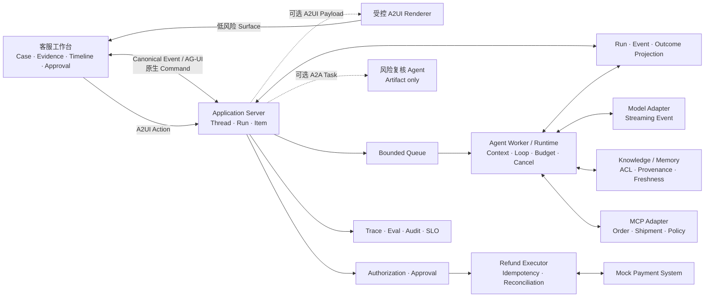

# Agent 应用工程：从原理到完整 Agentic 应用

Large Language Model（LLM）让软件第一次能够在运行时解释模糊目标、选择工具，并根据环境反馈调整下一步。它也改变了工程问题的形态：同一输入可能产生不同路径，Context 会改变行为，Tool Call 可能越权或重复，网络超时还可能掩盖已经发生的外部效果。

本书从这些现象出发，逐步建立 Model、Context、Agent Runtime、Tool、Knowledge、Evaluation、Security、Reliability 与 Product UX 的完整知识体系，并把每一部分落实到同一个可运行应用中。目标不是读完一组前置知识，也不是拼出一个聊天 Demo，而是理解并亲手完成一套可测试、可控制、可恢复的 Agent 系统。

贯穿全书的工程原则是：

> 模型负责理解目标、处理开放语义和提出候选；确定性系统负责状态、权限、副作用与完成证据。

## 适合的读者

本书面向具有资深前端或 TypeScript 工程经验、熟练使用 Claude Code、Codex 等 Agentic Coding Tool，但尚未系统开发过 Agent 应用的工程师。

前端工程中的类型系统、异步 I/O、Reducer、事件流、API Contract、测试和可观测性会在书中找到直接对应物。新增的部分主要是概率模型、Context Engineering、Agent Loop、Tool Contract、Eval、持久执行和安全边界。正文不要求读者了解本书的内部规划资料，也不把训练基础模型作为前置条件。

## 贯穿项目：Resolution Desk

全书持续构建 **Resolution Desk——可验证的退款处置工作台**。它只处理一个边界清晰的任务族：退款相关售后工单。用户诉求可能源于延迟配送、商品损坏、重复扣款或一般退款申请，但首版结果统一收敛为政策解释、信息澄清、退款 Proposal、安全拒绝或人工升级，不实现换货、补发和拒付等其他业务动作。

```text
读取工单与订单
→ 判断信息是否完整
→ 检索当前有效政策与历史事实
→ 展示证据和处置建议
→ 必要时请求风险复核
→ 生成不可变退款 Proposal
→ 服务端授权与人工 Approval
→ 在 Mock 支付系统提交退款
→ 查询权威 Outcome
→ 起草回复并保留完整任务时间线
```

这个场景同时具有前端工程师熟悉的列表、详情、时间线、表单和审批界面，也包含 Agent 工程最重要的难题：不确定判断、外部知识、多租户权限、Prompt Injection、真实副作用、结果未知和故障恢复。

最终系统包含：

- 基于 Thread、Run、Item 和 Canonical Event 的 Web 工作台；
- Model Streaming、Structured Outputs、Tool Calling 与有界 Agent Loop；
- 可复现 Environment Simulator、Synthetic Case、人工复核与 Agent Red Team；
- 带 Access Control List（ACL）、来源和版本的政策检索；
- 只保存经用户确认偏好的受治理 Memory；
- 通过 Model Context Protocol（MCP）接入的订单、物流与政策查询能力；
- 可选的 Agent Skills、Dynamic Tool Discovery、MCP Apps / Tasks 与授权扩展；
- 不可变 Proposal、服务端 Authorization、Approval 与幂等退款 Command；
- Cancel、断线重连、Checkpoint、未知效果核对与人工接管；
- Dataset、Grader、Trace、Audit、Service Level Objective（SLO）与发布门禁；
- 跨 Application Server、Queue、Worker 与 Tool 的 OpenTelemetry，以及可演练的生产拓扑；
- 作为互操作扩展的 AG-UI、Agent2Agent Protocol（A2A）与 Agent2UI（A2UI）。

所有支付、订单与外部 Agent 都运行在 Mock 或 Sandbox 中。项目不连接真实支付，不开放任意 Shell、SQL 或网页操作，也不把 Multi-Agent 当作默认架构。



## 书籍仓库与实践项目

当前仓库只承载书籍正文、站点配置和发布工具，不维护 Resolution Desk 的应用源码。书中的 TypeScript 片段、接口和测试用于解释机制；需要动手时，在本仓库之外创建独立的 `resolution-desk` 练习项目。

这种边界有两个目的：阅读环境保持干净，实践工程则可以自由选择包管理器、框架和部署方式。读者不需要修改本书仓库，也不需要跟随本书的 Git 历史。

## 全书如何推进同一个系统

| 部分                                                                                       | 建立的知识                                                                  | Resolution Desk 的可见增量                                              |
| ---------------------------------------------------------------------------------------- | ---------------------------------------------------------------------- | ------------------------------------------------------------------ |
| [01 导读](/masterpiece-static-docs/01-导读/01-如何阅读这本书.md)                                    | 系统分层、任务契约、Baseline                                                     | 固定产品边界、3 个 Anchor Case 与非 Agent Baseline                           |
| [02 数学与机器学习直觉](/masterpiece-static-docs/02-数学与机器学习直觉/01-概率-信息量与采样.md)                    | 概率、Embedding、分布变化                                                      | 认识回答波动、政策检索指标与回归来源                                                 |
| [03 LLM 工作原理](/masterpiece-static-docs/03-LLM工作原理/01-Token与自回归生成.md)                     | Token、Attention、训练与 Context Window                                     | 能解释流、截断和 Context 为什么改变结果                                           |
| [04 评测与实验科学](/masterpiece-static-docs/04-评测与实验科学/01-Grader-Trial与统计.md)                  | Dataset、Trial、Grader、Simulator、Human Review                            | 将 3 个 Anchor Case 扩展成可复现、持续增长的评测基线                                 |
| [05 模型接口与 Agent 内核](/masterpiece-static-docs/05-模型接口与Agent内核/01-TypeScript-Node运行时边界.md) | Model API、State、Loop、Application Server、Multi-Agent、AI SDK / LangGraph | 跑通 Streaming、只读 Tool Loop、Cancel 与 Web UI，再验证可替换 Runtime 和可删除的协作扩展 |
| [06 Context、知识与记忆](/masterpiece-static-docs/06-上下文-知识与记忆/01-Context-Engineering.md)      | Context Builder、RAG、Provenance、Memory                                  | 检索当前有效政策，展示来源并隔离无权内容                                               |
| [07 Tool、协议与行动控制](/masterpiece-static-docs/07-工具-协议与行动控制/01-工具契约与错误模型.md)                | Tool Contract、MCP、Skills、Dynamic Discovery、Authorization、Idempotency   | 查询订单并在 Approval 后安全提交一次 Mock 退款，按需扩展能力面                            |
| [08 安全与治理](/masterpiece-static-docs/08-安全与治理/01-Agent威胁建模.md)                            | Threat Model、Prompt Injection、Red Team、Agent UX                        | 阻断恶意内容和越权动作，用攻击回归证明防线并提供可信控制界面                                     |
| [09 可靠性与可观测](/masterpiece-static-docs/09-可靠性与可观测/01-失败分类-超时-重试与取消.md)                    | Recovery、Checkpoint、Backpressure、OpenTelemetry、SLO、生产拓扑                | 从断流、重启和 ACK 丢失中恢复，确认 Outcome 并完成部署迁移演练                             |
| [10 Rust 可选专题](/masterpiece-static-docs/10-可选专题-Rust迁移/01-Rust迁移所需理论.md)                 | 跨语言边界与迁移条件                                                             | 可跳过；不影响主项目完整性                                                      |
| [11 综合实践](/masterpiece-static-docs/11-综合实践与作品设计/09-Resolution-Desk总装与验收.md)              | 总装、端到端验证与能力迁移                                                          | 跑通正常、拒绝和故障恢复路径，完成整套应用                                              |

每一章都先从工作台中一个具体问题开始，再解释机制、增加能力并给出验收证据。前四部分的实验使用给定 Fixture 或小型独立实验，不要求读者提前拥有完整 Runtime；从第 05 部分开始，所有实现持续累加在同一个练习项目中。

## Claude Code 与 Codex 在书中的位置

Claude Code、Codex 等工具提供熟悉的直觉：项目规则进入 Context，搜索与测试构成反馈 Loop，Permission 与 Sandbox 限制动作，Diff 和测试结果比完成声明更可信。正文会用这些体验解释抽象机制，也会建议用 Coding Agent 生成 Fixture 骨架、运行测试和审查窄范围修改。

它们不是课程主角，也不替代读者的系统判断。状态由谁持有、动作凭什么获准、失败如何收敛、Outcome 由什么确认，仍由应用设计明确回答。

## 阅读入口

第一次阅读按目录顺序推进即可：

1. 从[如何阅读这本书](/masterpiece-static-docs/01-导读/01-如何阅读这本书.md)理解学习方式与项目边界；
2. 在[任务契约、Baseline 与数据集](/masterpiece-static-docs/01-导读/04-任务契约-Baseline与数据集.md)建立 3 个 Anchor Case；
3. 通过[贯穿项目的构建路线](/masterpiece-static-docs/01-导读/05-从学习到转型的完整路线.md)查看每一部分将增加的用户能力；
4. 按章节顺序完成机制学习与项目增量；
5. 最后使用[Resolution Desk 总装与验收](/masterpiece-static-docs/11-综合实践与作品设计/09-Resolution-Desk总装与验收.md)跑通完整系统。

[开始阅读：如何阅读这本书](/masterpiece-static-docs/01-导读/01-如何阅读这本书.md)
