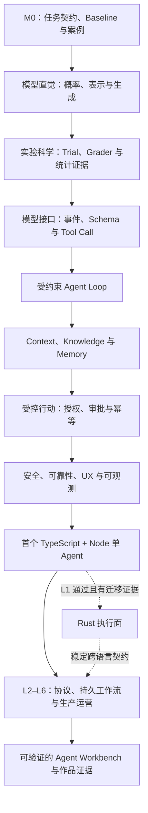

# Agent 应用工程：从模型接口到生产系统

> 研究基准：2026-07-11
>
> 一条面向软件工程师的可验证转型路线：以 TypeScript + Node 构建 Agent 应用，在证据充分时再把稳定执行面迁移到 Rust。

这不是一本框架 API 手册，也不以“做出一个能调用工具的演示”为终点。全书围绕同一个 Agent Workbench 逐步展开：先定义任务与证据，再理解模型接口、运行时、上下文和工具，随后把安全、可靠性、用户控制与生产运营接入同一系统。

完成这条路线，意味着你能独立解释、实现、评测和运营一个 Agent 应用，并能判断哪些复杂度现在不该引入。全书持续回答以下问题：

- 语言模型实际上产生了什么，为什么它不能直接获得执行权？
- Agent 为什么应被设计成受约束、可中断、可观测的状态机？
- Context、Thread State、Knowledge、Memory 为什么不是同一个东西？
- Schema、Prompt、审批、授权和沙箱分别能防住什么，不能防住什么？
- 怎样用结果、轨迹和多次 trial 判断系统真的变好了？
- 为什么超时、重试、幂等、背压和未知副作用收敛属于 Agent 基础？
- TypeScript 控制面与 Rust 执行面应如何分工，何时才有迁移证据？

## 怎样阅读这本书

不同读者可以从不同入口开始，但都要回到可验证的产出：

| 你的状态                | 建议入口                                                            | 阅读方式                             |
| ------------------- | --------------------------------------------------------------- | -------------------------------- |
| 正式开始转型              | [如何阅读这本书](/masterpiece-static-docs/00-导读/01-如何使用这套教材.md)        | 按八周启动计划建立理论与 M0 证据，再进入首个手写 Agent |
| 已经做过 Agent 原型       | [知识地图与学习门禁](/masterpiece-static-docs/00-导读/02-知识地图与学习门禁.md)     | 用章节验收矩阵定位缺口，不必机械重读已能通过的章节        |
| 已有稳定单 Agent Runtime | [从学习到转型的完整路线](/masterpiece-static-docs/00-导读/05-从学习到转型的完整路线.md) | 按 L2–L6 补齐产品与生产能力；Rust 迁移仍需独立证据  |

阅读时遵循五条约定：

1. `00–08` 与 `10/01–06` 是首次手写 Agent 前的主线，按八周计划中的显式依赖顺序学习；`09` 与 `10/07` 是完成 L1 后的 Rust 迁移门禁。`08/03` 在首次门禁中只要求 durable 心智模型，不要求实现引擎。
2. 每章先写初始答案，阅读后做纸面/前置微实验，最后重答章末检查。标为“L1 后系统实验”的内容不阻塞首次动手。
3. `必须掌握` 是进入手写 Agent Loop 前的门禁；`L1 后` 不等于没用，而是需要先有单 Agent baseline。
4. 一手资料用于校验概念，不要求逐篇精读。优先读指定章节、方法图、限制和实验结论。
5. M0 分两次收敛：任何模型探针前先完成任务契约、风险、非 Agent baseline 和 12–20 个平衡 seed cases；首次手写 Agent 前扩展为 30–50 个版本化案例。L1 是第一个手写单 Agent Runtime。

## 全书路线

| 模块                                                                                               | 核心问题                   | 完成标志                       |
| ------------------------------------------------------------------------------------------------ | ---------------------- | -------------------------- |
| [00 导读与 M0](/masterpiece-static-docs/00-导读/01-如何使用这套教材.md)                                       | 怎样读这本书、先定义什么以及完整路线通向哪里 | 完成 M0 契约、案例和 baseline 方案   |
| [01 数学与机器学习直觉](/masterpiece-static-docs/01-数学与机器学习直觉/01-概率-信息量与采样.md)                            | 概率、向量和泛化怎样影响模型行为       | 能解释随机性、相似度和分布偏移            |
| [02 LLM 工作原理](/masterpiece-static-docs/02-LLM工作原理/01-Token与自回归生成.md)                             | 自回归模型如何训练与生成           | 能解释上下文、采样、KV Cache 与能力边界   |
| [03 评测与实验科学](/masterpiece-static-docs/03-评测与实验科学/01-Grader-Trial与统计.md)                          | 如何证明差异不是随机波动           | 能设计 trial、grader、区间和轨迹评测   |
| [04 TS/Node、模型接口与 Agent 内核](/masterpiece-static-docs/04-模型接口与Agent内核/01-TypeScript-Node运行时先修.md) | 如何把概率模型包进确定性运行时        | 能画出可取消、可收敛、有终态的状态机         |
| [05 上下文、知识与记忆](/masterpiece-static-docs/05-上下文-知识与记忆/01-Context-Engineering.md)                  | 每一步应让模型看到什么            | 能区分来源、状态、知识、记忆、检索与压缩       |
| [06 工具、协议与行动控制](/masterpiece-static-docs/06-工具-协议与行动控制/01-工具契约与错误模型.md)                          | 模型建议怎样安全变成外部动作         | 能设计工具契约、授权、审批、幂等与隔离        |
| [07 安全、治理与 UX](/masterpiece-static-docs/07-安全与治理/01-Agent威胁建模.md)                                | 如何约束攻击并保留用户控制          | 能完成威胁模型和可控交互设计             |
| [08 可靠性与可观测](/masterpiece-static-docs/08-可靠性与可观测/01-失败分类-超时-重试与取消.md)                            | 长链路如何在失败中保持可控          | 能解释取消、背压、checkpoint 和副作用语义 |
| [09 Rust 迁移（L1 后）](/masterpiece-static-docs/09-Rust迁移理论-L1后/01-Rust迁移所需理论.md)                    | 何时把稳定执行面迁移到 Rust       | 能给出控制面/执行面边界及迁移证据          |
| [10 毕业门禁](/masterpiece-static-docs/10-毕业门禁/01-综合系统心智模型.md)                                       | 是否已经具备动手所需心智模型         | 通过分域闭卷检查并完成 M0             |

## 完整目录

- 00：[阅读方法](/masterpiece-static-docs/00-导读/01-如何使用这套教材.md) · [知识地图](/masterpiece-static-docs/00-导读/02-知识地图与学习门禁.md) · [术语](/masterpiece-static-docs/00-导读/03-术语与边界.md) · [M0 模板与示例](/masterpiece-static-docs/00-导读/04-M0任务契约-Baseline与数据集.md) · [完整转型路线](/masterpiece-static-docs/00-导读/05-从学习到转型的完整路线.md)
- 01：[概率与采样](/masterpiece-static-docs/01-数学与机器学习直觉/01-概率-信息量与采样.md) · [向量与 Embedding](/masterpiece-static-docs/01-数学与机器学习直觉/02-向量-嵌入与相似度.md) · [训练与分布偏移](/masterpiece-static-docs/01-数学与机器学习直觉/03-训练-泛化与分布偏移.md)
- 02：[Token](/masterpiece-static-docs/02-LLM工作原理/01-Token与自回归生成.md) · [Transformer/KV Cache](/masterpiece-static-docs/02-LLM工作原理/02-Transformer-Attention与KV-Cache.md) · [预训练/后训练](/masterpiece-static-docs/02-LLM工作原理/03-预训练-后训练与推理.md) · [上下文/采样边界](/masterpiece-static-docs/02-LLM工作原理/04-上下文窗口-采样与能力边界.md)
- 03：[Grader/Trial/统计](/masterpiece-static-docs/03-评测与实验科学/01-Grader-Trial与统计.md) · [Outcome/Trajectory/Trace](/masterpiece-static-docs/03-评测与实验科学/02-结果-轨迹与Trace.md) · [Eval 驱动迭代](/masterpiece-static-docs/03-评测与实验科学/03-Eval驱动迭代.md)
- 04：[TS/Node 先修](/masterpiece-static-docs/04-模型接口与Agent内核/01-TypeScript-Node运行时先修.md) · [指令与 Context](/masterpiece-static-docs/04-模型接口与Agent内核/02-指令层级-Prompt与Context.md) · [API 与事件](/masterpiece-static-docs/04-模型接口与Agent内核/03-模型API-状态与流式事件.md) · [JSON Schema](/masterpiece-static-docs/04-模型接口与Agent内核/04-JSON-Schema基础.md) · [结构化输出/工具调用](/masterpiece-static-docs/04-模型接口与Agent内核/05-结构化输出与工具调用.md) · [Agent 状态机](/masterpiece-static-docs/04-模型接口与Agent内核/06-Agent-Loop与状态机.md) · [架构模式边界](/masterpiece-static-docs/04-模型接口与Agent内核/07-架构模式与多Agent边界.md) · [框架/SDK 优先级](/masterpiece-static-docs/04-模型接口与Agent内核/08-框架与SDK学习优先级.md)
- 05：[Context Engineering](/masterpiece-static-docs/05-上下文-知识与记忆/01-Context-Engineering.md) · [来源/权限/新鲜度](/masterpiece-static-docs/05-上下文-知识与记忆/02-来源-权限与新鲜度.md) · [RAG](/masterpiece-static-docs/05-上下文-知识与记忆/03-检索-RAG与重排.md) · [状态/记忆/压缩](/masterpiece-static-docs/05-上下文-知识与记忆/04-状态-记忆与压缩.md)
- 06：[工具契约](/masterpiece-static-docs/06-工具-协议与行动控制/01-工具契约与错误模型.md) · [身份/授权/审批](/masterpiece-static-docs/06-工具-协议与行动控制/02-身份-授权与审批.md) · [MCP](/masterpiece-static-docs/06-工具-协议与行动控制/03-MCP与互操作协议.md) · [幂等/补偿/沙箱](/masterpiece-static-docs/06-工具-协议与行动控制/04-幂等-补偿与沙箱.md)
- 07：[威胁建模](/masterpiece-static-docs/07-安全与治理/01-Agent威胁建模.md) · [Prompt Injection](/masterpiece-static-docs/07-安全与治理/02-Prompt-Injection与不可信内容.md) · [最小权限/隐私](/masterpiece-static-docs/07-安全与治理/03-最小权限-隐私与Confused-Deputy.md) · [纵深防御](/masterpiece-static-docs/07-安全与治理/04-纵深防御与人类控制.md) · [Agent UX](/masterpiece-static-docs/07-安全与治理/05-Agent-UX与可控交互.md)
- 08：[失败/重试/取消](/masterpiece-static-docs/08-可靠性与可观测/01-失败分类-超时-重试与取消.md) · [并发/背压](/masterpiece-static-docs/08-可靠性与可观测/02-并发-背压与预算.md) · [持久执行](/masterpiece-static-docs/08-可靠性与可观测/03-持久执行-Checkpoint与Exactly-Once.md) · [Trace/SLO/成本](/masterpiece-static-docs/08-可靠性与可观测/04-Trace-SLO与成本.md)
- 09（L1 后）：[Rust 理论](/masterpiece-static-docs/09-Rust迁移理论-L1后/01-Rust迁移所需理论.md) · [跨语言契约](/masterpiece-static-docs/09-Rust迁移理论-L1后/02-跨语言契约与控制面-执行面.md)
- 10：[综合模型](/masterpiece-static-docs/10-毕业门禁/01-综合系统心智模型.md) · [闭卷检查](/masterpiece-static-docs/10-毕业门禁/02-动手前闭卷检查.md) · [评分](/masterpiece-static-docs/10-毕业门禁/03-参考答案与评分.md) · [八周计划](/masterpiece-static-docs/10-毕业门禁/04-八周理论学习计划.md) · [资料索引](/masterpiece-static-docs/10-毕业门禁/05-一手资料索引.md) · [章节验收](/masterpiece-static-docs/10-毕业门禁/06-章节验收矩阵.md) · [Rust 迁移门禁](/masterpiece-static-docs/10-毕业门禁/07-Rust迁移门禁.md)

## 总依赖图

## 首次实现前暂不投入

- 从零训练基础模型、CUDA 内核、分布式训练和量化工程。
- 同时学习 LangGraph、OpenAI Agents SDK、Mastra、AutoGen 等框架。
- 在没有单 Agent baseline 前构建多 Agent 系统。
- 在没有权限模型、评测和故障语义前接入真实写操作。
- Durable Workflow 引擎的完整实现与双 worker 恢复实验。
- Rust 重写 Agent Runtime 或跨语言线上迁移。

完成 `00–08` 与核心毕业门禁后，下一步是用官方模型 SDK 手写一个带 3–5 个 mock/只读工具的单 Agent Runtime。它不是路线终点，而是后续 Context、受控行动、持久工作流、生产运营与专项能力的共同 baseline。

从 [如何阅读这本书](/masterpiece-static-docs/00-导读/01-如何使用这套教材.md) 开始；若你已经具备这部分能力，直接用 [章节验收矩阵](/masterpiece-static-docs/10-毕业门禁/06-章节验收矩阵.md) 找出真正缺口。
