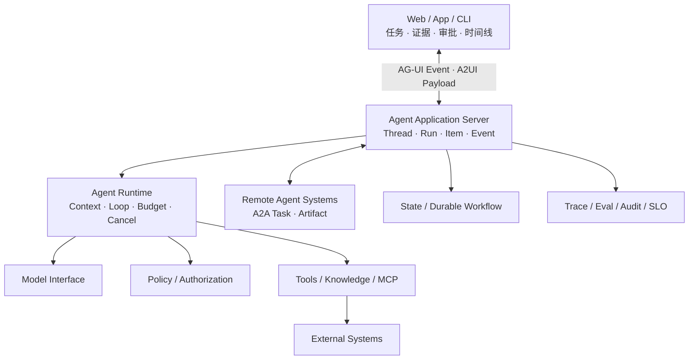

# Agent 应用工程：从前端开发到可验证的 Agent 系统

Large Language Model（LLM）使应用能够在运行时解释模糊目标、选择工具，并根据环境反馈调整下一步。但模型的这种能力并不自动带来可靠的软件：它会受 Context 影响，输出具有概率性，Tool Call 也可能越权、重复或在外部状态未知时失败。

本书讨论的不是如何包装一个聊天界面，而是如何把模型放进一套可测试、可控制、可恢复的应用架构中。核心原则贯穿始终：

> 模型负责理解与提出候选；确定性系统负责权限、状态、副作用和完成证据。

## 适合的读者

本书面向具有资深前端或 TypeScript 工程经验、能够熟练使用 Claude Code、Codex 等 Coding Agent，但尚未系统开发过 Agent 应用的工程师。

前端工程中的类型系统、异步 I/O、状态管理、事件驱动 UI、API Contract、测试和可观测性，可以直接映射到 Agent 应用的协议、运行时和产品界面。新增的工程对象主要是模型接口、Context Engineering、Agent Runtime、Tool Contract、Eval、持久执行和安全边界。

全书内容自包含，不把训练基础模型作为前置要求。书中出现的阶段、协议和工程对象都会在正文首次使用时解释。

## 全书持续构建的系统

所有章节围绕同一个贯穿项目 **Agent Workbench** 演进，而不是每章创建一个孤立 Demo：

图中的 MCP 指 Model Context Protocol，用于连接外部 Tool 与 Resource；SLO 指 Service Level Objective，用于描述可用性、延迟或质量等服务目标。

这个系统从一个模型调用开始，逐步加入 Tool Loop、Context Snapshot、语义事件、带权限的知识检索、Approval、Idempotency、故障恢复和发布验证。每增加一项能力，都应同步补充相应的故障注入与验证证据。

## 两个贯穿案例

**Coding Agent** 提供熟悉的工程入口。仓库规则、文件搜索、代码修改、测试输出和 Diff 可以映射到 Context、Tool、Observation、Loop 与 Outcome Verification。以测试修复为例，输入包括当前未通过的测试用例、断言位置、相关实现和 API 兼容约束；结果由测试报告与 Diff 共同确认。

**退款资格与执行助手** 承担完整业务案例。它需要读取获准访问的订单和政策，生成带证据的退款 Preview，经服务端 Authorization 与具体 Approval 后提交，并从支付系统核对真实 Outcome。这个案例能够覆盖知识、权限、不可逆动作、状态未知、幂等和人工接管。

## 章节结构

| 章节                                                                                       | 核心问题                           | 主要交付物                                                            |
| ---------------------------------------------------------------------------------------- | ------------------------------ | ---------------------------------------------------------------- |
| [01 导读](/masterpiece-static-docs/01-导读/01-如何阅读这本书.md)                                    | Agent 应用由哪些层构成，怎样定义一项可验证任务     | 系统地图、Task Contract、Baseline                                      |
| [02 数学与机器学习直觉](/masterpiece-static-docs/02-数学与机器学习直觉/01-概率-信息量与采样.md)                    | 概率、Embedding 和分布变化怎样影响工程判断     | 多 Trial 实验、Retrieval Eval                                        |
| [03 LLM 工作原理](/masterpiece-static-docs/03-LLM工作原理/01-Token与自回归生成.md)                     | 模型实际接收什么、生成什么，能力边界来自哪里         | Token / Context 实验、流式 Item 重建                                    |
| [04 评测与实验科学](/masterpiece-static-docs/04-评测与实验科学/01-Grader-Trial与统计.md)                  | 怎样区分流畅回答与真实任务完成                | Dataset、Grader、Trace、回归报告                                        |
| [05 模型接口与 Agent 内核](/masterpiece-static-docs/05-模型接口与Agent内核/01-TypeScript-Node运行时先修.md) | 怎样把 Model、Tool 和状态组成有界 Runtime | OpenAI SSE Adapter、手写 Agent Loop、Canonical Event 与 AG-UI Adapter |
| [06 Context、知识与记忆](/masterpiece-static-docs/06-上下文-知识与记忆/01-Context-Engineering.md)      | 有限窗口中应该放入哪些信息                  | Context Snapshot、带来源和权限的检索                                       |
| [07 Tool、协议与行动控制](/masterpiece-static-docs/07-工具-协议与行动控制/01-工具契约与错误模型.md)                | 候选动作怎样取得执行资格，独立 Agent 怎样协作     | Tool Contract、MCP、A2A、Authorization、Approval                     |
| [08 安全与治理](/masterpiece-static-docs/08-安全与治理/01-Agent威胁建模.md)                            | 不可信内容怎样跨模型、Tool 与生成界面形成真实风险    | 威胁模型、纵深防御、Agent UX 与 A2UI Renderer                               |
| [09 可靠性与可观测](/masterpiece-static-docs/09-可靠性与可观测/01-失败分类-超时-重试与取消.md)                    | Timeout、Retry、Cancel 和重启后怎样收敛  | 故障矩阵、Durable Execution、SLO                                       |
| [10 可选专题：Rust 迁移](/masterpiece-static-docs/10-可选专题-Rust迁移/01-Rust迁移所需理论.md)              | 在边界稳定且证据充分时，哪些组件值得迁移           | Rust Sidecar、共享 Contract、迁移证据                                    |
| [11 综合实践与作品设计](/masterpiece-static-docs/11-综合实践与作品设计/01-综合系统心智模型.md)                     | 怎样把局部机制组合成完整产品                 | 实践路径、综合自测、作品设计                                                   |

章节遵循相同结构：从问题场景开始，解释机制与工程实现，再说明边界、常见误区和可重复验收。数学只深入到能够解释系统行为和设计实验的程度；框架只在对应底层机制清楚之后引入。

## 阅读入口

第一次阅读可以顺序完成三个动作：

1. 阅读[如何阅读这本书](/masterpiece-static-docs/01-导读/01-如何阅读这本书.md)，了解目标系统、贯穿案例与学习方式。
2. 阅读[从一次 Agent 任务看懂系统分层](/masterpiece-static-docs/01-导读/02-从一次Agent任务看懂系统分层.md)，将 Coding Agent 行为拆成 Model、Context、Runtime、Harness 与 Application。
3. 阅读[任务契约、Baseline 与数据集](/masterpiece-static-docs/01-导读/04-任务契约-Baseline与数据集.md)，为贯穿项目建立第一组可重复任务和 Grader。

之后按照章节顺序扩展同一个 Workbench。每次引入 Model、Tool、Memory、Workflow 或新框架，都回放已有 Dataset，并保留上一版 Baseline。

## 技术边界

- TypeScript + Node.js 是模型接口、产品控制面与 Agent Runtime 的默认主线。
- React 或其他 Web UI 用于展示任务、证据、Preview、Approval、进度和恢复动作；聊天气泡不是唯一交互形态。
- Rust 只在边界稳定、资源敏感或需要独立隔离时承接执行与数据组件。
- Multi-Agent、长期记忆、Agentic Retrieval-Augmented Generation（Agentic RAG）和 Computer Use 都是条件性能力，必须由任务需求和 Eval 证明收益。
- AG-UI 是需要理解的 UI Event Model；A2UI 与 A2A 只在声明式生成界面或跨 Agent 系统互操作成为真实需求时引入。
- 时效性结论以对应章节标注的官方一手资料和核验日期为准；正文不推测私有 Prompt、模型权重或托管基础设施。

[开始阅读：如何阅读这本书](/masterpiece-static-docs/01-导读/01-如何阅读这本书.md)
